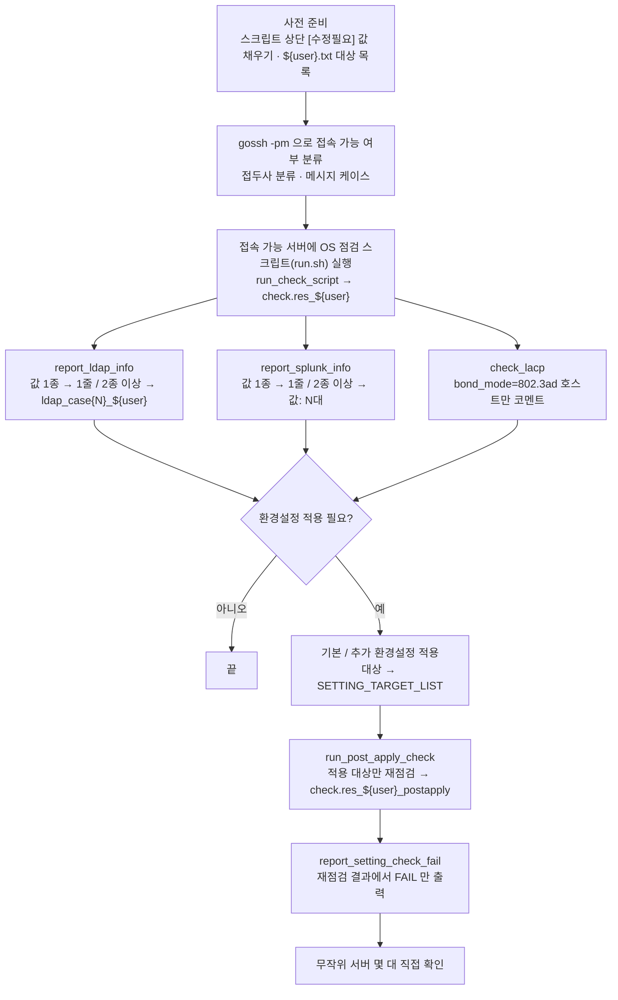

# ARCHITECTURE.md

| 폴더/파일 | 역할 |
|---|---|
| `os_check_final_annotated.sh` | 스크립트 본체: gossh `-pm` 접속 분류 → OS 점검 → LDAP/SPLUNK/LACP 리포트 → 환경설정 적용 → 재점검 |
| `README.md` | 사전 준비, 실행 방법, 결과 파일, 함수 목록 |
| `WORKFLOW.md` | 작업 흐름도 |
| `PLAN.md` | 개발/변경 계획 메모 |

스크립트 안의 주석 태그로 수정 범위를 구분합니다.

| 태그 | 의미 |
|---|---|
| `[수정필요]` | 환경에 맞게 값을 채우거나 확인할 부분 (예: `select_user`, 파일명 규칙, FAIL 판정 기준) |
| `[수정금지]` | 기존 로직. 건드리면 안 되는 부분 (예: 접두사 분류, 메시지 케이스 6~9) |
| `[연계]` | 다른 함수와 데이터를 주고받는 부분 (예: `run_post_apply_check` ↔ `report_setting_check_fail`) |

수정 요청별로 볼 곳:

- **"리포트 항목 추가"** → `report_*` 함수
- **"재점검 방식 변경"** → `run_post_apply_check` + `report_setting_check_fail` (함께 수정)
- **"점검 스크립트 대상 변경"** → `run_check_script(target_list, output_file)`

## 작업 흐름도

단계별 설명은 [WORKFLOW.md](WORKFLOW.md)를 참고하세요.

