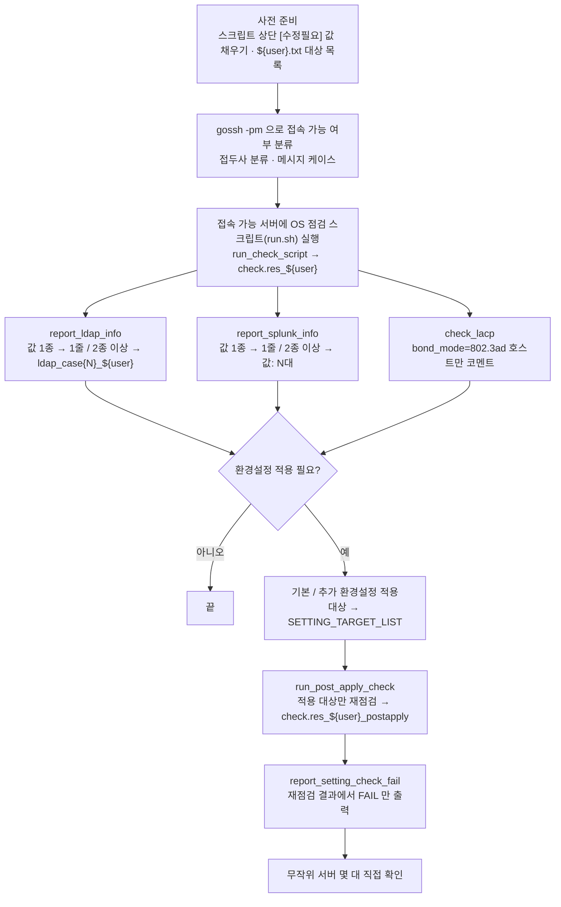

# 작업 흐름도 — OS 점검 및 환경설정 자동화 (os_check_final_annotated.sh)

OS 배포 후 **점검 → 리포트 → 환경설정 적용 → 적용 대상 재점검**을 한 번에 처리하는 흐름입니다.
함수별 설명은 [README.md](README.md)의 "4.6 함수 목록"을 참고하세요.

SVG 이미지로 보기 (workflow.svg)

