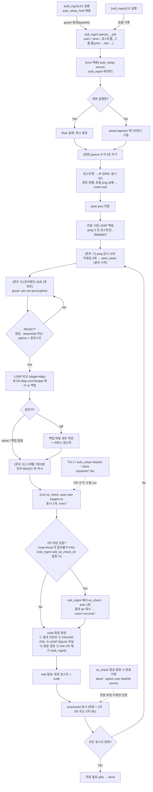
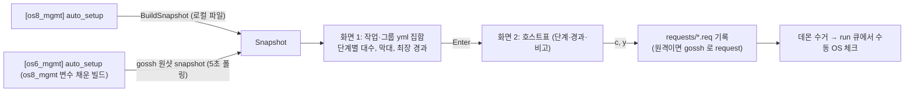

# WORKFLOW

## auto_setup 실행 흐름 (Mermaid, 2차 반영)



## 상태 리포트 흐름 (TUI, 양방향 동일)



## 실행 흐름 상세 설명

### 1단계: 전달 (01.AWX_nodeinfo_V2.sh)

```bash
# [14-1] 02 성공 직후 (auto_setup_host 가 비어 있으면 로컬, 채워져 있으면 gossh 로 os8_mgmt 에 전송)
{ echo "user=${user}"; echo "time=$(date +%s)"; cat "$hostfile"; as_group_lines; } > job
```

- 항상 전달(프롬프트 없음), 02 실패 시 전달 없음, 실패해도 경고 1줄만
- `as_group_lines`: 그룹 yml 이 2개 이상일 때 `yml=<파일명> infra= os= boot= splunk= hosts=<h1,h2,…>` 그룹별 한 줄 + `all=<전체 yml>`
- 원격 전송은 base64 를 두 글자마다 `.` 로 나눠 gossh 위험어를 우연히 만드는 것을 피함

### 2단계: 감시 시작 (데몬 큐)

```bash
# 01 이 넘긴 job 파일을 로드
jobs/<jobid>.json 생성
- id / user / submitted
- hosts: host → {ip, route, seen_down, ready_at, processed, stage, ldap, second, done_src, ...}
- groups: yml → {infra, os, boot, splunk, hosts}, all_yml
- runs: [{code, hosts, at}, ...]
```

### 3단계: 경로 판별 · 전달 시점 LDAP 백업

```bash
# 로컬 ICMP ping 응답 없음 → route=os6 (os6_mgmt 비어있으면 모두 local)
# ssh os6_mgmt "<os6_autosetup>/auto_setup probe -i 10s" 장기 세션 유지
# ping O 인 호스트: gossh 로 LDAP 설정 파일 수집 → ldapbak/<jobid>/<host>/ (0700/0600)
```

### 4단계: 감시 루프 (ping)

```bash
# 10초마다: local 은 raw ICMP, os6 는 probe 세션에서 변화 수신
# 무응답 2회 연속 → seen_down=true (설치 시작 간주)
# stage: queued → deploying → installing → booting; seen_down 후 60분 넘기면 stuck(화면 표시만)
```

### 5단계: 준비확인 (30초 주기)

```bash
# 후보: (미처리 && ping up && seen_down) || (기동 후 1회)
# gossh -pm -script -w <list> "cat /proc/uptime"
# READY = 응답 있음 && anaconda 아님 && uptime < (지금 − submitted)
```

### 6단계: LDAP 비교·복원 (READY 직후, os_check 전)

```bash
# 백업 보유 호스트: 새 OS 의 ldap.conf bindpw 해시만 백업과 비교
# same → 생략 / diff → 백업 파일 세트 복원(권한·소유, restorecon, sssd|nslcd·chronyd|ntpd 재시작)
# 실패해도 run 진행 (os_check 가 FAIL 로 보고). os_check·설정 스크립트는 변경 없음
```

### 7단계: 스케줄 (7분/3분)

```bash
# 1차: 전부 READY → 즉시 / 아니면 첫 READY + 7분
# 늦은: 첫 늦은 READY + 3분 모아서
# 각 run 시 targets.txt (1차=전체, 재실행=미처리만, 완료기록·수동 완료 호스트 제외)
```

### 8단계: os_check 실행

```bash
# cd /tmp/auto_setup/runs/<code>
# os6 호스트 포함 시: /tmp/auto_setup/bin/gossh 래퍼 PATH 앞에 삽입
# bash os_check_sh -auto <user> targets.txt > os_check.log 2>&1
# os_check 는 정상 종료 시 (빈 변수 auto_done_* 가 채워진 경우) 완료기록을 남김
```

### 9단계: 2차(이중) 체크

```bash
# 대상: route=local 중 접속불가 또는 postapply FAIL (route=os6 제외)
# os6_mgmt 에서 os_check -auto <user> <목록> 1회 → tar 회수 → runs/<code>/second/
# 최종 판정 = 1차 OK 또는 2차 OK. os6_os_check_sh="-" 면 끔
# 부작용: 설정(set)이 같은 호스트에 한 번 더 적용될 수 있음
```

### 10단계: code 파일 생성

```
codes/<code>.txt
├── 결과 리포트 (담당자 문구)
├── 설정체크 (FAIL/NO FAIL)
├── LDAP/Splunk/커널 요약
├── 원본 경로
└── ### 2차 체크 (os6_mgmt)  (2차 체크를 한 경우)
```

### 11단계: wall 발송

```bash
# wall "[auto_setup] OS 설치 + 설정체크 완료 (user=<user>)"
#      "host01 host02 host03 (3대)"
#      "code : 4821   →  auto_setup code 4821"
```

### 12단계: 감시 계속 또는 종료

```bash
# processed 된 호스트 제외
# 남은 호스트 있음 → 무기한 감시 (cancel 까지)
# 모두 처리 → 작업 종료 (jobs → done)
```

### 완료기록 (타 경로에서 먼저 끝난 호스트)

```bash
# os_check(어느 서버든) 정상 종료 → done/<host> : "epoch user sha256 source"
# 데몬: 전달 이후 · 마지막 부팅 이후 기록만 인정 (미래 +5분 초과 거부) → processed(done_src=external)
# 수동: auto_setup done <host...> (부팅 시각 검증 없음)
```

### 요청 (TUI c · request)

```bash
# requests/<epoch>_<kind>.req (manual-run | cancel) → 데몬 5초 주기 수거
# manual-run 은 그룹 전체가 완료일 때만 수락 → 데몬 run 큐에서 실행(동시 1개), code·wall 동일
```

## 흐름도 보조 자료

- **계획서 §14**: 2차 설계
- **workflow.svg**: 정적 SVG 흐름도 (2차 반영)
- **ARCHITECTURE.md**: 함수 및 단계 매핑
