# WORKFLOW

## auto_setup 데몬 실행 흐름 (Mermaid)

```mermaid
flowchart TD
    A["[01] 02 성공<br/>queue 파일 생성"] --> B["<code>queue/<epoch>_<user>_<pid>.job</code><br/>user=, time=, 호스트줄"]
    B --> C["[cron 매분]<br/>auto_setup ensure"]
    
    C --> D{"데몬<br/>실행중?"}
    D -->|Yes| D1["flock 실패<br/>즉시 종료"]
    D -->|No| D2["setsid daemon<br/>백그라운드 기동"]
    D1 --> E
    D2 --> E["[데몬] queue 수거<br/>5초 주기 readdir"]
    
    E --> F["호스트명 → IP<br/>DNS 조회(동시 32)"]
    F --> G["경로 판별<br/>로컬 ICMP ping"]
    G --> H{"응답?"}
    H -->|Yes| H1["route=local"]
    H -->|No| H2["route=os6"]
    H1 --> I
    H2 --> I["jobs/<jobid>.json<br/>상태 저장"]
    
    I --> J["[루프 ①] 감시<br/>10초 주기"]
    J --> K{"ping<br/>변화?"}
    K -->|응답 없음 2회 연속| K1["seen_down=true<br/>설치 시작 간주"]
    K -->|응답 복구| K2["응답 대기"]
    K1 --> L
    K2 --> L["[루프 ②] 준비확인<br/>30초 주기<br/>후보만"]
    
    L --> M["gossh -pm<br/>cat /proc/uptime"]
    M --> N{"READY?<br/>응답 &&<br/>anaconda 아님 &&<br/>uptime < 경과시간"}
    N -->|Yes| N1["READY 호스트"]
    N -->|No| N2["미준비"]
    N1 --> O
    N2 --> L
    
    O["[루프 ③] 스케줄<br/>7분/3분 규칙"]
    O --> P{"전부 READY?"}
    P -->|Yes| P1["즉시 run"]
    P -->|No| P2{"첫 READY +<br/>7분?"}
    P2 -->|Yes| P3["READY 인것만 run"]
    P2 -->|No| P4["무기한 대기"]
    P1 --> Q
    P3 --> Q
    P4 --> L
    
    Q["늦게 올라온<br/>호스트들"]
    Q --> Q1{"첫 늦은 +<br/>3분?"}
    Q1 -->|Yes| Q2["3분 묶음 run"]
    Q1 -->|No| Q3["무기한 대기"]
    Q2 --> R
    Q3 --> L
    
    R["[run] os_check 실행<br/>동시 1개"]
    R --> S["cd /tmp/auto_setup/<br/>runs/<code>"]
    S --> T["bash os_check_sh<br/>-auto user targets.txt"]
    T --> U["os_check.log 기록"]
    
    U --> V["code 파일 생성"]
    V --> W["① 결과 리포트 블록<br/>② FAIL/NO FAIL<br/>③ LDAP·Splunk·커널 요약<br/>④ 원본 경로"]
    W --> X["codes/<code>.txt 저장"]
    
    X --> Y["wall 발송"]
    Y --> Z["[auto_setup]<br/>완료 호스트(가로)<br/>code : NNNN"]
    
    Z --> AA["processed 표시<br/>남은 호스트 제외"]
    AA --> AB{"모든 호스트<br/>처리?"}
    AB -->|Yes| AB1["작업 종료<br/>jobs → done"]
    AB -->|No| AB2["무기한 감시"]
    AB1 --> END1["END"]
    AB2 --> L
```



## 실행 흐름 상세 설명

### 1단계: 전달 (01.AWX_nodeinfo_V2.sh)

```bash
# [14-1] 02 성공 직후
auto_setup_queue="${AUTO_SETUP_DIR:-/tmp/auto_setup}/queue"
mkdir -p "$auto_setup_queue"
q="$auto_setup_queue/$(date +%s)_${user}_$$.job"
{ echo "user=${user}"; echo "time=$(date +%s)"; cat "$hostfile"; } > "$q.tmp" && mv "$q.tmp" "$q"
```

- 항상 전달(프롬프트 없음), 02 실패 시 전달 없음

### 2단계: 감시 시작 (데몬 큐)

```bash
# 01 이 넘긴 job 파일을 로드
jobs/<jobid>.json 생성
- id: epoch_user_timestamp
- user: 사용자
- submitted: 전달 시각
- hosts: host → {ip, route, seen_down, ready_at, processed, miss}
- runs: [{code, hosts, at}, ...]
```

### 3단계: 경로 판별

```bash
# 각 호스트를 로컬 ICMP 로 ping
# 응답 없음 → route=os6 (os6_mgmt 비어있으면 모두 local)
# ssh os6_mgmt "<os6_autosetup>/auto_setup probe -i 10s" 장기 세션 유지
```

### 4단계: 감시 루프 (ping)

```bash
# 10초마다 반복
local: raw ICMP 송신 → 응답 기록
os6: ssh 세션에서 변화(up/down) 수신
# 무응답 2회 연속 → seen_down=true (설치 시작 간주)
```

### 5단계: 준비확인 (30초 주기)

```bash
# 후보: (미처리 && ping up && seen_down) || (기동 후 1회)
# gossh -pm -script -w <list> "cat /proc/uptime"
# READY = 응답 있음 && anaconda 아님(_os_install 에 없음) && uptime < (지금 − submitted)
```

### 6단계: 스케줄 (7분/3분)

```bash
# 1차: 전부 READY → 즉시 / 아니면 첫 READY + 7분
# 늦은: 첫 늦은 READY + 3분 모아서
# 각 run 시 targets.txt (1차=전체, 재실행=미처리만)
```

### 7단계: os_check 실행

```bash
# cd /tmp/auto_setup/runs/<code>
# targets.txt 준비
# dhcp.sh 링크 (있으면)
# os6 호스트 포함 시: /tmp/auto_setup/bin/gossh 래퍼 PATH 앞에 삽입
# bash os_check_sh -auto <user> targets.txt > os_check.log 2>&1
```

### 8단계: code 파일 생성

```
codes/<code>.txt
├── 결과 리포트 (담당자 문구)
├── 설정체크 (FAIL/NO FAIL)
├── LDAP/Splunk/커널 요약
└── 원본 경로
```

### 9단계: wall 발송

```bash
# wall "[auto_setup] OS 설치 + 설정체크 완료 (user=<user>)"
#      "host01 host02 host03 (3대)"
#      "code : 4821   →  auto_setup code 4821"
```

### 10단계: 감시 계속 또는 종료

```bash
# processed 된 호스트 제외
# 남은 호스트 있음 → 무기한 감시 (cancel 까지)
# 모두 처리 → 작업 종료 (jobs → done)
```

## 흐름도 보조 자료

- **§4 원문**: 계획서 의 실행 흐름 그림
- **workflow.svg**: 정적 SVG 흐름도
- **ARCHITECTURE.md**: 함수 및 단계 매핑
