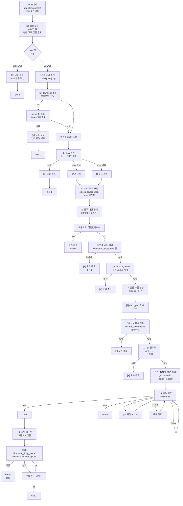
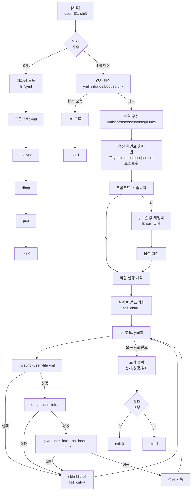

# WORKFLOW

## 01.AWX_nodeinfo_V2.sh 실행 흐름 (Mermaid)

## 02.source_dhcp_pxe.sh 실행 흐름

## 부연 설명

### 01 흐름의 주요 분기
- **노드정보 수집**: Y 선택 시 `awxkit/nodeinfo.sh` 호출, N 선택 시 기존 `${user}.txt` 사용
- **작업 진행**: N 선택 시 즉시 종료 (사전 점검 목적), Y 선택 시 inventory_delete → 이후 진행
- **메뉴 선택**: su(02 진입), exit(전체 종료), ls(yml 목록), 파일명(내용 출력)
- **02 호출 재시도**: 02 실패 시 "재시도 Y|N" 프롬프트로 반복

### 02 흐름의 주요 특징
- **호환 모드**: 인자 0개 시 기존 대화형 방식(1개 yml만) 유지
- **배치 모드**: 인자 1개 이상 시 자동 반복 (01에서 호출)
- **옵션 확인**: 최초 1회 전체 옵션 표시 후 N 선택 시 수동 수정
- **실패 처리**: 한 단계 실패 시 해당 yml의 나머지는 건너뛰고 다음 yml 진행
