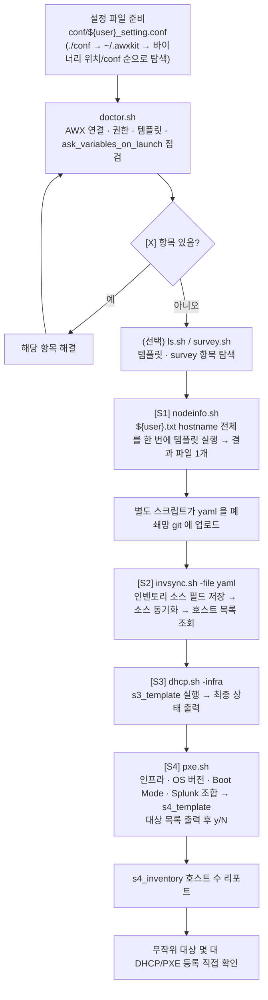

# ARCHITECTURE.md

| 폴더/파일 | 역할 |
|---|---|
| `cmd/` | 7개 하위 명령 진입점 → `awxkit-doctor`, `-ls`, `-survey`, `-nodeinfo`, `-invsync`, `-dhcp`, `-pxe` |
| `cli/` | 7개 바이너리 공유 로직: conf 로딩·클라이언트 생성(`client.go`), Job/동기화 폴링(`poll.go`), 번호/값/생략 선택지(`choice.go`) |
| `awx/` | AWX REST API 클라이언트 |
| `config/` | `${user}_setting.conf` 파싱과 탐색 순서 |
| `conf/` | 설정·대상 목록 예시 |
| `setup.sh` | 7개 바이너리 오프라인 빌드 (`vendor/`) |
| `doctor.sh` / `ls.sh` / `survey.sh` / `nodeinfo.sh` / `invsync.sh` / `dhcp.sh` / `pxe.sh` | 바이너리가 없으면 자동 빌드 후 실행하는 래퍼 |
| `PLAN.md` / `WORKLOG.md` | 설계·API 매핑 / 작업 이력 |
| `.gitattributes` | `*.sh`/`*.go`/`go.mod` LF 강제 |

수정 요청별로 볼 곳:

- **"새 단계(템플릿) 추가"** → `cmd/<새 이름>/` + `cli/` 공유 로직 재사용 + 같은 이름의 `.sh` 래퍼 + `setup.sh` 빌드 목록
- **"설정 키 추가"** → `config/` + README 3.3 표
- **"doctor 점검 항목 추가"** → `cmd/doctor/`
- **"Job 대기·실패 처리 변경"** → `cli/poll.go`

## 작업 흐름도

단계별 설명은 [WORKFLOW.md](WORKFLOW.md)를 참고하세요.

SVG 이미지로 보기 (workflow.svg)

