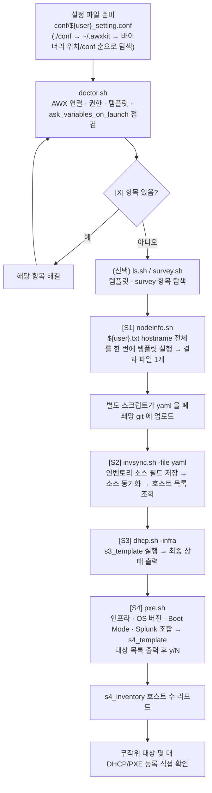

# 작업 흐름도 — awxkit (Ansible AWX 조작 도구)

설정 파일을 준비하고 `doctor`로 점검한 뒤 **[S1] NodeInfo → [S2] 인벤토리 동기화 → [S3] DHCP 등록 → [S4] PXE 등록** 순서로 진행하는 흐름입니다.
각 단계의 옵션은 [README.md](README.md)를 참고하세요.

SVG 이미지로 보기 (workflow.svg)

