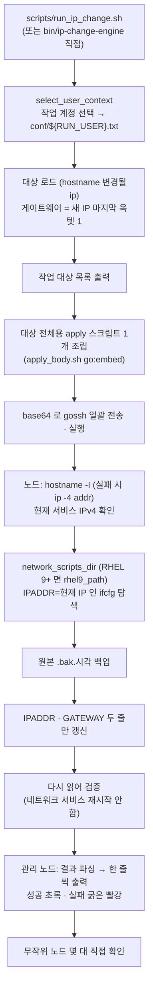

# 작업 흐름도 — ip_change (RHEL 노드 IP · 게이트웨이 일괄 변경)

관리 노드에서 apply 스크립트 하나를 만들어 `gossh`로 대상 노드에 보내고, 노드에서 ifcfg 파일의 두 키만 바꾸는 흐름입니다.
자세한 설명은 [README.md](README.md)의 "실행 흐름"을 참고하세요.

```mermaid
flowchart TD
    A["scripts/run_ip_change.sh<br/>(또는 bin/ip-change-engine 직접)"] --> B["select_user_context<br/>작업 계정 선택 → conf/${RUN_USER}.txt"]
    B --> C["대상 로드 (hostname 변경될ip)<br/>게이트웨이 = 새 IP 마지막 옥텟 1"]
    C --> D["작업 대상 목록 출력"]
    D --> E["대상 전체용 apply 스크립트 1개 조립<br/>(apply_body.sh go:embed)"]
    E --> F["base64 로 gossh 일괄 전송 · 실행"]
    F --> G["노드: hostname -I (실패 시 ip -4 addr)<br/>현재 서비스 IPv4 확인"]
    G --> H["network_scripts_dir (RHEL 9+ 면 rhel9_path)<br/>IPADDR=현재 IP 인 ifcfg 탐색"]
    H --> I["원본 .bak.시각 백업"]
    I --> J["IPADDR · GATEWAY 두 줄만 갱신"]
    J --> K["다시 읽어 검증<br/>(네트워크 서비스 재시작 안 함)"]
    K --> L["관리 노드: 결과 파싱 → 한 줄씩 출력<br/>성공 초록 · 실패 굵은 빨강"]
    L --> M["무작위 노드 몇 대 직접 확인"]
```
