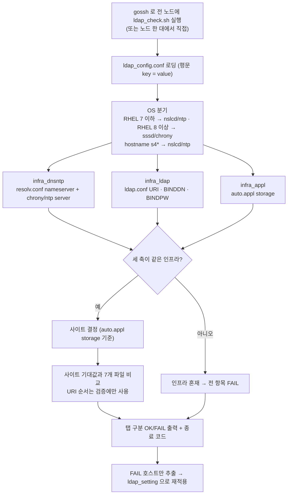

# 작업 흐름도 — ldap_check (LDAP · DNS · NTP · autofs 정합성 검사)

노드에서 설정 파일을 읽기만 해서 인프라·사이트를 판별하고 7개 파일을 OK/FAIL로 출력하는 흐름입니다.
판별 규칙은 [README.md](README.md)의 "판별 방식 — 3중 교차 검증"을 참고하세요.

```mermaid
flowchart TD
    A["gossh 로 전 노드에 ldap_check.sh 실행<br/>(또는 노드 한 대에서 직접)"] --> B["ldap_config.conf 로딩 (평문 key = value)"]
    B --> C["OS 분기<br/>RHEL 7 이하 → nslcd/ntp · RHEL 8 이상 → sssd/chrony<br/>hostname s4* → nslcd/ntp"]
    C --> D1["infra_dnsntp<br/>resolv.conf nameserver + chrony/ntp server"]
    C --> D2["infra_ldap<br/>ldap.conf URI · BINDDN · BINDPW"]
    C --> D3["infra_appl<br/>auto.appl storage"]
    D1 --> E{"세 축이 같은 인프라?"}
    D2 --> E
    D3 --> E
    E -- 아니오 --> F["인프라 혼재 → 전 항목 FAIL"]
    E -- 예 --> G["사이트 결정 (auto.appl storage 기준)"]
    G --> H["사이트 기대값과 7개 파일 비교<br/>URI 순서는 검증에만 사용"]
    H --> I["탭 구분 OK/FAIL 출력 + 종료 코드"]
    F --> I
    I --> J["FAIL 호스트만 추출 → ldap_setting 으로 재적용"]
```
