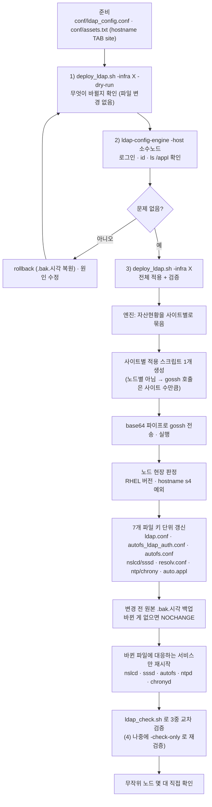

# 작업 흐름도 — ldap_setting (LDAP · DNS · NTP · autofs 일괄 적용)

자산현황을 읽어 사이트별 적용 스크립트를 만들고 `gossh`로 배포한 뒤 `ldap_check`로 검증하는 흐름입니다.
옵션은 [README.md](README.md), 파일별 역할은 [ARCHITECTURE.md](ARCHITECTURE.md)를 참고하세요.

SVG 이미지로 보기 (workflow.svg)

