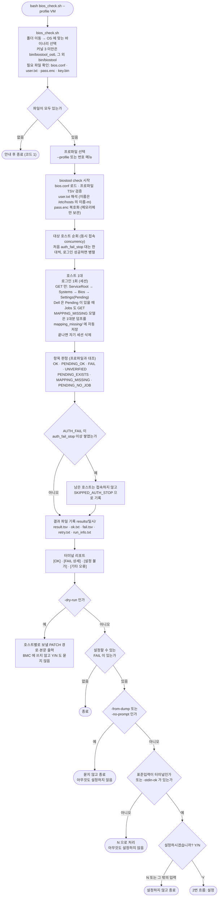
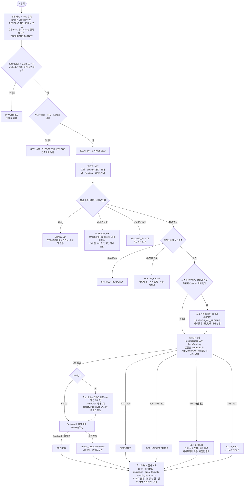
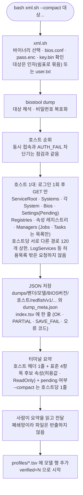
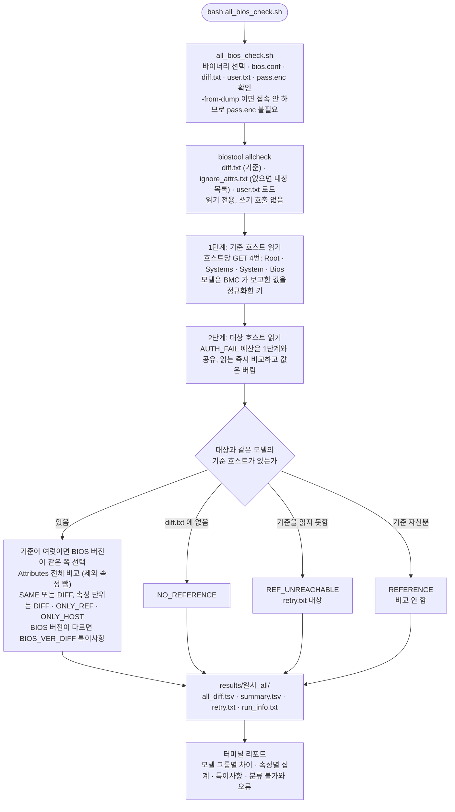
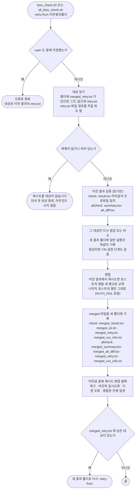

# 작업 흐름도 — redfish (BIOS 표준값 점검·설정 도구)

명령 한 번이 실행되는 주요 경로 5가지를 그렸습니다. 옵션 전체는 [README.md](README.md), 파일별 역할은 [ARCHITECTURE.md](ARCHITECTURE.md), 첫 실장비에서 사람이 확인할 것은 [FIRST_RUN.md](FIRST_RUN.md) 를 참고하세요.

각 흐름은 mermaid 로 그렸고(GitHub 에서 바로 렌더링됩니다), mermaid 를 렌더링한 그림을 같은 폴더에 함께 두었습니다: 1번 [workflow.svg](workflow.svg), 2번 [workflow_set.svg](workflow_set.svg), 3번 [workflow_dump.svg](workflow_dump.svg), 4번 [workflow_allcheck.svg](workflow_allcheck.svg), 5번 [workflow_retry.svg](workflow_retry.svg). mermaid 를 보지 못하는 뷰어에서는 SVG 를 여십시오.

공통 약속: 재부팅은 하지 않습니다. 호스트당 로그인은 1회, 끝나면 자기 세션만 삭제합니다. 허용목록 밖 호출(로그 조회·ClearLog·Reset 등)은 전송 전에 코드가 막습니다.

## 1. 점검 — `bash bios_check.sh --profile VM`

## 2. 설정 (점검 후 Y) — 호스트 1대 기준

## 3. 사전조사 — `bash xml.sh [대상...]`

## 4. 모델별 전체 비교 — `bash all_bios_check.sh`

## 5. 재시도 — `-retry-from 이전결과폴더`

