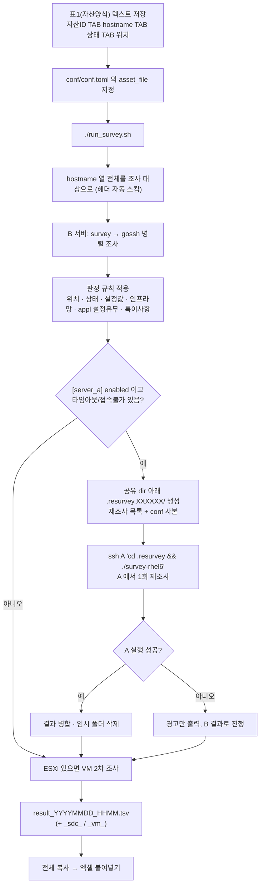

# 작업 흐름도 — survey (RHEL 서버 자산 조사)

표1(자산양식) 텍스트를 입력으로 `gossh` 병렬 조사를 하고, A·B 서버 연동으로 재조사한 뒤 탭 구분 결과 파일을 만드는 흐름입니다.
설정과 판정 규칙은 [README.md](README.md)를 참고하세요.

```mermaid
flowchart TD
    A["표1(자산양식) 텍스트 저장<br/>자산ID TAB hostname TAB 상태 TAB 위치"] --> B["conf/conf.toml 의 asset_file 지정"]
    B --> C["./run_survey.sh"]
    C --> D["hostname 열 전체를 조사 대상으로 (헤더 자동 스킵)"]
    D --> E["B 서버: survey → gossh 병렬 조사"]
    E --> F["판정 규칙 적용<br/>위치 · 상태 · 설정값 · 인프라망 · appl 설정유무 · 특이사항"]
    F --> G{"[server_a] enabled 이고<br/>타임아웃/접속불가 있음?"}
    G -- 아니오 --> K
    G -- 예 --> H["공유 dir 아래 .resurvey.XXXXXX/ 생성<br/>재조사 목록 + conf 사본"]
    H --> I["ssh A 'cd .resurvey && ./survey-rhel6'<br/>A 에서 1회 재조사"]
    I --> J{"A 실행 성공?"}
    J -- 예 --> J1["결과 병합 · 임시 폴더 삭제"] --> K
    J -- 아니오 --> J2["경고만 출력, B 결과로 진행"] --> K
    K["ESXi 있으면 VM 2차 조사"] --> L["result_YYYYMMDD_HHMM.tsv<br/>(+ _sdc_ / _vm_)"]
    L --> M["전체 복사 → 엑셀 붙여넣기"]
```
