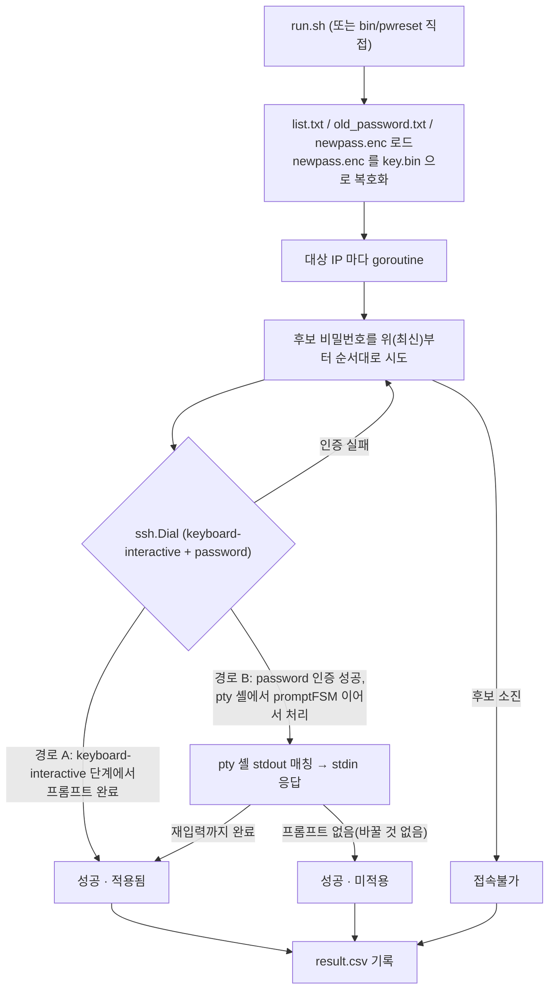

# ARCHITECTURE.md — 패스워드변경자동화 (pwreset)

| 파일 | 역할 |
|---|---|
| `run.sh` | 빌드(`go build`) → 입력 파일 존재 검증 → `bin/pwreset` 실행 |
| `cmd/pwreset/main.go` | CLI 진입점. 플래그 파싱, `-encrypt`/기본(reset) 모드 분기, 대상별 goroutine 병렬 처리, CSV 저장 |
| `cmd/pwreset/sshclient.go` | 대상 한 대에 접속해 비밀번호 변경 프롬프트에 응답. SSH 인증 단계 + pty 셸 단계 두 경로 |
| `cmd/pwreset/promptfsm.go` | 비밀번호 변경 프롬프트 상태머신. 두 경로가 이 상태머신을 공유 |
| `cmd/pwreset/cryptutil.go` | AES-256-GCM 대칭 암복호화, 키 파일(`key.bin`) 로드/생성 |
| `cmd/pwreset/targets.go` | `list.txt`(IP 목록), `old_password.txt`(후보 비밀번호) 파싱 |
| `cmd/pwreset/report.go` | 결과를 `result.csv` 로 기록 |
| `list.txt.example`, `old_password.txt.example` | 입력 파일 형식 예시. 실제 값은 없음 |
| `.gitignore` | `list.txt`/`old_password.txt`/`newpass.enc`/`key.bin`/`result.csv`/`bin/` 커밋 차단 |

## 수정 요청별로 볼 곳

| 요청 | 볼 파일 |
|---|---|
| "새 프롬프트 문구(정규식) 추가/변경" | `cmd/pwreset/promptfsm.go` 의 `reCurrent`/`reNew`/`reRetype`/`reSuccess`/`shellPrompts` |
| "SSH 인증 방식 변경(키 인증 추가 등)" | `cmd/pwreset/sshclient.go` 의 `tryCandidate`, `ssh.ClientConfig` |
| "pty 셸 타임아웃/버퍼 크기 변경" | `cmd/pwreset/sshclient.go` 의 `dialTimeout`/`readTimeout`/`sessTimeout`, `runShell` |
| "CLI 옵션 추가" | `cmd/pwreset/main.go` |
| "암호화 방식 변경" | `cmd/pwreset/cryptutil.go` |
| "입력 파일 형식 변경" | `cmd/pwreset/targets.go` + `list.txt.example`/`old_password.txt.example` 동시 갱신 |
| "결과 CSV 컬럼 추가" | `cmd/pwreset/report.go` 의 `Result`/`writeCSV` |
| "병렬 처리 방식 변경(동시 수 제한 등)" | `cmd/pwreset/main.go` 의 `runReset` |

## 처리 흐름

1. `main.go`: `-encrypt` 면 `runEncrypt`(평문 → AES-256-GCM 암호화 → `newpass.enc` 저장), 아니면 `runReset`
2. `runReset`: 키 로드 → `newpass.enc` 복호화(메모리에서만 평문 유지) → `list.txt`/`old_password.txt` 로드
3. 대상(IP)마다 goroutine 하나씩 띄워 `processHost` 병렬 실행
4. `processHost`: `old_password.txt` 의 후보를 **위(최신)부터 순서대로** 시도. 인증 실패면 다음 후보로, 접속(로그인) 성공하면 그 결과를 바로 반환
5. 한 후보로 `tryCandidate`(`sshclient.go`) 호출:
   - `ssh.Dial` 로 접속 시도. `keyboard-interactive` 콜백과 일반 `password` 인증을 함께 제시
   - **경로 A — SSH 인증 단계에서 프롬프트가 뜨는 경우**: 서버가 keyboard-interactive 로
     `Current password`/`New password`/`Retype` 질문을 던지면, `promptFSM.answer()` 가
     즉시 그 자리에서 응답. 재입력까지 끝나면 `fsm.completed()` 가 true 가 되고 인증 자체가 성공으로 끝남
   - **경로 B — 일반 password 인증으로 로그인에 성공한 뒤, 셸 단계에서 프롬프트가 뜨는 경우**:
     `runShell` 이 pty 세션을 열고 stdout 을 읽으며 `promptFSM.feed()` 로 같은 문구를 매칭해 stdin 에 입력
6. 결과를 `Result{IP, FoundIndex, Status, Applied}` 로 모아 `report.go` 가 CSV 로 기록

## 프롬프트 상태머신 (`promptfsm.go`)

두 경로(SSH 인증 단계 / pty 셸 단계)가 던지는 문구는 같으므로(`Current
password`, `New password`, `Retype new password`) 상태머신 하나를 공유합니다.

| 상태 | 의미 | 다음 응답 |
|---|---|---|
| `stateWaitCurrentOrNew` | 초기 상태. Current/New 중 먼저 오는 쪽을 기다림 | Current 매칭 시 후보 비밀번호, New 매칭 시(Current 를 건너뛰고 바로 New 가 온 경우) 새 비밀번호 |
| `stateWaitNew` | Current 응답 후, New 프롬프트를 기다림 | 새 비밀번호 |
| `stateWaitRetype` | New 응답 후, 재입력 프롬프트를 기다림 | 새 비밀번호(재입력) |
| `stateDoneOrClosed` | 재입력까지 완료. 성공 판정만 남음 | 없음(`reSuccess` 문구 또는 셸 프롬프트 매칭 시 `success=true`) |

`completed()` 는 `state == stateDoneOrClosed` 여부만 봅니다 — 재입력 응답을
**보냈는지**로 성공을 판정하며, 서버가 실제로 받아들였는지(예: 정책 위반으로
거부)는 이 상태머신 레벨에서는 구분하지 않습니다.

## 반드시 지킬 것

1. **계정은 `root` 고정입니다.** `sshclient.go` 의 `ssh.ClientConfig.User` 를
   바꾸면 계획서의 전제(root 로그인 복구)가 깨집니다.
2. **호스트 키 검증을 하지 않습니다(`ssh.InsecureIgnoreHostKey()`).** 랩
   환경 소수 서버 전제이기 때문입니다. 신뢰할 수 없는 네트워크 대상으로
   범위를 넓히려면 이 부분부터 다시 설계해야 합니다.
3. **새 비밀번호를 로그·CSV·디스크에 평문으로 남기지 마십시오.** `report.go`
   의 `Result` 에는 새 비밀번호 필드가 없습니다 — 컬럼을 추가할 때 실수로
   넣지 않도록 주의하십시오.
4. **`old_password.txt` 는 읽기 전용으로만 다룹니다.** 비밀번호 원문을
   훼손하지 않도록 `targets.go` 의 `loadPasswords` 는 좌우 공백을 다듬지
   않습니다.
5. **계정 잠금 정책이 있는 서버에는 쓰지 않는다는 전제입니다.** 실패한
   후보마다 재시도 간 딜레이가 없는 것도 이 전제 때문입니다(`main.go` 주석
   참고). 잠금 정책이 있는 대상으로 범위를 넓히려면 딜레이/재시도 제한부터
   추가해야 합니다.
6. **`old_password.txt.example`/`list.txt.example` 의 형식을 바꿀 때는
   `targets.go` 의 파싱 로직과 같이 갱신하십시오.**
