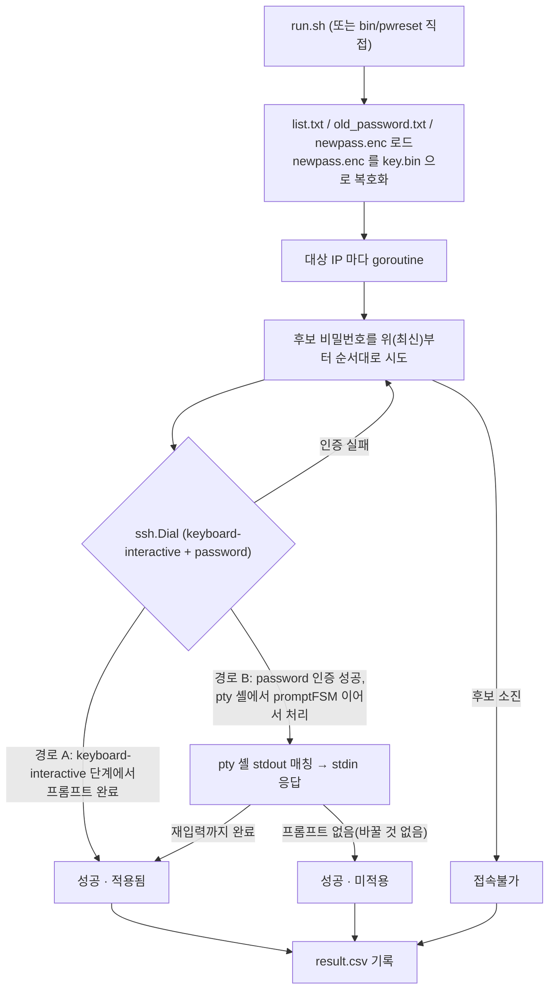

# 작업 흐름도 — 패스워드변경자동화 (pwreset)

과거 비밀번호 후보로 자동 로그인해, SSH 인증 단계 또는 로그인 후 pty 셸
단계에서 뜨는 비밀번호 변경 프롬프트를 처리하는 흐름입니다. 자세한 설명은
[README.md](README.md)와 [ARCHITECTURE.md](ARCHITECTURE.md)를 참고하세요.

```mermaid
flowchart TD
    A["run.sh (또는 bin/pwreset 직접)"] --> B["list.txt / old_password.txt / newpass.enc 로드<br/>newpass.enc 를 key.bin 으로 복호화"]
    B --> C["대상 IP 마다 goroutine"]
    C --> D["후보 비밀번호를 위(최신)부터 순서대로 시도"]
    D --> E{"ssh.Dial (keyboard-interactive + password)"}
    E -->|"인증 실패"| D
    E -->|"경로 A: keyboard-interactive 단계에서<br/>프롬프트 완료"| G["성공 · 적용됨"]
    E -->|"경로 B: password 인증 성공,<br/>pty 셸에서 promptFSM 이어서 처리"| F["pty 셸 stdout 매칭 → stdin 응답"]
    F -->|"재입력까지 완료"| G
    F -->|"프롬프트 없음(바꿀 것 없음)"| H["성공 · 미적용"]
    D -->|"후보 소진"| I["접속불가"]
    G --> J["result.csv 기록"]
    H --> J
    I --> J
```
