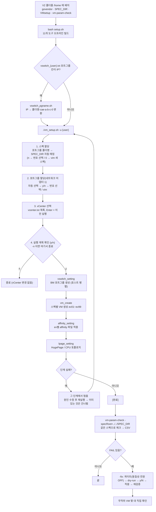

# ARCHITECTURE.md

| 폴더/파일 | 역할 |
|---|---|
| `README.md` | V2 전체 소개, 빌드/배치/사용 순서 |
| `setup.sh` | **전체 오프라인 빌드** — 각 도구의 setup.sh 를 한 번에 돌리고 요약 (`-l` 목록, `-c` 정리, 도구 이름으로 일부만). OS6(또는 `--os6`)면 빌드 대신 `bin_os6/*.gz` 를 제자리에 푼다 |
| `build_os6.sh`, `bin_os6/` | OS6(커널 2.6.32)용 빌드 — Go 1.20 + govmomi vendor 사본 패치(slices/min/reflect.TypeFor). 결과는 gzip 으로 커밋 |
| `passwd_update.sh`, `secret_lib.sh` | vCenter/ESXi 비밀번호를 `secret/key` 로 암호화(`openssl enc -aes-256-cbc -md sha256`) 저장·갱신 / 풀기 함수. `secret/` 은 git 제외 |
| `govendor/govmomi-0.55.1-standard/` | VMsetup 도구들이 공유하는 오프라인 의존성 (각 `setup.sh`가 `vendor`로 링크) |
| `govendor/govmomi-0.39.0/` | vm-param-check 의존성 |
| `vcenter.txt` (git 제외, 예시 `vcenter.txt.example`) | vCenter 목록 — `vm_setup.sh`가 번호로 고르게 보여준다(없으면 vm-param-check 폴더의 `vcenter.txt`) |
| `SPEC_DIR/` | **공유 스펙** — `vswitch_<user>.txt`(BM 포트그룹 VLAN) + `<CAE폴더명>/<CAE폴더명>_spec.txt`(+affinity 파일). git에는 예시만 |
| `VMsetup/vm_setup.sh` | 전체 실행 스크립트: user 선택 → 스펙·포트그룹 자동 할당 → VM 표 y/n → 수동 선택 → vim → CAE 번호 변경(`ask_cae_number`) → vswitch/vm_create/affinity/lpage → vm-param-check `-specFolder` 체크 |
| `VMsetup/vswitch_pgname.sh` | `vswitch_<user>.txt`의 포트그룹 컬럼이 IP면 폴더명을 물어봐 `<폴더명>-cae-a-b-c-0`으로 변환(`/24` 가정). `vm_setup.sh` 실행 전 별도 단계 |
| `VMsetup/vm_create-source/main.go` | VM 생성(ev01~ev99, 데이터센터 여러 개, `-mapFile` VM 키) |
| `VMsetup/affinity_setting-source/main.go` | affinity 일괄 적용(`-vm_cnt` 1~99, ev마다 파일 필수 — 자동 계산 없음) |
| `VMsetup/lpage_setting-source/main.go` | HugePage/CPU 토폴로지(ev01~ev99) |
| `VMsetup/vswitch_setting-source/main.go` | BM 포트그룹 생성(호스트 병렬) |
| `VMsetup/nic_assign-source/main.go` | 네트워크 어댑터 1 포트그룹 교체 + 연결 체크 |
| `VMsetup/tag_setting-source`, `numa_preferht_setting-source`, `license_assign-source`, `mac_info-source`, `main_conn-source` | 그 밖의 단독 도구 |
| `vm-param-check-usability-improvement/vm-param-check/main.go` | 체크/`-fix` CLI 진입점, 플래그 등록(ev01~ev99, `-h`에는 ev02~99를 한 줄로 묶어 표시), `-specRoot`, `-specExport`, `-specFolder`(대상 전부에 한 스펙) |
| `.../vm-param-check/model/group.go` | ev 그룹 판정(`ClassifyGroup`)과 최대 개수(`MaxGroup=99`) — 이름이 `ev%02d` 두 자리라 99가 상한(ev100은 `ev10`을 포함해 판정이 깨짐) |
| `.../vm-param-check/config/spec.go` | 스펙 파일 파싱(`키="값"` 지원), 폴더명 정규화·매칭 |
| `.../vm-param-check/config/export.go` | `-specExport`: 스펙을 VM 생성용 `이름=값`으로 정규화하고 규칙(ev01 필수/연속/필수값) 검사 |
| `.../vm-param-check/checker/` | 항목별 체크(하드웨어/토폴로지/affinity/전원…) |
| `.../vm-param-check/fixer/` | `-fix` 계획·게이트·적용 |
| `.github/workflows/ci.yml` | V2 브랜치용 CI (V2 폴더가 저장소 루트일 때 동작) |

수정 요청별로 볼 곳:

- **"ev 개수를 늘려달라"** → `vm-param-check/model/group.go`(MaxGroup) + 각 도구의 `maxVMCount`/`maxGroup` 상수 + `tag_setting`의 `-vmCount` 검사 + `vm_setup.sh`의 `seq 1 99`(스펙 저장). 99를 넘기려면 VM 이름을 세 자리로 바꾸고 `ClassifyGroup`을 긴 이름 우선으로 고쳐야 한다
- **"스펙 키를 추가해달라"** → `config/export.go`(내보내기 규칙) + `vm_setup.sh`의 `build_flags`/`spec_key_list`
- **"vm_setup.sh 질문 흐름을 바꿔달라"** → `VMsetup/vm_setup.sh` 한 파일 (검증: `검증/vmsetup_test.sh`)
- **"VM 생성 옵션을 추가해달라"** → `vm_create-source/main.go`
- **"다른 vCenter 구조(데이터센터/폴더)에서 안 된다"** → 해당 도구의 데이터센터 조회 부분(`ContainerView`로 RootFolder부터 조회하는지 확인)
- **"vm_setup.sh 에 질문/출력을 추가해달라"** → `vm_setup.sh` (색: `info/warn/hdr` 함수, 질문: `prompt/ask_yn`). stdin 순서가 바뀌면 `검증/vmsetup_test.sh` 입력도 같이 고친다
- **"OS6 에서 안 뜬다"** → `build_os6.sh` 의 `patch_govmomi` (govmomi 가 새 Go 문법을 더 쓰면 패치 추가) → `bin_os6/` 다시 빌드
- **"호스트를 못 찾는다(FQDN/짧은 이름)"** → `vm_create`의 `lookupHost`, `vswitch_setting`의 `lookupHost` (정확한 이름 → 짧은 이름 비교, 두 도구가 같은 규칙)

## 작업 흐름도

단계별 설명은 [WORKFLOW.md](WORKFLOW.md)를 참고하세요.

SVG 이미지로 보기 (workflow.svg)

