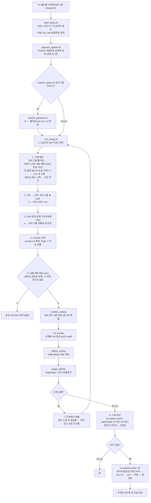

# 작업 흐름도 — V2 (VMsetup + vm-param-check, SPEC_DIR 공유)

V2 폴더를 서버에 배치한 뒤 **빌드 → VM 생성·설정(`vm_setup.sh`) → 체크·교정(`vm-param-check`)** 으로 이어지는 전체 흐름입니다.
두 도구는 같은 스펙 폴더 `SPEC_DIR`를 읽습니다. 자세한 옵션은 [README.md](README.md), 파일별 역할은 [ARCHITECTURE.md](ARCHITECTURE.md)를 참고하세요.

SVG 이미지로 보기 (workflow.svg)

## 단계 설명

| 단계 | 도구 | 설명 |
|---|---|---|
| 배치·빌드 | `setup.sh` | OS8: `GOPROXY=off`, `-mod=vendor`로 12개 도구를 오프라인 빌드. OS6: `bin_os6/*.gz`(Go 1.20 빌드)를 제자리에 설치. `-l` 목록, `-c` 정리 |
| 비밀번호 | `passwd_update.sh` | vCenter/ESXi 비밀번호를 `secret/key`로 암호화 저장. 이후 환경변수 없이 실행. 비밀번호가 바뀌면 다시 실행 |
| 포트그룹명 변환 (선택) | `VMsetup/vswitch_pgname.sh` | `vswitch_<user>.txt`의 포트그룹 칸이 IP이면 `<폴더명>-cae-a-b-c-0`으로 변환, 원본은 `.bak` |
| 스펙·포트그룹 할당 | `VMsetup/vm_setup.sh` | user 선택 → 스펙 자동 매칭(CAE 번호 무시) → VM 표(스펙·포트그룹) y/n. 못 정한 것은 번호 선택 또는 vim 입력. CAE 번호 변경 질문 |
| 생성·설정 | `vswitch_setting` → `vm_create` → `affinity_setting` → `lpage_setting` | 실패하면 그 단계에서 멈춤. 재실행 시 이미 있는 포트그룹/VM은 건너뜀 |
| 스펙 체크 | `vm_setup.sh` → `vm-param-check -specFolder` | 방금 만든 VM 만 실행한 스펙으로 체크, `[일치]`/`[차이]` 요약 |
| 교정 | `vm-param-check -fix` | 게이트(스펙별 동질성·전원 OFF) → dry-run → 확인 → 적용 → 재검증 |
| 사후 확인 | 사람 | 설정 변경 후 무작위 VM 몇 대를 직접 확인 |
