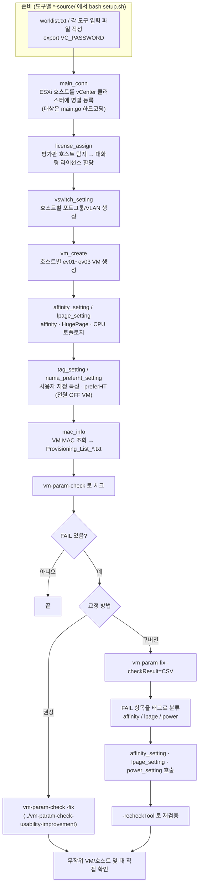

# ARCHITECTURE.md

| 폴더/파일 | 역할 |
|---|---|
| `README.md` | 폴더 소개, 빌드·사용 순서, `power_setting` 안내 |
| `WORKFLOW.md` | 작업 흐름도 |
| `vm-param-fix/` | (구버전) 체크 CSV를 affinity/lpage/power 태그로 나눠 외부 도구를 호출하는 오케스트레이터. `power_setting` 바이너리(소스 없음, 유일한 사본) 포함 |
| `affinity_setting-source/main.go` | ev01~ev03 affinity 일괄 적용 |
| `lpage_setting-source/main.go` | HugePage / CPU 토폴로지 일괄 적용 |
| `vm_create-source/main.go` | 호스트별 VM 생성 (`-vmCount` 1~3) |
| `vswitch_setting-source/main.go` | 표준 vSwitch 포트그룹 일괄 생성 |
| `tag_setting-source/main.go` | VM 사용자 지정 특성 설정 |
| `numa_preferht_setting-source/main.go` | `numa.vcpu.preferHT=TRUE` 일괄 적용 (전원 OFF VM만) |
| `license_assign-source/main.go` | 평가판 라이선스 호스트 탐지 → 대화형 할당 |
| `mac_info-source/main.go` | VM MAC 조회 → Kickstart 프로비저닝 목록 생성 (읽기 전용) |
| `main_conn-source/main.go` | ESXi 호스트를 vCenter 클러스터에 병렬 등록 (대상 하드코딩) |
| `*-source/setup.sh` | 도구별 오프라인 빌드 (`vendor/`, `-mod=vendor`) |

수정 요청별로 볼 곳:

- **"VM 생성 옵션 추가"** → `vm_create-source/main.go` (ev01~ev99가 필요하면 V2의 `../V2/VMsetup/vm_create-source`를 쓰세요)
- **"affinity/lpage 적용 방식 변경"** → 해당 `*-source/main.go` 한 파일
- **"교정 흐름 변경"** → 새로 만들지 말고 `../vm-param-check-usability-improvement/vm-param-check/fixer/`(`-fix`)를 고치는 것을 권장

## 작업 흐름도

단계별 설명은 [WORKFLOW.md](WORKFLOW.md)를 참고하세요.

SVG 이미지로 보기 (workflow.svg)

