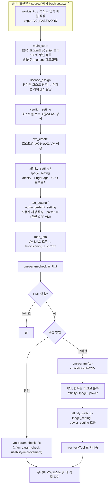

# 작업 흐름도 — VM_setup (V1 개별 설정 도구 모음)

VM_setup은 개별 도구를 필요한 순서대로 단독 실행하는 모음입니다. 아래는 **VM을 새로 만들 때의 일반적인 순서**와,
구버전 오케스트레이터 `vm-param-fix`의 **체크 CSV 기반 교정 흐름**입니다. ev01~ev99를 한 번에 처리하는 확장판은 [`../V2/WORKFLOW.md`](../V2/WORKFLOW.md)를 참고하세요.

SVG 이미지로 보기 (workflow.svg)

## 단계 설명

| 단계 | 도구 | 설명 |
|---|---|---|
| 호스트 등록 | `main_conn-source` | 커맨드라인 옵션 없음. `main.go`의 vCenter URL·클러스터·호스트 목록을 고친 뒤 재빌드해 실행 |
| 라이선스 | `license_assign-source` | 평가판 호스트만 골라, 사람이 라이선스 번호를 골라 할당(대화형) |
| 네트워크 | `vswitch_setting-source` | `호스트 포트그룹 VLAN` 목록으로 표준 vSwitch에 포트그룹 생성, 이미 있으면 건너뜀 |
| VM 생성·설정 | `vm_create`, `affinity_setting`, `lpage_setting`, `tag_setting`, `numa_preferht_setting` | 각각 단독 실행. preferHT는 전원이 꺼진 VM에만 적용 |
| 프로비저닝 목록 | `mac_info-source` | 읽기 전용. VM MAC을 모아 Kickstart용 목록 파일 생성 |
| 교정 | `vm-param-check -fix`(권장) / `vm-param-fix`(구버전) | `vm-param-fix`는 CSV를 태그로 나눠 외부 도구 3개를 호출. `power_setting`은 바이너리만 있음 |
| 사후 확인 | 사람 | 설정 변경 후 무작위 대상 몇 대를 직접 확인 |
