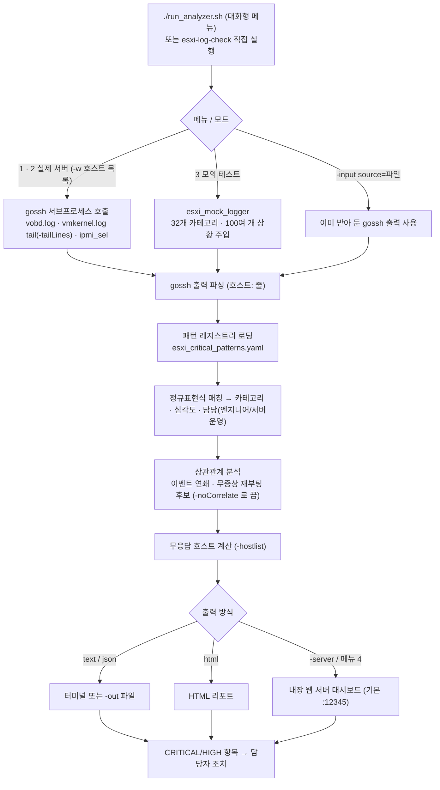

# ARCHITECTURE.md

| 폴더/파일 | 역할 |
|---|---|
| `main.go` | CLI 진입점: 옵션 파싱, 입력 수집, 분석·리포트 실행 |
| `collect.go` | `-w` 모드: gossh 서브프로세스로 vobd.log/vmkernel.log/ipmi_sel 수집 |
| `esxi_critical_patterns.yaml` | 패턴 레지스트리 (32개 카테고리, 정규표현식, 힌트·권고안) |
| `internal/gossh/` | gossh 출력(`호스트: 줄`) 파싱 |
| `internal/registry/` | 패턴 레지스트리 로딩 |
| `internal/match/` | 로그 패턴 매칭 엔진 |
| `internal/correlate/` | 이벤트 상관관계, 무증상 재부팅 후보 판정 |
| `internal/report/` | 텍스트/HTML 리포트 |
| `internal/mock/` | 모의 로그 생성기·테스트 시나리오 |
| `run_analyzer.sh` | 대화형 메뉴 (권장 사용법) |
| `start_server.sh` / `stop_server.sh` / `run_test_server.sh` | 웹 서버 모드 시작·중지 / 모의 테스트 서버 |
| `setup.sh` | 오프라인 빌드 (`vendor/`, `-mod=vendor`) |

수정 요청별로 볼 곳:

- **"새 장애 패턴 추가"** → `esxi_critical_patterns.yaml` (+ 모의 시나리오는 `internal/mock/`)
- **"수집 대상 로그 추가"** → `collect.go` + YAML의 sources
- **"리포트 모양 변경"** → `internal/report/`
- **"연쇄 판정 규칙 변경"** → `internal/correlate/`

## 작업 흐름도

단계별 설명은 [WORKFLOW.md](WORKFLOW.md)를 참고하세요.

SVG 이미지로 보기 (workflow.svg)

