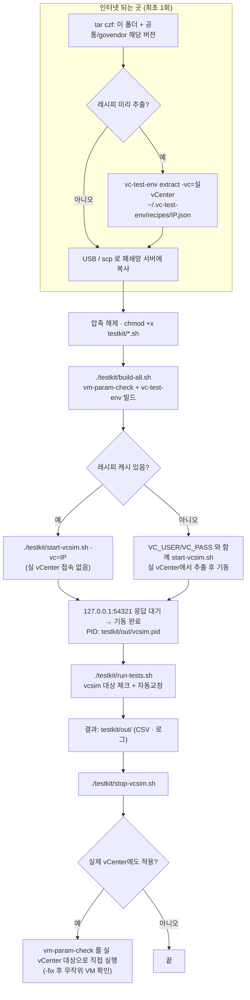

# ARCHITECTURE.md

| 폴더/파일 | 역할 |
|---|---|
| `README.md` | 두 도구를 묶어 빌드·테스트하는 절차 |
| `WORKFLOW.md` | 빌드 → vcsim 기동 → 테스트 → 종료 흐름도 |
| `vm-param-check/` | 체크+자동교정 도구 사본 (구조는 `../vm-param-check-usability-improvement/ARCHITECTURE.md`와 같음) |
| `vc-test-env/` | 실 vCenter 구조를 레시피로 추출해 vcsim에 재현하는 도구 (`extract` / `tree` / `build` / `diff`) |
| `testkit/build-all.sh` | 두 도구 빌드 |
| `testkit/start-vcsim.sh` | 레시피로 vcsim 기동 (127.0.0.1:54321, PID는 `testkit/out/vcsim.pid`) |
| `testkit/run-tests.sh` | vcsim 대상 체크+자동교정 테스트, 결과는 `testkit/out/` |
| `testkit/stop-vcsim.sh` | vcsim 종료 |

의존성: `vm-param-check` → `.claude/공통/govendor/govmomi-0.39.0`, `vc-test-env` → `.claude/공통/govendor/govmomi-0.55.1-vcsim` (각 `setup.sh`가 `vendor`로 링크).

수정 요청별로 볼 곳:

- **"테스트 시나리오 추가"** → `testkit/run-tests.sh`
- **"vcsim에 재현할 필드 추가"** → `vc-test-env/README.md`의 "필드 추가하는 법"
- **"체크/교정 로직 수정"** → `vm-param-check/`(다른 사본과 함께 반영)

## 작업 흐름도

단계별 설명은 [WORKFLOW.md](WORKFLOW.md)를 참고하세요.

SVG 이미지로 보기 (workflow.svg)

