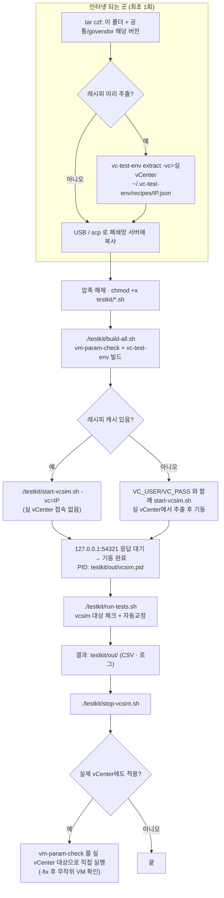

# 작업 흐름도 — integrated-vm-param-check-test-tool

폐쇄망 서버로 옮겨 **빌드 → vcsim 기동 → 체크·자동교정 테스트 → 종료**까지 진행하는 흐름입니다.
자세한 절차는 [README.md](README.md)를 참고하세요.

```mermaid
flowchart TD
    subgraph ONLINE["인터넷 되는 곳 (최초 1회)"]
        A["tar czf: 이 폴더 + 공통/govendor 해당 버전"] --> A2{"레시피 미리 추출?"}
        A2 -- 예 --> A3["vc-test-env extract -vc=실vCenter<br/>~/.vc-test-env/recipes/IP.json"]
        A2 -- 아니오 --> B
        A3 --> B["USB / scp 로 폐쇄망 서버에 복사"]
    end
    B --> C["압축 해제 · chmod +x testkit/*.sh"]
    C --> D["./testkit/build-all.sh<br/>vm-param-check + vc-test-env 빌드"]
    D --> E{"레시피 캐시 있음?"}
    E -- 예 --> F["./testkit/start-vcsim.sh -vc=IP<br/>(실 vCenter 접속 없음)"]
    E -- 아니오 --> F2["VC_USER/VC_PASS 와 함께 start-vcsim.sh<br/>실 vCenter에서 추출 후 기동"]
    F --> G["127.0.0.1:54321 응답 대기 → 기동 완료<br/>PID: testkit/out/vcsim.pid"]
    F2 --> G
    G --> H["./testkit/run-tests.sh<br/>vcsim 대상 체크 + 자동교정"]
    H --> I["결과: testkit/out/ (CSV · 로그)"]
    I --> J["./testkit/stop-vcsim.sh"]
    J --> K{"실제 vCenter에도 적용?"}
    K -- 예 --> L["vm-param-check 를 실 vCenter 대상으로 직접 실행<br/>(-fix 후 무작위 VM 확인)"]
    K -- 아니오 --> M["끝"]
```
