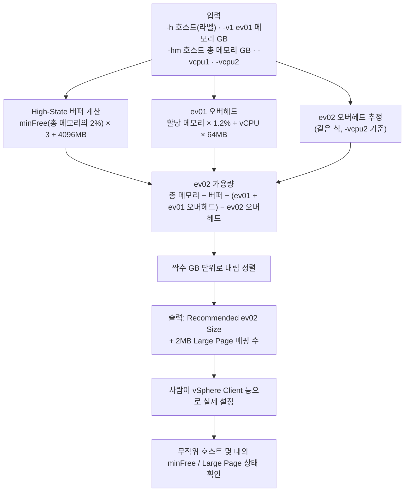

# ARCHITECTURE.md

| 폴더/파일 | 역할 |
|---|---|
| `main.go` | 단일 파일 프로그램: 옵션 파싱, `calculateHostReservedMB`(High-State 버퍼), `calculateVmOverheadMB`(VM 오버헤드), ev02 가용량 산출·출력 |
| `go.mod` | 모듈 정의 (외부 의존성 없음) |
| `setup.sh` | `go build -o lpage_search main.go` |
| `README.md` / `WORKFLOW.md` | 사용법 / 계산 흐름도 |

수정 요청별로 볼 곳:

- **"오버헤드 계수·버퍼 비율 조정"** → `main.go`의 `calculateVmOverheadMB`, `calculateHostReservedMB`
- **"입력 옵션 추가"** → `main.go`의 flag 정의 + README 3장 표

## 작업 흐름도

단계별 설명은 [WORKFLOW.md](WORKFLOW.md)를 참고하세요.

SVG 이미지로 보기 (workflow.svg)

