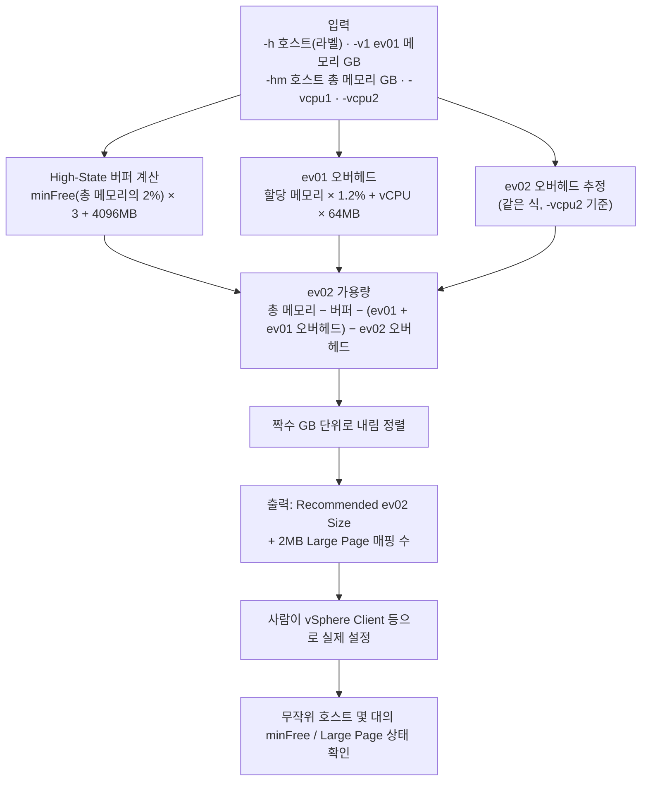

# 작업 흐름도 — lpage_search (ESXi Large Page 메모리 사이징)

입력값으로 ev02 VM에 안전하게 줄 수 있는 메모리를 계산하는 흐름입니다. vCenter/ESXi에는 접속하지 않습니다.
계산식은 [README.md](README.md)의 "4.1 계산 로직 개요"를 참고하세요.

SVG 이미지로 보기 (workflow.svg)

