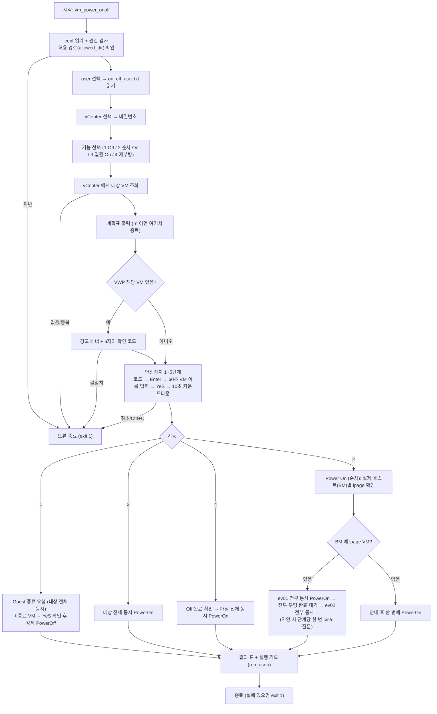

# 작업 흐름도 — vm_power_onoff

`vm_power_onoff -u hong` 한 번이 실행되는 흐름입니다. 옵션 전체는 [README.md](README.md), 파일별 역할은 [ARCHITECTURE.md](ARCHITECTURE.md)를 참고하세요.

```mermaid
flowchart TD
    A["시작: vm_power_onoff"] --> B["conf 읽기 + 권한 검사<br/>허용 경로(allowed_dir) 확인"]
    B -->|위반| X["오류 종료 (exit 1)"]
    B --> C["user 선택 → on_off_user.txt 읽기"]
    C --> D["vCenter 선택 → 비밀번호"]
    D --> E["기능 선택 (1 Off / 2 순차 On / 3 일괄 On / 4 재부팅)"]
    E --> F["vCenter 에서 대상 VM 조회"]
    F -->|없음/중복| X
    F --> G["계획표 출력 (-n 이면 여기서 종료)"]
    G --> H{"VWP 해당 VM 있음?"}
    H -->|예| I["경고 배너 + 6자리 확인 코드"]
    H -->|아니오| J
    I -->|불일치| X
    I --> J["안전장치 1~5단계<br/>코드 → Enter → 60초 VM 이름 입력 → YeS → 10초 카운트다운"]
    J -->|취소/Ctrl+C| X
    J --> K{"기능"}
    K -->|1| L1["Guest 종료 요청 (대상 전체 동시)<br/>미종료 VM → YeS 확인 후 강제 PowerOff"]
    K -->|3| L3["대상 전체 동시 PowerOn"]
    K -->|4| L4["Off 완료 확인 → 대상 전체 동시 PowerOn"]
    K -->|2| L2["Power On (순차): 실제 호스트(BM)별 lpage 확인"]
    L2 --> M{"BM 에 lpage VM?"}
    M -->|있음| N["ev01 전부 동시 PowerOn → 전부 부팅 완료 대기 → ev02 전부 동시 …<br/>(지연 시 단계당 한 번 c/s/q 질문)"]
    M -->|없음| O["안내 후 한 번에 PowerOn"]
    L1 --> R
    L3 --> R
    L4 --> R
    N --> R
    O --> R["결과 표 + 실행 기록 (run_user/)"]
    R --> S["종료 (실패 있으면 exit 1)"]
```

