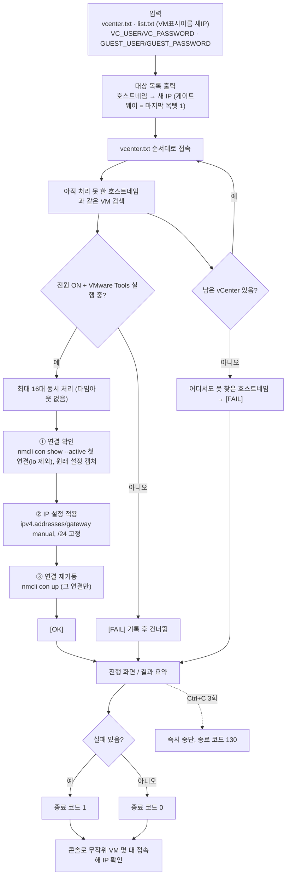

# ARCHITECTURE — 어디를 고치면 되나

| 경로 | 역할 |
|---|---|
| `cmd/vm-ip-change/main.go` | 진입점. 입력 파일 읽기, vCenter 에서 VM 찾기, 16대 워커 풀로 3단계 실행 |
| `internal/target/` | `vcenter.txt`/`list.txt` 파싱, 게이트웨이 계산, 게스트 임시파일용 ID |
| `internal/vsphere/` | vCenter 접속·VM 조회, 게스트 명령 3단계(연결 확인/IP 적용/재기동) 스크립트와 실행·폴링 |
| `internal/status/` | VM 별 진행 상태(단계·결과·경과시간) — 워커가 쓰고 화면이 읽음 |
| `internal/tui/` | 진행 화면(60초 전 한 줄, 이후 페이지 목록/상세), Ctrl+C 3회 종료와 중단 요약 |
| `cmd/fake-vcenter/` | 시험용 가짜 vCenter(vcsim + 가짜 게스트 명령 실행기)와 검증 보고 |
| `setup.sh` | 오프라인 빌드(두 바이너리) |
| `fake-vcenter.sh` | 가짜 vCenter 실행 래퍼(없으면 빌드) |
| `e2e-test.sh` | 가짜 vCenter 로 끝까지 돌려 PASS/FAIL 판정 |
| `vendor/` | 폐쇄망 빌드용 의존성(govmomi, uuid, x/term, x/sys) |

변경 유형별 시작점:
- 게스트 안에서 실행하는 명령(nmcli) 바꾸기 → `internal/vsphere/vsphere.go`
- 동시 처리 대수·단계 순서 → `cmd/vm-ip-change/main.go`
- 화면/키 조작/Ctrl+C → `internal/tui/tui.go` (+ `tui_test.go`)
- 시험 시나리오 → `cmd/fake-vcenter/main.go` (게스트 스크립트 단계 판별 `stageOf` 는
  vsphere.go 의 스크립트 문구에 의존 — 스크립트를 바꾸면 `main_test.go` 도 확인)

## 작업 흐름도

단계별 설명은 [WORKFLOW.md](WORKFLOW.md)를 참고하세요.

