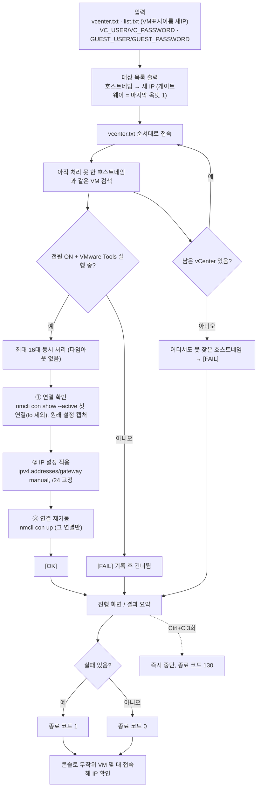
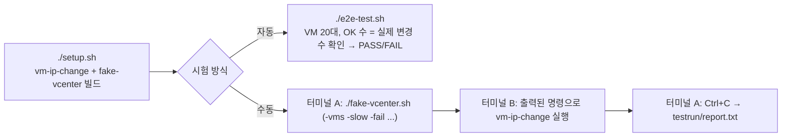

# 작업 흐름도 — vm-ip-change (vCenter Guest Operations 로 IP 재설정)

네트워크로 접속할 수 없는 VM 의 IP 를 vCenter → ESXi → VMware Tools 경로로 바꾸는 흐름입니다.
자세한 설명은 [README.md](README.md) 3장 "실행 흐름" 을 참고하십시오.

SVG 이미지로 보기 (workflow.svg)

## 시험 흐름 (실제 vCenter 없이)

SVG 이미지로 보기 (workflow-test.svg)

