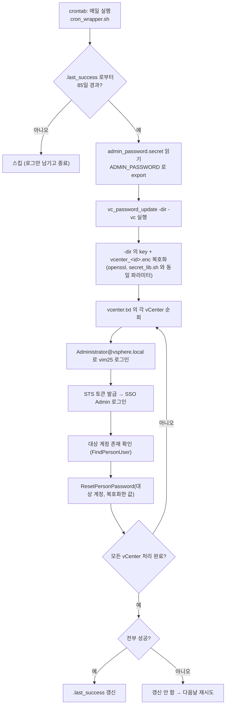

# ARCHITECTURE.md

| 폴더/파일 | 역할 |
|---|---|
| `main.go` | CLI 진입점 겸 전체 로직 — 인자 파싱, 대상 계정 비밀번호 복호화(`decryptSecret`), vCenter별 admin 로그인/SSO 로그인/재설정(`resetOne`), 결과 요약 |
| `go.mod` / `go.sum` | 의존성 선언 (`github.com/vmware/govmomi` v0.55.1) |
| `vendor/` | `../../공통/govendor/govmomi-0.55.1-vc-password-update` 심볼릭 링크 (git 비대상, `setup.sh`가 생성) |
| `run.sh` | 실행 편의 — 바이너리 없으면 `setup.sh` 자동 호출, 인자 전달, `ADMIN_PASSWORD` 없고 대화형이면 프롬프트 |
| `cron_wrapper.sh` | crontab 진입점 — 85일 경과 체크(`.last_success` 스탬프 파일), `admin_password.secret` 파일에서 비대화형으로 비밀번호 로딩 |
| `setup.sh` | 폐쇄망 오프라인 빌드 (`vendor/` 심볼릭 링크 생성 + `-mod=vendor go build`) |
| `vcenter.txt.example` | vCenter 목록 서식 예시 (`vcenter.txt`는 git 비대상) |
| `.github/workflows/ci.yml` | 커밋마다 빌드/vet/폐쇄망 빌드 확인 |
| `계획서.md` | 최초 기획 문서 — 가정, 설계 결정, 리스크 배경 |
| `WORKFLOW.md` / `workflow.svg` | 실행 흐름도 |

수정 요청별로 볼 곳:

- **"대상/admin 계정을 다르게 하고 싶다"** → `main.go`의 `-id`/`-adminId` 플래그, 기본값 상수(`defaultTargetID`/`defaultAdminID`)
- **"비밀번호 저장 방식을 바꾸고 싶다"** → `main.go`의 `decryptSecret`/`secretFile` (현재 `secret_lib.sh`와 동일한 openssl 파라미터로 shell-out)
- **"크론 주기를 바꾸고 싶다"** → `cron_wrapper.sh`의 `INTERVAL_DAYS`
- **"vCenter 접속이 너무 오래 걸려 다음 vCenter로 안 넘어간다"** → `main.go`의 `-timeout` (per-host `context.WithTimeout`)
- **"SSO Admin 로그인 방식이 바뀌었다(govmomi 업데이트)"** → `main.go`의 `ssoLogin` (STS 토큰 발급 → `ssoadmin.Client.Login`)
- **"의존성을 추가해야 한다"** → `go.mod`에 추가 후 인터넷 되는 Rocky Linux 호스트에서 `go mod tidy && go mod vendor`, 결과 `vendor/`를 `../../공통/govendor/govmomi-0.55.1-vc-password-update`에 복사해 커밋 (이 프로젝트는 `ssoadmin`/`sts` 패키지가 필요해 다른 프로젝트의 govmomi vendor 사본과 분리 관리함)

## 작업 흐름도

단계별 설명은 [WORKFLOW.md](WORKFLOW.md)를 참고하세요.

