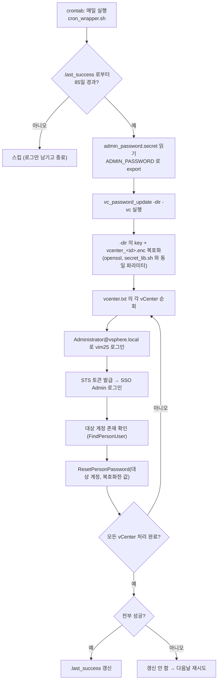

# 작업 흐름도 — vc_password_update

`cron_wrapper.sh` 한 번(또는 `run.sh` 수동 실행)이 실행되는 흐름입니다. 옵션 전체는
[README.md](README.md)를 참고하세요.

SVG 이미지로 보기 (workflow.svg)

## 단계 설명

1. **85일 경과 체크** — cron은 day-of-month 필드가 매월 1일 기준으로 리셋되어
   "정확히 85일마다"를 표현할 수 없다. `cron_wrapper.sh`는 매일 실행되도록 등록해 두고
   `.last_success` 스탬프 파일과 현재 시각을 비교해서 85일이 안 지났으면 조용히
   종료한다.
2. **admin 비밀번호 로딩** — crontab에는 비밀번호를 직접 적지 않는다.
   `admin_password.secret`(권한 600) 한 줄을 읽어 `ADMIN_PASSWORD` 환경변수로 넘긴다.
3. **대상 계정 비밀번호 복호화** — `-dir`로 받은 `secret/` 폴더의 `key`와
   `vcenter_<대상계정>.enc`를 `secret_lib.sh`와 동일한 openssl 파라미터로 복호화한다.
   기존 `passwd_update.sh`로 저장해 둔 파일을 그대로 재사용한다.
4. **vCenter 순회** — `vcenter.txt`의 각 vCenter에 대해 5~7단계를 반복한다. 한 vCenter가
   실패해도(연결 불가/타임아웃 등) 나머지는 계속 처리한다(`-timeout`으로 한도 설정).
5. **admin 로그인 + SSO 로그인** — vim25 세션 로그인과는 별도로, SSO Admin API는
   STS 토큰 기반 세션이 필요해 추가로 로그인한다.
6. **대상 계정 존재 확인** — 계정명 오타나 그 vCenter에 대상 계정이 없는 경우를
   실패로 명확히 구분해서 보고한다.
7. **비밀번호 재설정** — admin 강제 재설정(`ResetPersonPassword`)은 직전 비밀번호
   재사용 금지 정책을 우회하므로, 복호화한 값과 "같은 값"으로도 성공한다(README §6
   검증 이력 참고). 성공하면 vCenter 쪽 비밀번호 만료 타이머가 리셋된다.
8. **기준일 갱신** — 목록의 vCenter가 전부 성공했을 때만 `.last_success`를 갱신한다.
   일부라도 실패하면 갱신하지 않아 다음날 다시 시도한다 — 크론 자동 실행이라 부분
   실패를 조용히 넘기면 만료 임박을 놓칠 수 있기 때문이다.
