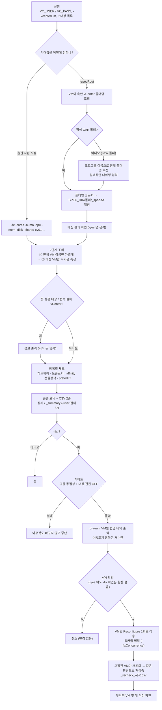

# ARCHITECTURE.md

| 폴더/파일 | 역할 |
|---|---|
| `README.md` | 프로젝트 소개, 빠른 시작, 갱신 방법 |
| `WORKFLOW.md` | 체크 → 교정 → 재검증 흐름도, 배포·갱신 흐름도 |
| `CHANGELOG.md` / `계획서.md` | 변경 이력 / 설계 배경·검증 근거 |
| `update.sh` | [폐쇄망] 업데이트 패키지의 실행 파일만 교체, 사용자 파일 보존 |
| `make_update_package.sh` | 폐쇄망용 업데이트 패키지(정적 빌드 + SHA256SUMS) 생성 |
| `update_deploy.sh` | [인터넷 되는 서버] standalone 브랜치로 제자리 갱신 + 재빌드 |
| `vm-param-check/main.go` | CLI 진입점: 옵션 파싱, `-specRoot` 병합, 전체 흐름 |
| `vm-param-check/config/` | 스펙 자동매칭(`spec.go`), `-initFolder`(`init.go`), Task 폴더 예외(`portgroup.go`), 대상 목록(`targets.go`) |
| `vm-param-check/vcenter/client.go` | vCenter 접속, 2단계 조회(`FetchVMs`), 폴더/포트그룹 조회 |
| `vm-param-check/checker/` | 항목별 체크: 하드웨어·토폴로지·affinity·전원정책·preferHT·고정값 |
| `vm-param-check/fixer/` | `-fix` 계획(`plan.go`), 게이트(`gates.go`), dry-run 출력(`describe.go`), 병렬 적용(`apply.go`) |
| `vm-param-check/report/` | 콘솔 / CSV / 요약 출력 |
| `vm-param-check/model/types.go` | 공용 데이터 구조체 |
| `vm-param-check/setup.sh` | 오프라인 빌드 (`../../../공통/govendor/govmomi-0.39.0`을 `vendor`로 링크) |
| `vm-param-check/folder_setup.sh`, `vm_setting_check_insert.sh` | 스펙 생성 / 체크·`-fix` 실행 대화형 래퍼 |

수정 요청별로 볼 곳:

- **"체크 항목 추가"** → `checker/` + `report/`(출력 컬럼) + 필요하면 `fixer/plan.go`(자동교정 대상 여부)
- **"스펙 키 추가"** → `config/spec.go`(파싱) + `main.go`(옵션 병합)
- **"조회가 느리다"** → `vcenter/client.go`의 2단계 조회
- **"교정 안전장치 변경"** → `fixer/gates.go`
- 같은 코드의 사본이 `../V2/…`, `../integrated-vm-param-check-test-tool/vm-param-check`, `../vm-param-setting-check`에도 있으므로 공유 코드 버그는 사본에도 똑같이 반영하세요.

## 작업 흐름도

단계별 설명은 [WORKFLOW.md](WORKFLOW.md)를 참고하세요.

