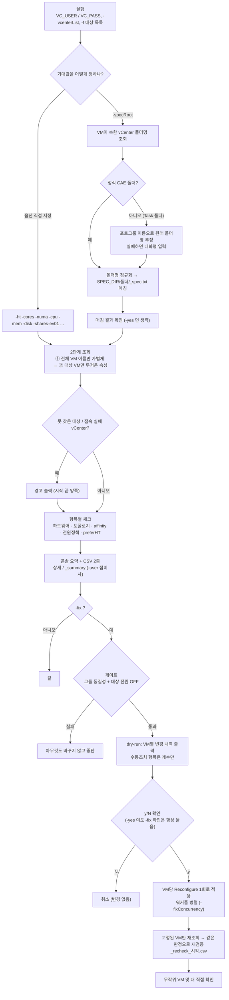
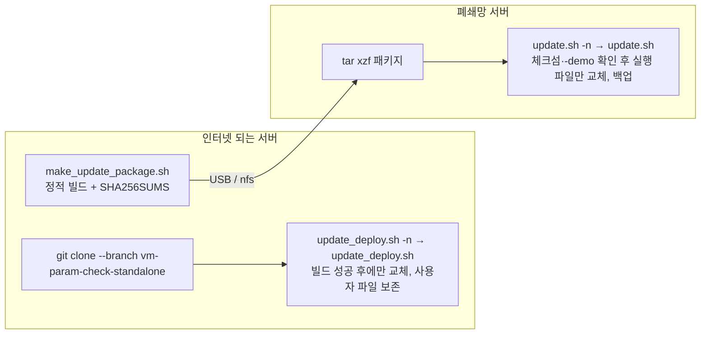

# 작업 흐름도 — vm-param-check (체크 + 자동교정)

`vm-param-check` 한 번 실행으로 **스펙 결정 → 대상 VM 조회 → 체크 → CSV → (선택) 교정 → 재검증**까지 이어지는 흐름입니다.
옵션 설명은 [vm-param-check/README.md](vm-param-check/README.md), 파일별 역할은 [ARCHITECTURE.md](ARCHITECTURE.md)를 참고하세요.

## 배포·갱신 흐름

## 단계 설명

| 단계 | 설명 |
|---|---|
| 기대값 결정 | 옵션을 직접 주거나, `-specRoot`로 VM이 속한 vCenter 폴더 이름에 맞는 스펙을 자동으로 찾음 |
| Task 폴더 예외 | 정식 폴더 규칙을 안 따르는 임시 폴더의 VM은 포트그룹 이름에서 폴더명을 추정, 실패하면 물어봄 |
| 2단계 조회 | 인벤토리 전체 이름만 먼저 훑고 대상 VM만 상세 조회 (3,000대 기준 3.22초 → 0.20초) |
| 체크·리포트 | 콘솔 `[1]` 요약 표 + `[2]` 상세, CSV 상세/요약 2종 |
| 교정 (`-fix`) | 게이트 → dry-run → y/N → VM당 Reconfigure 1회 → 재검증 CSV |
| 사후 확인 | 설정 변경 후 무작위 VM 몇 대를 직접 확인 |
