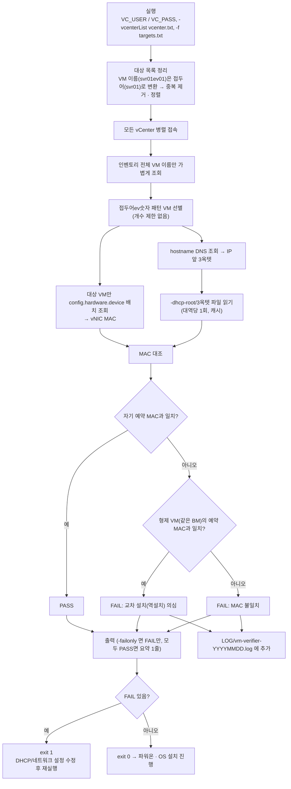

# ARCHITECTURE.md

| 폴더/파일 | 역할 |
|---|---|
| `main.go` | CLI 진입점: 옵션, 대상 목록 정리(VM 이름 → 접두어), 전체 흐름·출력·종료 코드 |
| `main_test.go` | 대상 목록 정리 등 진입점 로직 테스트 |
| `vc/` | vCenter 병렬 접속, 이름 조회 → 대상 VM만 vNIC MAC 배치 조회(`devices.go`) |
| `dhcp/` | DNS로 대역 결정, 3옥텟 이름의 DHCP 대역 파일 읽기·캐시 |
| `verify/verify.go` | 자기 예약 MAC 대조, 형제 VM 예약 MAC과 비교해 교차 설치 판정 |
| `auditlog/auditlog.go` | FAIL hostname을 `LOG/vm-verifier-YYYYMMDD.log`에 추가 |
| `setup.sh` | 오프라인 빌드 (`../../공통/govendor/govmomi-0.39.0`을 `vendor`로 링크) |
| `run.sh` | 빌드·계정·옵션을 물어보는 대화형 실행 스크립트 |
| `PLAN.md` / `CHANGELOG.md` | 설계 배경 / 변경 이력 |

수정 요청별로 볼 곳:

- **"판정 규칙 변경(역설치 조건 등)"** → `verify/verify.go`
- **"DHCP 파일 형식·경로가 바뀌었다"** → `dhcp/dhcp.go`
- **"조회가 느리다"** → `vc/vc.go`, `vc/devices.go`
- **"옵션 추가"** → `main.go` + README 3장 표

## 작업 흐름도

단계별 설명은 [WORKFLOW.md](WORKFLOW.md)를 참고하세요.

