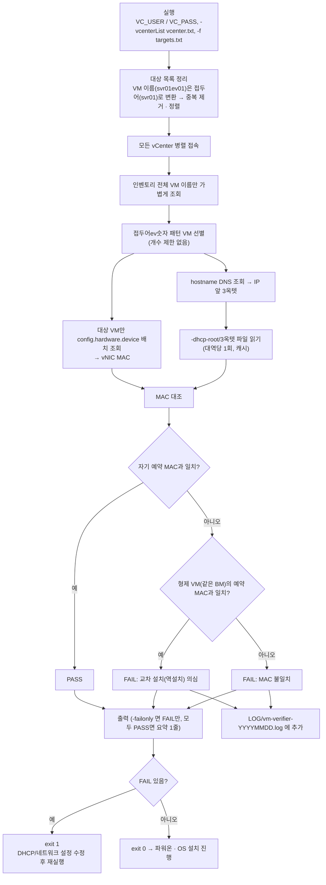

# 작업 흐름도 — vm-verifier (VM MAC ↔ DHCP 예약 MAC 교차 설치 검증)

VM 생성 직후, **파워온 전에** vCenter가 인식한 vNIC MAC과 DHCP 정적 예약 MAC을 대조하는 흐름입니다.
옵션은 [README.md](README.md), 설계 배경은 [PLAN.md](PLAN.md)를 참고하세요.

SVG 이미지로 보기 (workflow.svg)

## 단계 설명

| 단계 | 패키지 | 설명 |
|---|---|---|
| 대상 정리 | `main.go` | VM 이름을 적어도 BM 접두어로 바꾸고 중복 제거·정렬 |
| vCenter 조회 | `vc/` | 모든 vCenter 병렬 접속, 이름만 훑은 뒤 대상 VM만 장치 정보 배치 조회 |
| DHCP 조회 | `dhcp/` | DNS로 대역을 정하고, 3옥텟 이름의 대역 파일만 읽어 캐시 |
| 판정 | `verify/` | 자기 예약 MAC과 비교, 틀리면 형제 VM 예약 MAC과 비교해 역설치 판정 |
| 감사 로그 | `auditlog/` | FAIL hostname만 `LOG/vm-verifier-YYYYMMDD.log`에 추가 |
