# 10. V2 — VM 생성·설정(VMsetup) + 점검·교정(vm-param-check), SPEC_DIR 공유

## 한눈에 보기

| 항목 | 값 |
|---|---|
| **위험도** | 🔴 **VM 생성·포트그룹 생성·affinity/lpage 적용 등 실제 vCenter를 바꿉니다** (`-n`은 변경 없음) |
| 폴더 | `.claude/VM/V2/` (서버에는 V2 폴더를 통째로, 예: `/home/V2`) |
| 진입점 | `VMsetup/vm_setup.sh` (전체 과정), `VMsetup/*-source/<도구>` (개별 도구 11종) |
| 하는 일 | 호스트(BM)당 VM 1~99대(`ev01`~`ev99`)를 스펙 폴더 `SPEC_DIR` 기준으로 만들고 설정(MAC 수집·전원정책·라이선스까지 자동, 터미널이면 진행 모니터로 표시). 점검·교정은 같은 `SPEC_DIR`를 읽는 [11. vm-param-check](./11_vm-param-check.md) |
| 인증 | `vm_setup.sh`: `passwd_update.sh`로 등록한 암호 파일 → 직접 입력 (계정 `-id`, 기본 `lscsystems@vsphere.local`) / 개별 도구: `VC_PASSWORD` |

---

## 1. 바로 쓰는 명령어

```bash
# 1) 비밀번호 암호 파일 등록 (처음 한 번, 비밀번호가 바뀌면 다시)
cd /home/V2
./passwd_update.sh                       # vCenter, 계정 lscsystems@vsphere.local (다른 계정: -id <계정>)
./passwd_update.sh -list                 # 저장된 항목이 풀리는지 확인

# 2) 신규 VM 생성·설정 — 계획만 먼저 확인 (vCenter 변경 없음)
cd /home/V2/VMsetup
./vm_setup.sh -u <작업이름> -n

# 3) 신규 VM 생성·설정 — 실제 실행 (-u 없으면 user 번호 메뉴, vCenter 는 vcenter.txt 목록에서 번호 선택)
./vm_setup.sh -u <작업이름>

# 4) vCenter·계정을 직접 지정해서 실행
./vm_setup.sh -u <작업이름> -v <vCenter IP> -id <vCenter 계정>

# 5) vswitch_<작업이름>.txt 의 포트그룹 칸에 IP 를 적어 둔 경우 — 실행 전에 이름 형식으로 변환
bash vswitch_pgname.sh vswitch_<작업이름>.txt

# 6) 추가 점검 (vm_setup.sh 는 끝날 때 만든 VM 을 자동으로 스펙 체크함) → 11번 문서
cd /home/V2/vm-param-check-usability-improvement/vm-param-check
./vm-param-check -vcenterList=vcenter.txt -f=targets.txt -specRoot=../../SPEC_DIR -out=result.csv

# 이하 개별 도구 — 비밀번호는 환경변수 (암호 파일에서 꺼내기)
export VC_PASSWORD="$(. /home/V2/secret_lib.sh; secret_get vcenter lscsystems@vsphere.local)"

# 7) 만들어진 VM 의 네트워크 어댑터 1 포트그룹 교체 (+연결됨/전원 켤 때 연결)
cd /home/V2/VMsetup/nic_assign-source
./nic_assign -vcTargetIP=<vCenter IP> -id=<계정> -mapFile=nic_map.txt

# 8) DHCP 등록용 MAC 목록 추출 (읽기 전용) → Provisioning_List_<vCenterIP>.txt
cd /home/V2/VMsetup/mac_info-source
./mac_info -vcTargetIP=<vCenter IP> -id=<계정> -worklistFile=worklist.txt -arg1=<사이트> -argInt=<순번> -argStr=<KS프로파일>

# 9) numa.vcpu.preferHT=TRUE 일괄 적용 (켜진 VM 은 건너뜀)
cd /home/V2/VMsetup/numa_preferht_setting-source
./numa_preferht_setting -vc=<vCenter IP> -id=<계정> -f=vms.txt

# 10) 평가판 라이선스 호스트에 라이선스 할당 (대화형 — 번호 입력)
cd /home/V2/VMsetup/license_assign-source
./license_assign -vcTargetIP=<vCenter IP> -id=<계정> -worklistFile=worklist.txt
```

실행 후 무작위 VM 몇 대를 vSphere Client에서 직접 확인하세요.

---

## 2. V1(`VM_setup`) 대체 범위

V2가 V1 `VM_setup`의 도구를 모두 포함합니다. **V1 폴더에서 계속 쓰는 것은 `power_setting` 바이너리 하나뿐**입니다([17번](./17_VM_setup_잔여도구.md)).

| V1 `VM_setup/` | V2 | 비고 |
|---|---|---|
| `vm_create-source` | `VMsetup/vm_create-source` | ev01~ev99, FQDN/짧은 이름 매칭, 실패 시 종료코드 1 |
| `affinity_setting-source` | `VMsetup/affinity_setting-source` | ev마다 파일 필수, 자동 계산(`-ht`/`AUTO`) 삭제 |
| `lpage_setting-source` | `VMsetup/lpage_setting-source` | ev01~ev99 |
| `tag_setting-source` | `VMsetup/tag_setting-source` | ev01~ev99 |
| `vswitch_setting-source` | `VMsetup/vswitch_setting-source` | 호스트 병렬, FQDN/짧은 이름 매칭 |
| `numa_preferht_setting-source` | `VMsetup/numa_preferht_setting-source` | 동일 |
| `license_assign-source` | `VMsetup/license_assign-source` | 동일. `vm_setup.sh`가 스펙이 모두 끝난 뒤 BM 전체 대상 1회 호출 |
| `mac_info-source` | `VMsetup/mac_info-source` | 동일. `vm_setup.sh`가 스펙마다 `vm_create` 직후 호출(설치 정보 값 자동 전달, 디스크 값 자동매칭) |
| (없음) | `VMsetup/power_setting-source` | 신규(소스 있음): BM 전원정책 고성능 설정. `vm_setup.sh`가 스펙마다 `mac_info` 다음 자동 호출 |
| `main_conn-source` | `VMsetup/main_conn-source` | 동일 (옵션 없음, 소스 수정 후 빌드) |
| (없음) | `VMsetup/nic_assign-source` | 신규: 네트워크 어댑터 1 포트그룹 교체 |
| (없음) | `VMsetup/vm_setup.sh`, `vswitch_pgname.sh` | 신규: 전체 과정 실행, 포트그룹명 변환 |
| (없음) | `passwd_update.sh`, `secret_lib.sh` | 신규: 비밀번호 암호 파일 등록·풀기 |
| (없음) | `build_os6.sh`, `bin_os6/` | 신규: OS6(RHEL/CentOS 6)용 미리 빌드한 실행파일 |
| `vm-param-fix` (오케스트레이터) | `vm-param-check -fix` | V2에 넣지 않음 (대체됨) |
| `vm-param-fix/power_setting` | `VMsetup/power_setting-source` (신규, 소스 있음) | 호스트 전원정책 고성능 설정. **`vm_setup.sh`가 스펙마다 자동 호출**하므로 새로 작업할 때는 V1 바이너리가 필요 없음 → [17번](./17_VM_setup_잔여도구.md) |
| V1 `vm-param-check-usability-improvement` | `V2/vm-param-check-usability-improvement` | ev01~ev99, `-specExport` 추가 → [11번](./11_vm-param-check.md) |

---

## 3. 흐름도

`vm_setup.sh`는 **스펙마다** `vm_create` → `mac_info` → `power_setting` → `affinity_setting` → `lpage_setting`을 실행하고, 모든 스펙이 끝나면 **BM 전체를 대상으로 `license_assign`을 1회** 실행합니다(모두 실제로 호출하는 내부 단계입니다 — 별도 후속 도구가 아닙니다). 실행 계획을 확인(y)한 뒤 이 단계들은 터미널이면 **진행 모니터**(아래 표)로 보여줍니다.

```mermaid
flowchart TD
    A["준비<br/>VMsetup/작업이름.txt (BM 목록)<br/>VMsetup/vswitch_작업이름.txt (BM 포트그룹 VLAN)<br/>vcenter.txt · passwd_update.sh 암호 파일"]:::input --> B{"포트그룹 칸이 IP?"}
    B -- 예 --> B1["vswitch_pgname.sh<br/>IP → 폴더명-cae-a-b-c-0, 원본 .bak"] --> C
    B -- 아니오 --> C["./vm_setup.sh"]:::cmd
    C --> U["1. user 선택 (-u 없을 때)<br/>0 직접 선택 · 1 lsh · 2 ljh · 3 dhk"]
    U --> U0["설치 정보 — OS 버전 / 인프라 입력<br/>매번 물어봄 (건너뛰는 환경변수 없음)"]
    U0 --> D["2. 스펙 할당<br/>포트그룹 폴더명 → SPEC_DIR 자동 매칭 (CAE 번호 무시)"]
    D --> D0{"스펙에 affinity-evNN 없음?"}
    D0 -- 예 --> D3["ev별 affinity 골라 스펙에 추가? y/N"] --> D1
    D0 -- 아니오 --> D1{"자동 매칭 실패 BM?"}
    D1 -- 있음 --> D2["번호로 선택<br/>0 → vim 으로 새 스펙 + ev별 affinity"] --> E
    D1 -- 없음 --> E["3. 포트그룹 할당 (네트워크 어댑터 1)<br/>VM → 스펙 / 포트그룹 표 y/n"]
    E -- n / 자동 실패 --> E2["번호로 선택 / 0 → vim"] --> Q
    E -- y --> Q{"4. CAE 번호를 바꾸시겠습니까? y/N"}
    Q -- y --> Q1["폴더별 새 번호 → 만들 포트그룹·어댑터 1 이름에 반영"] --> F
    Q -- N --> F["5. vCenter 선택 (-v 없을 때)<br/>Enter = 이 user 의 직전 실행"]
    F --> G{"6. 실행 계획 확인 y/n<br/>vm_create/MAC 디스크 자동매칭/affinity 값 포함<br/>-n 이면 여기서 종료"}
    G -- n --> Z["종료 (변경 없음)"]:::safe
    G -- "y (터미널이면 진행 모니터로 표시)" --> H["vswitch_setting (호스트 병렬)"]:::change
    H --> I["vm_create (스펙별)"]:::change
    I --> P["mac_info<br/>MAC/IP 조사, 설치 정보 값 자동 전달<br/>디스크(sda5)는 스펙 disk 값으로 자동매칭"]:::change
    P --> P1["power_setting<br/>그 스펙 BM 전원정책 고성능 (이미 고성능이면 스킵)"]:::change
    P1 --> J["affinity_setting"]:::change
    J --> K["lpage_setting"]:::change
    K --> K1["license_assign (스펙이 모두 끝난 뒤 BM 전체 1회)<br/>평가판 호스트만 — 라이선스 번호 선택 (모니터 잠시 닫힘)<br/>q = 취소하고 다음 단계로"]:::change
    K1 --> L{"단계 실패?"}
    L -- 예 --> L1["그 단계에서 멈춤, [완료] 없음<br/>원인 수정 후 재실행 → 이미 있는 것 / 이미 고성능인 호스트는 건너뜀"]:::warn --> C
    L -- 아니오 --> N["7. 스펙 체크 (만든 VM 만, vm-param-check -specFolder)<br/>[일치] / [차이] → run_작업이름/check_번호.*"]
    N --> P2{"차이 있음?"}
    P2 -- 예 --> R["교정 명령 안내 (-fix, 11번)"] --> MC
    P2 -- 아니오 --> MC["MAC 목록 합본 복사<br/>스펙마다 모은 run_작업이름/mac_all.txt →<br/>awx_route 있으면 awx_route/작업이름.txt 로 복사"]
    MC --> M["[완료]"]:::safe
    M --> O["무작위 VM 몇 대 직접 확인"]
    class G,Q gate
```



### 진행 모니터 (6~7번, 터미널일 때)

실행 확인(y) 이후 단계를 도구 출력을 그대로 흘리는 대신 **단계별 요약 화면**으로 보여줍니다(대체 화면 — 끝나면 원래 화면으로 복원).

```
 vm_setup — lsh @ vcsim.saccae.com   OS 8.10 / 인프라 test-infra              경과 00:17
  [완료]   00:00  작업 시작         (계획: 스펙 1개, BM 40대, VM 240대)
  [완료]   00:00  포트그룹 생성     성공 1 / 스킵 39 / 실패 0
   ── 스펙 1/1: SAC-CAE101-VM06-HPC ──
  [완료]   00:04  VM 생성           [INFO] VM 생성 및 리소스 설정이 완료되었습니다!
> [진행]   00:02  MAC 조사          ...
  [대기]          라이선스 할당     (선택이 필요하면 모니터가 잠시 꺼집니다)
```

| 키 | 동작 |
|---|---|
| ↑/↓ (k/j) | 단계 이동 (구분선은 건너뜀) |
| Enter | 그 단계의 실행 결과(로그) 보기 → ↑↓·PgUp/PgDn 스크롤(진행 중이면 새 줄을 따라감), Enter 로 목록 |
| `[종료]` 줄에서 Enter 두 번 | 모니터 종료 → 최종 요약(단계별 걸린 시간, 스펙 체크, MAC 목록, 로그 경로) |
| Ctrl+C 3번(5초 안) | 실행 중인 도구를 끝내고 종료(종료코드 130). 1·2번째는 안내만 |

- 상태: `[대기]` `[진행]` `[완료]` `[실패]` `[건너뜀]` `[중단]`(앞 단계 실패/Ctrl+C 로 실행 안 함) `[취소]`(라이선스 `q`).
- 켜지는 조건: 표준입력·표준에러가 둘 다 터미널이고 `VMSETUP_MONITOR=0`이 아닐 때. 파이프 입력·nohup·cron은 예전처럼 줄줄이 출력합니다(같은 단계 목록·같은 로직).
- 로그: 단계별 `run_<작업이름>/logs/NN_<단계>.log`, 전체 `run_<작업이름>/run.log`, 실행 계획 `run_<작업이름>/plan.txt`.

---

## 4. 준비물

### 서버 배치와 빌드

```bash
cp -r V2 /home/V2 && cd /home/V2          # 폴더 안의 상대 위치로 서로를 찾음
cp vcenter.txt.example vcenter.txt         # vCenter 주소로 수정
bash setup.sh                              # OS8: Go 1.26.5 이상으로 12종 오프라인 빌드 / OS6: bin_os6/*.gz 설치 (자동 판단)
./passwd_update.sh                         # vCenter 비밀번호 암호 파일 등록
```

`vm_setup.sh`는 실행 파일이 없으면 V2의 `setup.sh <이름>`을 불러 준비합니다.

| `setup.sh` 명령 | 동작 |
|---|---|
| `bash setup.sh` | 12종 전체. OS6 면 빌드 대신 `bin_os6/*.gz`를 푼다 |
| `bash setup.sh vm_create nic_assign` | 지정한 도구만 |
| `bash setup.sh --os6` | OS 와 상관없이 `bin_os6/` 설치 |
| `OS6_hostname="host1\|host2" bash setup.sh` | 이 목록에 현재 `hostname`이 있으면 OS6 취급 (자동 판단이 안 통할 때) |
| `bash setup.sh -l` / `-c` | 대상 목록 / 빌드 결과 정리 |

OS6 판단: `--os6`, `VMSETUP_OS6=1`, 커널 2.6.x, `/etc/redhat-release` release 6, `OS6_hostname` 중 하나. OS6 는 Go 가 필요 없습니다(Go 1.20 정적 빌드, bash 4.1·openssl 필요). 소스가 바뀌면 Go 1.20 이 있는 서버에서 `bash build_os6.sh [go 경로]`로 `bin_os6/`를 다시 만듭니다.

### 비밀번호 (암호 파일)

| 명령 | 동작 |
|---|---|
| `./passwd_update.sh` | vCenter 비밀번호 등록·갱신 (계정 `lscsystems@vsphere.local`) |
| `./passwd_update.sh -id <계정>` | 다른 vCenter 계정 |
| `./passwd_update.sh -esxi [-id <계정>]` | ESXi 비밀번호 (기본 `root`) |
| `./passwd_update.sh -list` | 저장된 항목과 풀리는지 확인 (비밀번호는 표시 안 함) |

- `secret/key`(처음 한 번 생성, 권한 600)로 `secret/vcenter_<계정>.enc`를 만듭니다. OS6·OS8 모두 같은 파일을 풉니다.
- 다른 서버로 옮길 때는 `secret/` 폴더(키 포함)를 그대로 복사합니다. 키가 있으면 누구든 풀 수 있으므로 파일 권한으로 지키고 저장소에 올리지 않습니다(`.gitignore`).
- `vm_setup.sh`와 `vm_setting_check_insert.sh`는 **시작할 때 셸의 `VC_PASSWORD`/`VC_PASS`/`VCENTER_PASS`를 지웁니다.** 비밀번호는 항상 암호 파일 → 직접 입력 순으로만 받습니다.

### 기존 vm-param-check 배포 폴더를 그대로 쓰는 경우

예전 `vcenter.txt`, `SPEC_DIR/`를 `V2/vm-param-check-usability-improvement/vm-param-check/`에 복원하면 `vm_setup.sh`도 그 파일을 찾아 씁니다. 추가로 `VMsetup/<작업이름>.txt`, `VMsetup/vswitch_<작업이름>.txt`와 암호 파일 등록이 필요합니다. 예전 스펙에는 `affinity-evNN` 줄이 없는데, 처음 쓸 때 "지금 ev 별 affinity 를 골라 이 스펙에 추가할까요?"에 y 하면 골라서 스펙에 적어 둡니다(한 번만).

찾는 순서 — SPEC_DIR: `-s` → `vm-param-check/SPEC_DIR`(있으면) → `V2/SPEC_DIR`. vcenter.txt: `V2/vcenter.txt` → `vm-param-check/vcenter.txt`.

### 입력 파일

| 파일 | 형식 | 예 |
|---|---|---|
| `VMsetup/<작업이름>.txt` | BM 이름, 한 줄에 하나 (FQDN·짧은 이름 둘 다 가능) | `esxi-node-001.domain` |
| `VMsetup/vswitch_<작업이름>.txt` | `BM  포트그룹  VLAN` (BM당 여러 줄 가능 → 포트그룹 여러 개) | `esxi-node-001.domain  TST-CAE001-SAMP48c-QRST-cae-10-1-2-3  100` |
| `V2/vcenter.txt` | vCenter 주소 (없으면 vm-param-check 폴더의 `vcenter.txt`) | `192.168.0.50` |
| `SPEC_DIR/<CAE폴더명>/<CAE폴더명>_spec.txt` | 스펙 (아래) | |
| `SPEC_DIR/<CAE폴더명>/affinity_evNN.txt` | `sched.vcpuN.affinity=물리CPU목록`, vCPU 수만큼 | `sched.vcpu0.affinity=0,1` |

두 파일(`<작업이름>.txt`, `vswitch_<작업이름>.txt`)의 BM 표기는 같게 적습니다. 포트그룹 이름을 `<CAE폴더명>-cae-a-b-c-d`로 지으면 그 폴더명으로 스펙이 자동 할당됩니다. **CAE 번호는 빼고 비교**하므로 `SAC-CAE001` 스펙을 `SAC-CAE100` 포트그룹으로 실행해도 같은 스펙을 씁니다.

### 스펙 파일 (`_spec.txt`)

`vm_setup.sh`와 `vm-param-check`가 같이 읽습니다. `이름=값`, `#` 뒤는 주석, `키=""`는 지정 안 함.

```
ht=on
# ev01 (필수)
cpu=4
mem=8
disk=100
shares-ev01=normal
cores=4
numa=4
affinity-ev01=affinity_ev01.txt
# ev02 (선택, ev01 부터 연속)
cpu-ev02=2
mem-ev02=4
disk-ev02=50
shares-ev02=4000
cores-ev02=2
numa-ev02=2
affinity-ev02=affinity_ev02.txt     # 여러 ev 가 같은 파일을 써도 됨
```

스펙 값이 VM 생성 옵션으로 바뀌는 규칙:

| 스펙 키 | 전달되는 옵션 |
|---|---|
| `cpu/mem/disk/shares-evNN` | `vm_create -evNNCpu/Mem/Disk/Share` (disk·shares 에 쉼표 목록이 있으면 첫 값) |
| `affinity-evNN` | `affinity_setting -affinityFileNN` (**ev마다 필수**) |
| `ht` | VM 생성에는 쓰지 않음 (vm-param-check 점검용) |
| `cores`, `numa` | `lpage_setting`의 소켓 수 / NUMA 노드 수 계산 |

스펙이 생성 옵션으로 어떻게 바뀌는지 미리 보려면:

```bash
cd /home/V2/vm-param-check-usability-improvement/vm-param-check
./vm-param-check -specRoot=../../SPEC_DIR -specExport=<CAE폴더명>
```

### 설치 정보 · MAC 목록 내보내기 (`awx_route`)

`vm_setup.sh`는 user 선택 다음 **매번** OS 버전과 인프라를 물어봅니다(`read -p`, 형식은 숫자만 — `8.10`처럼). 값을 건너뛰는 환경변수는 없습니다(비밀번호와 같은 이유로 시작할 때 항상 지웁니다). 이 값은 스펙마다 `mac_info -argStr=<OS 버전> -arg1=<인프라>`로 그대로 전달됩니다.

스펙마다 모은 `mac_info` 결과를 `run_<작업이름>/mac_all.txt`에 이어붙이고, 스크립트 상단의 `awx_route="..."`(또는 환경변수)를 채우면 전 스펙이 끝난 뒤 `awx_route/<작업이름>.txt`로 한 번에 복사합니다. 비워 두면 복사하지 않고 `run_<작업이름>/` 안에만 남습니다.

### 권한

VM 생성, Reconfigure, 호스트 Network configuration. 라이선스 할당은 Global > Licenses, 호스트 등록은 Host > Inventory.

---

## 5. 옵션 상세표

### 5-1. `vm_setup.sh` (소스: `getopts "u:v:i:s:w:c:nh"`, `-id`는 `-i`로 바꿔 넘김)

| 옵션 | 기본값 | 필수 | 설명 |
|---|---|---|---|
| `-u <작업이름>` | 번호 메뉴 | | `VMsetup/<작업이름>.txt`, `VMsetup/vswitch_<작업이름>.txt`를 찾는 이름. 영문/숫자/`._-`만. 없으면 메뉴(`0) 직접 선택` `1) lsh` `2) ljh` `3) dhk`) |
| `-n` | — | | 스펙·포트그룹 할당과 실행 계획까지만 보여 주고 종료 (vCenter 변경 없음) |
| `-v <ip>` | 환경변수 `VC_IP` | | vCenter IP. 없으면 `vcenter.txt` 목록에서 번호 선택 (`0` 직접 입력, Enter 직전 실행) |
| `-id <계정>` (`-i`) | `lscsystems@vsphere.local` | | vCenter 계정. 비밀번호는 암호 파일 → 입력 |
| `-s <dir>` | `vm-param-check/SPEC_DIR`(있으면), 없으면 `../SPEC_DIR` | | SPEC_DIR 경로 |
| `-w <vswitch>` | `vSwitch0` | | 포트그룹을 만들 가상 스위치 |
| `-c <n>` | 각 도구 기본값 | | vswitch/affinity/lpage 동시 처리 수 |
| `-h` | — | | 도움말 |

환경변수 `VM_SETUP_EDITOR`로 vim 대신 다른 편집기를 쓸 수 있습니다. 터미널에서는 색으로 구분해 보여 줍니다(`NO_COLOR=1` 또는 `VMSETUP_COLOR=never`로 끄고 `always`로 강제). 6~7번 단계의 진행 모니터는 `VMSETUP_MONITOR=0`으로 끄면 예전처럼 줄줄이 출력합니다(파이프 입력·nohup·cron은 자동으로 꺼짐).

**CAE 번호 변경 끄기**: 필요 없으면 `vm_setup.sh`의 `# 숫자변경기능` 주석 아래 `ask_cae_number` 한 줄을 주석처리합니다.

### 5-2. `vm_create` (VM 생성)

| 플래그 | 기본값 | 설명 |
|---|---|---|
| `-vcTargetIP` | — (필수) | vCenter IP |
| `-id` | `lscsystems@vsphere.local` | 계정 |
| `-worklistFile` | `worklist.txt` | BM 목록 |
| `-vmCount` | `2` | 호스트당 VM 수 1~99. 값(`-evNNCpu`)이 없는 evNN은 만들지 않음 |
| `-ev01Cpu` ~ `-ev99Cpu` / `Mem` / `Disk` | `0` | ev별 vCPU / 메모리 GB / 디스크 GB |
| `-ev01Share` ~ `-ev99Share` | `0` | 숫자 또는 `nomal`/`normal` |
| `-mapFile` | `hostgroup.txt` | `BM 포트그룹` 매핑 (VM 이름을 키로도 가능) |
| `-firmware` | `efi` | `bios` 또는 `efi` |
| `-guestId` | `rhel8_64Guest` | 게스트 OS 식별자 |
| `-datacenter` | — | 데이터센터가 여러 개면 필수 |
| `-prepConcurrency` | `16` | 호스트 사전 조사 동시 수 |
| `-taskConcurrency` | `24` | vCenter Task 동시 수 |

### 5-3. `affinity_setting`

| 플래그 | 기본값 | 설명 |
|---|---|---|
| `-vcTargetIP` / `-id` / `-worklistFile` | —, `lscsystems@vsphere.local`, `worklist.txt` | 공통 |
| `-vm_cnt` | `2` | 대상 ev 범위 (1=ev01 … 99=ev01~ev99) |
| `-affinityFile01` ~ `-affinityFile99` | — | **`-vm_cnt` 범위의 ev마다 필수**. 같은 파일 지정 가능 |
| `-affinityFile` | — | 구버전 호환: `-affinityFile02` 미지정 시 ev02 파일 |
| `-ht` | — | 받기만 하고 무시 (구버전 명령줄 호환) |
| `-concurrency` | `20` | 동시 처리 수 |

### 5-4. `lpage_setting`

| 플래그 | 기본값 | 설명 |
|---|---|---|
| `-vcTargetIP` / `-id` / `-worklistFile` | 공통 | |
| `-ev01Cores` ~ `-ev99Cores` | `0` | 코어 수. 미지정 ev는 처리 안 함 |
| `-ev01Sockets` ~ `-ev99Sockets` | `0` | 소켓 수 (Cores 지정 시 필수) |
| `-ev01Numa` ~ `-ev99Numa` | `0` | NUMA 노드 수 (0이면 NUMA 설정 생략) |
| `-applyTopology` | `true` | CPU 토폴로지(소켓당 코어/NUMA) 적용 여부 |
| `-concurrency` | `20` | 동시 처리 수 |

### 5-5. `vswitch_setting`

| 플래그 | 기본값 | 설명 |
|---|---|---|
| `-vcTargetIP` / `-id` | —, `lscsystems@vsphere.local` | |
| `-worklistFile` | `worklist.txt` | `BM 포트그룹 VLAN` 파일 |
| `-targetVSwitch` | `vSwitch0` | 대상 가상 스위치 |
| `-concurrency` | `20` | 동시 처리 호스트 수 (같은 호스트 안에서는 순서대로) |

### 5-6. `nic_assign`

| 플래그 | 기본값 | 설명 |
|---|---|---|
| `-vcTargetIP` / `-id` | —, `lscsystems@vsphere.local` | |
| `-mapFile` | `nic_map.txt` | `VM이름 포트그룹` (공백 또는 콤마, `#` 주석) |
| `-concurrency` | `20` | 동시 처리 VM 수 |

전원이 꺼진 VM은 "연결됨"을 켤 수 없어 "전원을 켤 때 연결"만 확인합니다.

### 5-7. `numa_preferht_setting`

| 플래그 | 기본값 | 설명 |
|---|---|---|
| `-vc` | — (필수) | vCenter IP (다른 도구와 이름이 다름) |
| `-id` | `lscsystems@vsphere.local` | |
| `-f` | — (필수) | 대상 **VM 이름** 목록 |
| `-concurrency` | `20` | |

### 5-8. `tag_setting` (사용자 지정 특성, `vm_setup.sh`에는 포함되지 않음)

| 플래그 | 기본값 | 설명 |
|---|---|---|
| `-vcTargetIP` / `-id` | —, `lscsystems@vsphere.local` | |
| `-hostListFile` | `hostlist.txt` | BM 목록 |
| `-vmCount` | `1` | 호스트당 VM 수 (ev01부터) |
| `-deptNames` / `-purposes` / `-vmTypes` | — | ev 순번별 `DEPT_NAME` / `PURPOSE` / `VM_TYPE` 값 (콤마 구분) |

### 5-9. `mac_info` 🟢 / `power_setting` 🔴 / `license_assign` 🔴 / `main_conn` 🔴

| 도구 | 플래그 |
|---|---|
| `mac_info` | `-vcTargetIP`(필수), `-id`, `-worklistFile`(`worklist.txt`), `-arg1`(필수), `-argInt`(`0`), `-argStr`(필수) |
| `power_setting` | `-vcTargetIP`(필수), `-id`, `-worklistFile`(`worklist.txt`), `-concurrency`(`20`). 도메인 없이 hostname만 적어도 찾음(짧은 이름 중복이면 오류), 이미 고성능이면 스킵 |
| `license_assign` | `-vcTargetIP`(필수), `-id`, `-worklistFile`(`worklist.txt`). 실행 중 라이선스 번호를 입력 받음 — 무인 실행 불가 |
| `main_conn` | **플래그 없음.** `main.go` 상단의 vCenter URL·클러스터 이름·호스트 목록을 고친 뒤 `bash setup.sh`로 재빌드 |

`vm_setup.sh` 안에서는 이 값들을 직접 넘길 필요가 없습니다 — `mac_info`의 `arg1`/`argStr`은 설치 정보 입력값을, `power_setting`·`license_assign`의 대상은 그 스펙(또는 전체) BM 목록을 자동으로 씁니다. 위 플래그는 **단독 실행**할 때만 필요합니다.

---

## 6. 결과 확인 방법

| 도구 | 확인 |
|---|---|
| `vm_setup.sh` | 마지막에 `[완료]`가 나와야 성공. 실패 단계에서 멈추면 `[완료]` 없음 |
| `vm_setup.sh` 스펙 체크 | 만든 VM 만 실행한 스펙으로 체크해 `[일치]` / `[차이]`(항목별 개수). 자세한 결과 `run_<작업이름>/check_<번호>.log`, `.csv`. 차이가 있으면 안내된 `-fix` 명령으로 교정 |
| `vm_setup.sh` 진행 모니터 | 단계별 로그 `run_<작업이름>/logs/NN_<단계>.log`, 전체 `run_<작업이름>/run.log`, 실행 계획 `run_<작업이름>/plan.txt` |
| `vm_create`, `vswitch_setting` | 호스트 못 찾음/생성 실패 시 `[오류]` 출력 + 종료코드 1. 이미 있는 VM/포트그룹은 성공(0) |
| `affinity_setting`, `numa_preferht_setting`, `nic_assign`, `power_setting` | 적용 후 재조회해서 실제 값 확인 |
| `mac_info` (단독 실행) | `Provisioning_List_<vCenterIP의 .을 _로>.txt`. `vm_setup.sh` 안에서는 `run_<작업이름>/mac_all.txt`(+ `awx_route` 설정 시 그 폴더) |
| 전체 | `vm-param-check -specRoot=../../SPEC_DIR`로 점검 → [11번](./11_vm-param-check.md) |

---

## 7. 자주 나는 오류와 해결

| 증상 | 원인 | 해결 |
|---|---|---|
| `SPEC_DIR 를 찾을 수 없습니다` | `V2/SPEC_DIR`·`vm-param-check/SPEC_DIR` 모두 없음 | V2 폴더를 통째로 배치하거나 `-s` 지정 |
| `Login failure` | 암호 파일의 비밀번호가 바뀌었거나 계정이 다름 | `./passwd_update.sh [-id <계정>]`로 다시 등록 (셸의 `export`는 무시됨) |
| 스펙 체크를 건너뛴다는 경고 | 스펙에 ev01 `cores`/`numa`가 없음 (VM 생성은 가능) | 스펙에 `cores`, `numa` 추가 후 vm-param-check 로 체크 |
| 스펙이 자동 할당되지 않고 이유가 출력됨 | 스펙에 `affinity-evNN`이 없고 추가 질문에 n | 다시 실행해 y 로 추가하거나 스펙에 ev마다 affinity 파일 지정 |
| 호스트를 못 찾음 / 같은 이름 여러 대 | 짧은 이름이 같은 호스트가 여러 대 | `<작업이름>.txt`와 `vswitch_*.txt`에 FQDN으로 적기 |
| `Go 버전이 낮습니다` | Go 1.26.5 미만 | 서버 Go 업그레이드 (폐쇄망은 자동 다운로드 안 함) |
| `govendor/ 가 없습니다` | `V2/govendor` 누락 | V2 폴더 전체 복사 |
| `VC_PASSWORD 환경 변수가 설정되지 않았습니다` | 개별 도구 실행 시 비밀번호 없음 | `export VC_PASSWORD` (암호 파일에서 꺼내는 명령은 1절) |
| OS6 서버에서 실행파일이 안 뜸 | OS8 용(Go 1.26) 실행파일이 설치됨 | `bash setup.sh --os6` 또는 `OS6_hostname="<호스트>" bash setup.sh` |
| `please specify a datacenter` | 데이터센터가 여러 개 | `vm_create -datacenter <이름>` |
| affinity 파일 `AUTO` 오류 | 자동 계산 삭제됨 | 실제 CPU 목록 파일 작성 |
| OS 버전을 계속 다시 물어봄 | 숫자·점 형식(`8.10`)이 아닌 값을 입력 | 형식에 맞게 다시 입력 (건너뛰는 환경변수 없음) |
| 진행 모니터가 안 뜨고 예전처럼 줄줄이 출력됨 | 표준입력/표준에러가 터미널이 아니거나(파이프·nohup) `VMSETUP_MONITOR=0` | 의도한 동작이면 무시. 터미널에서 보려면 `VMSETUP_MONITOR` 를 지우고 대화형으로 실행 |
| 라이선스 할당에서 응답이 없어 보임 | 모니터가 잠시 닫히고 `license_assign` 선택 화면으로 전환됨(정상) | 화면의 번호 안내를 보고 선택하거나 `q` 로 취소 |

---

## 8. 주의사항과 한계

- 🔴 설정 변경 후 무작위로 VM 몇 대를 골라 실제 반영 여부를 직접 확인하세요.
- `lpage_setting`은 NUMA 노드당 코어 수를 스펙의 `numa`에 맞추지만 `numa.vcpu.maxPerVirtualNode`는 코어 수로 씁니다. `vm-param-check`에서 FAIL이 나오면 `-fix`로 교정합니다.
- `vm-param-check/folder_setup.sh`는 ev01~ev03까지만 묻습니다. ev04 이후는 `vm_setup.sh`의 vim 입력 또는 `_spec.txt` 직접 편집.
- `vm_setup.sh`의 vim 스펙 템플릿은 ev10까지만 빈 틀이 있습니다. ev11~ev99는 같은 규칙의 줄(`cpu-ev11="4"`)을 직접 추가하면 저장됩니다.
- `-h` 도움말은 ev02~ev99 옵션을 `-ev02~99Cpu`처럼 한 줄로 묶어 보여 줍니다(실제 옵션 이름은 `-ev57Cpu` 그대로).
- 새 포트그룹을 만들면서 VM에 붙이는 기능은 없습니다. 새 포트그룹은 `vswitch_<작업이름>.txt`에 적어 `vswitch_setting`으로 만드세요.
- `tag_setting`은 스펙에 값이 없어 `vm_setup.sh`에 포함되지 않았습니다. 필요하면 단독 실행.
- 망변경의 `vswitch_<계정>.txt`(BM당 한 줄 규칙)와 이 `vswitch_<작업이름>.txt`(BM당 여러 줄)는 **다른 파일**입니다. 섞어 쓰지 마세요.
- `main_conn`은 비밀번호가 소스에 들어갑니다. 값을 채운 `main.go`를 커밋하지 마세요.

---

## 9. 파일 구조

```
V2/
├── setup.sh                     # 12종 오프라인 전체 빌드 (-l 목록, -c 정리, OS6 면 bin_os6/ 설치)
├── build_os6.sh / bin_os6/      # OS6 용 실행파일 빌드 스크립트 / 미리 빌드한 실행파일(.gz)
├── passwd_update.sh / secret_lib.sh   # 비밀번호 암호 파일 등록 / 풀기 함수
├── secret/                      # (생성됨, git 제외) key + *.enc
├── vcenter.txt.example
├── govendor/                    # govmomi-0.39.0, govmomi-0.55.1-standard (공유 의존성)
├── SPEC_DIR/                    # 스펙 (vm_setup.sh 와 vm-param-check 가 공유)
│   └── TST-CAE001-SAMP48c-QRST/ # _spec.txt + affinity_ev01.txt, affinity_ev02.txt 예시
├── VMsetup/
│   ├── vm_setup.sh              # 전체 과정 실행
│   ├── vswitch_pgname.sh        # 포트그룹명 IP → 폴더명-cae-a-b-c-0 변환
│   ├── user.txt.example / vswitch_user.txt.example
│   ├── CHANGELOG.md
│   ├── run_<user>/              # (자동 생성) 입력 사본, last_vcenter, check_<번호>.log/.csv,
│   │                             #   mac_all.txt, plan.txt, run.log, logs/NN_<단계>.log
│   └── <도구>-source/           # main.go + setup.sh (+README.md) × 11
├── vm-param-check-usability-improvement/   # → 11번 문서
├── README.md / WORKFLOW.md / ARCHITECTURE.md / PR_CHECKLIST.md
└── workflow.svg
```

관련 문서: 1차 자료 `V2/README.md`, `V2/VMsetup/README.md`, `V2/VMsetup/*-source/README.md`, 변경 이력 `V2/VMsetup/CHANGELOG.md`.
