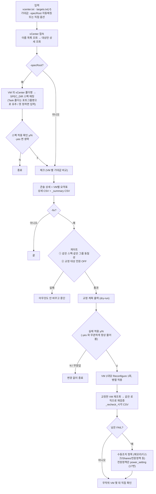

# 11. vm-param-check — VM 설정 점검 + 자동 교정 (주력 도구)

## 한눈에 보기

| 항목 | 값 |
|---|---|
| **위험도** | 🟢 점검만 할 때 / 🔴 **`-fix`를 붙이면 실제 vCenter 설정을 바꿉니다** |
| 폴더 | `.claude/VM/V2/vm-param-check-usability-improvement/vm-param-check/` (서버: `/home/vm-param-check-usability-improvement/vm-param-check/`) |
| 바이너리 | `vm-param-check` |
| 하는 일 | VM들이 스펙(CPU/메모리/디스크/NUMA/affinity/Shares/preferHT/호스트 전원정책)에 맞는지 점검하고, `-fix`면 게이트 → 확인 → 교정 → 재검증까지 |
| 인증 | `VC_USER` / `VC_PASS` (환경변수) |
| 기준 버전 | **V2** (ev01~ev99, `-specExport`). V1 폴더 `.claude/VM/vm-param-check-usability-improvement/`는 구버전 |

---

## 1. 바로 쓰는 명령어

```bash
cd /home/vm-param-check-usability-improvement/vm-param-check

# 1) 인증 (세션마다 1회)
export VC_USER='<계정>'
read -rsp 'vCenter 비밀번호: ' VC_PASS; export VC_PASS; echo

# 2) 설정 점검 — 정기 점검, VM 생성 직후 (스펙은 VM 이 속한 vCenter 폴더 이름으로 자동 매칭)
./vm-param-check -vcenterList=vcenter.txt -f=targets.txt -specRoot=../../SPEC_DIR -out=result.csv -user=<이름>

# 3) 대상이 많을 때 — FAIL 이 있는 VM 만 상세 출력
./vm-param-check -vcenterList=vcenter.txt -f=targets.txt -specRoot=../../SPEC_DIR -out=result.csv -onlyFail

# 4) 점검 후 틀린 항목 교정 — 대상 VM 전원 OFF 상태에서 (최종 y/N 확인은 항상 물어봄)
./vm-param-check -vcenterList=vcenter.txt -f=targets.txt -specRoot=../../SPEC_DIR -out=result.csv -fix

# 5) 새 스펙 폴더 만들기 — 기존 스펙을 복사해서 (vCenter 접속 없음)
./vm-param-check -specRoot=../../SPEC_DIR -initFolder="<새 CAE폴더명>" -template="<기존 CAE폴더명>"

# 6) 스펙이 VM 생성 옵션으로 어떻게 바뀌는지 보기 (vCenter 접속 없음)
./vm-param-check -specRoot=../../SPEC_DIR -specExport=<CAE폴더명>

# 7) 스펙 파일 없이 기대값을 직접 줘서 점검
./vm-param-check -vcenterList=vcenter.txt -f=targets.txt \
  -ht=on -cores=8 -numa=8 -cpu=16 -mem=64 -disk=500 -shares-ev01=2000 -out=result.csv
```

`-fix` 후에는 재검증 CSV를 보고, 무작위 VM 몇 대를 vSphere Client에서 직접 확인하세요.

---

## 2. 흐름도



---

## 3. 준비물

1. **빌드된 바이너리** — V2 전체 빌드(`cd /home && bash setup.sh`) 또는 이 폴더에서 `bash setup.sh`
2. **vCenter 계정** — 점검만 하면 읽기 전용, `-fix`는 **Reconfigure 권한**
3. **`vcenter.txt`** — vCenter 주소 목록 (한 줄에 하나, 줄 끝 `#` 주석 가능)
4. **`targets.txt`** — 점검할 **VM 이름** 목록 (`-f`). 안 주면 **인벤토리 전체**가 대상
5. **기대값** — `-specRoot=../../SPEC_DIR` 자동매칭(권장) 또는 명령행 옵션

### 스펙 폴더 매칭 규칙 (`-specRoot`)

VM이 들어 있는 vCenter 폴더 이름(예: `TST-CAE001-SAMP48c-QRST`)으로 `SPEC_DIR/<폴더명>/<폴더명>_spec.txt`를 찾습니다. 하이픈으로 나눠 **정확히 4조각**이어야 합니다.

| 조각 | 비교 방식 |
|---|---|
| 1번째 (`TST`) | 완전히 같아야 함 |
| 2번째 (`CAE001`) | 접두어(`CAE`/`LSI`)는 같아야 하고, **뒤의 숫자(차수)는 무시** |
| 3번째 (`SAMP48c`) | 완전히 같아야 함 |
| 4번째 (`QRST`) | 완전히 같아야 함 |

- `TST-CAE001-...` 와 `TST-CAE003-...`는 같은 스펙, `TST-LSI001-...`는 다른 스펙입니다.
- 허용 접두어는 `config/spec.go`의 `caeRecord` 정규식에 고정되어 있습니다. 새 접두어는 그 줄에 추가합니다.
- **직접 준 옵션이 항상 우선**합니다(`[수동 우선]` 표시).
- 여러 vCenter·여러 폴더에 흩어져 있어도 VM마다 자기 폴더의 스펙으로 점검합니다.
- **Task 폴더** 등 규칙에 맞지 않는 폴더의 VM은 포트그룹명(`<폴더명>-cae-a-b-c-d`)에서 유추하고, 후보가 하나가 아니면 물어봅니다(`?` = 스펙 목록). `-yes`가 켜져 있으면 물어볼 수 없어 즉시 중단합니다.
- `_spec.txt`에는 기대값 옵션만 쓸 수 있습니다. `-fix`, `-out` 같은 동작 플래그는 거부됩니다.

스펙 파일 형식은 [10. V2](./10_V2.md) 4절에 있습니다.

### 그룹 판정

VM 이름에 들어 있는 `ev01`~`ev99` 중 **첫 번째 일치**가 그 VM의 그룹입니다. 이름에 없으면 **미분류**로 보고 ev01 기대값(`-cpu`, `-cores` 등)을 적용합니다.

---

## 4. 옵션 상세표 (소스: `main.go` flag 정의)

### 4-1. 대상·스펙

| 플래그 | 기본값 | 필수 | 설명 |
|---|---|---|---|
| `-vcenterList` | `vcenter.txt` | | vCenter 주소 목록 파일 |
| `-f` | — | | 점검할 VM 이름 목록. **안 주면 인벤토리 전체** |
| `-specRoot` | — | | 스펙 루트 경로 (V2 서버 배치: `../../SPEC_DIR`) |
| `-yes` | `false` | | 스펙 자동매칭 확인만 생략. **`-fix`의 실제 변경 확인은 생략하지 않음** |

### 4-2. 출력

| 플래그 | 기본값 | 설명 |
|---|---|---|
| `-out` | `vm-param-check_<시각>.csv` | 상세 CSV 경로. `_summary` 요약 CSV가 하나 더 생김 |
| `-user` | — | CSV 파일명 접미사. `-out=result.csv -user=kdh` → `result_kdh.csv`, `result_kdh_summary.csv` |
| `-onlyFail` | `false` | PASS VM을 상세·상세 CSV에서 제외. **요약에는 PASS도 나옴** |
| `-noColor` | `false` | 색 끔 (재검증 화면 포함) |

### 4-3. 교정 🔴

| 플래그 | 기본값 | 설명 |
|---|---|---|
| `-fix` | `false` | 점검 후 게이트 → dry-run → y/N → 적용 → 재검증 |
| `-fixConcurrency` | `20` | 동시 Reconfigure 수 |
| `-fixOut` | `<상세CSV>_recheck_<시각>` | 재검증 CSV 경로 |

### 4-4. 기대값 — ev01·미분류 (스펙 파일에서도 같은 이름으로 지정)

| 플래그 | 기본값 | 필수 | 설명 |
|---|---|---|---|
| `-ht` | — | ✅ | `on`/`off`. ev01 affinity 파일이 없을 때 자동계산에 사용 |
| `-cpu` | `0` | ✅ | vCPU 수 |
| `-cores` | `0` | ✅ | 소켓당 코어 수 |
| `-numa` | `0` | ✅ | NUMA 노드당 최대 vCPU 수 |
| `-mem` | `0` | ✅ | 메모리 GB |
| `-disk` | — | ✅ | 디스크 총량 GB. 쉼표로 여러 개(`1024,1026`) → 하나만 맞아도 OK |
| `-shares-ev01` | — | ✅ | ratio 숫자(`4000`) 또는 `normal`, 쉼표로 여러 개 가능 |
| `-preferHT` | — | | `numa.vcpu.preferHT` 기대값(예: `TRUE`). 전 VM 공통. **값을 줄 때만 점검**, VM에 키가 없으면 FAIL |
| `-affinity-ev01` | — | | ev01 기대 affinity 파일. 안 주면 `-ht`/`-cores`로 자동계산 |

### 4-5. 기대값 — ev02 ~ ev99 (전부 선택, 안 주면 그 항목 점검 스킵)

| 플래그 | 설명 |
|---|---|
| `-cpu-ev02` ~ `-cpu-ev99` | vCPU 수 |
| `-cores-ev02` ~ `-cores-ev99` | 소켓당 코어 수 |
| `-numa-ev02` ~ `-numa-ev99` | NUMA 노드당 최대 vCPU |
| `-mem-ev02` ~ `-mem-ev99` | 메모리 GB |
| `-disk-ev02` ~ `-disk-ev99` | 디스크 GB (쉼표 다중값) |
| `-shares-ev02` ~ `-shares-ev99` | Shares (`-shares-ev01`과 같은 문법) |
| `-affinity-ev02` ~ `-affinity-ev99` | 기대 affinity 파일. 안 주면 그 그룹 affinity 스킵 |

`-h`에서는 `-cpu-ev02~99`처럼 한 줄로 묶어 보입니다. 실제 옵션 이름은 `-cpu-ev57` 그대로입니다. 조사 대상에 그 그룹 VM이 1대뿐이면 해당 그룹 점검은 스킵합니다.

### 4-6. 스펙 파일 관리 (vCenter 접속 없음)

| 플래그 | 설명 |
|---|---|
| `-initFolder <폴더명>` | `-specRoot` 아래 스펙 디렉터리와 `_spec.txt` 틀을 만들고 종료. 같은 스펙(차수만 다른 것 포함)이 있으면 오류로 중단 |
| `-template <폴더명>` | `-initFolder`와 함께: 값을 복사해 올 기존 스펙 |
| `-specExport <폴더명>` | 매칭되는 스펙을 VM 생성용 `이름=값` 줄로 출력하고 종료. 첫 줄 `groups=<ev 개수>`. ev01 필수, ev 번호 연속 검사 |

---

## 5. 결과 확인 방법

### 판정 값

| 값 | 의미 | 조치 |
|---|---|---|
| `OK` | 기대값과 일치 | 없음 |
| `FAIL` | 값이 다름 | 교정 |
| `설정없음` | 설정 자체가 없음 (Auto 모드 NUMA 포함) | 교정 |
| `미지원` | 해당 vCenter에서 조회할 수 없는 필드 (운영 vCenter에서는 나오지 않음) | 무시 |
| `정보` | 판정 없는 정보 (예: 포트그룹 이름) | 없음 |

### 화면과 CSV

- 화면: `[1] 상세` 다음 **맨 아래에 `[2] VM별 요약 표`**. 색: FAIL 빨강, 설정없음 노랑, PASS 초록.
- 요청한 대상 중 못 찾은 VM·조회 실패 vCenter는 **시작과 끝에 경고 박스**로 표시됩니다.

| 파일 | 컬럼 |
|---|---|
| 상세 CSV | `VM명, 소스, 항목Key, 기대값, 실제값, 결과, 비고` |
| 요약 CSV (`_summary`) | `VM명, 전체결과, OK, FAIL, 설정없음, 미지원, 정보` (PASS 포함) |
| 재검증 CSV (`_recheck_<시각>`) | 상세 CSV와 같은 형식, 교정한 VM만 |

"소스" 컬럼: `-`(공통 — 메모리/스케줄러/토폴로지/수치), `host`(호스트 전원정책, 기대값 항상 High Performance), `ev01`~`ev99`(그룹별 affinity·Shares), `network`(포트그룹, 정보).

### `-fix` 자동교정 대상 vs 수동조치

| ✅ 자동교정 | ❌ 수동조치 (vSphere Client) |
|---|---|
| `sched.mem.lpage.enable1GPage`, `sched.mem.prealloc`, `sched.mem.prealloc.pinnedMainMem`, `sched.swap.vmxSwapEnabled` | 메모리 크기 |
| `cpuid.coresPerSocket`, CPU 토폴로지(소켓당 코어) | 디스크 용량 |
| `numa.vcpu.maxPerVirtualNode`, `config.numaInfo.coresPerNumaNode` | CPU/메모리 Shares |
| `numa.vcpu.preferHT` (`-preferHT` 지정 시) | **호스트 전원정책** → [17번 power_setting](./17_VM_setup_잔여도구.md) |
| `sched.vcpuN.affinity` | "모든 게스트 메모리 예약" |
| vCPU 수 (코어 수와 조합) | 네트워크 포트그룹 |

vCPU 수와 소켓당 코어 수가 나누어떨어지지 않는 조합이면 계획 단계에서 오류로 멈춥니다(변경 없음).

---

## 6. 자주 나는 오류와 해결

| 증상 | 원인 | 해결 |
|---|---|---|
| `인증 정보 로드 실패` | `VC_USER`/`VC_PASS` 미설정 | 이 도구는 `VC_PASSWORD`가 아니라 **`VC_PASS`** |
| `[동질성 검증 실패]` | 같은 스펙·같은 그룹 안에서 VM 스펙이 다름 | 대상 목록을 나누거나, 다른 VM이 섞였는지 확인 |
| `[전원 OFF 검증 실패]` | 교정 대상 VM이 켜져 있음 | VM을 끄고 재실행 |
| 그룹 간 VM 대수 경고 | ev01과 ev02 대수가 다름 | 경고만, 교정은 진행됨 |
| `-fix` 후에도 FAIL | 수동조치 항목 | vSphere Client에서 변경 |
| 스펙을 못 찾음 | 폴더명이 규칙에 안 맞음 / 스펙 없음 / 접두어 다름 | `-initFolder`로 생성, 대화형에서 `?`로 목록 확인 |
| `-yes`로 실행했는데 중단 | Task 폴더 VM이 있어 물어봐야 함 | `-yes` 없이 한 번 대화형으로 실행 |
| 대상을 전부 못 찾았다는 경고 | 이름 오타, 다른 vCenter, 접속 실패 | `vcenter.txt` 확인 |
| `설정없음`이 많이 나옴 | vSphere API 8.0.0.1 미만 (`coresPerNumaNode` 없음) | 알려진 한계 |
| `flag provided but not defined: -cpu-ev100` | 그룹은 ev99까지 | ev 번호 확인 |

---

## 7. 주의사항과 한계

- 🔴 `-fix` 후 무작위 VM 몇 대를 vSphere Client에서 직접 확인하세요.
- `-f`를 안 주면 인벤토리 전체가 대상입니다. 처음에는 `-f`로 2~3대만.
- `-fix -yes`여도 실제 변경 확인은 항상 물어봅니다. 무인 실행에서 답이 없으면 **아무것도 바꾸지 않고 종료**합니다.
- **호스트 전원정책은 점검만** 합니다. 교정은 [17번 power_setting](./17_VM_setup_잔여도구.md).
- `config.numaInfo.coresPerNumaNode`는 vSphere API 8.0.0.1 이상에서만 조회·교정됩니다.
- Shares는 `-shares-evNN` 값 하나를 CPU/메모리 양쪽에 적용합니다.
- 같은 이름의 VM이 서로 다른 vCenter에 있으면 지원 범위 밖입니다.
- affinity 비교는 순서를 무시하고 개수는 봅니다(`16,17` ≠ `16,17,17`).
- `folder_setup.sh`는 ev01~ev03까지만 묻습니다. 그 이상은 `_spec.txt` 직접 편집.

---

## 8. 보조 스크립트

| 스크립트 | 하는 일 | 사용법 |
|---|---|---|
| `folder_setup.sh` | 스펙 폴더·틀 생성을 대화형으로 | `bash folder_setup.sh` |
| `vm_setting_check_insert.sh` | 점검/교정 실행을 변수 설정만으로. `-fix` 여부를 먼저 묻고 도구 자체 확인을 한 번 더 거침(이중 확인) | 상단 `VC_USER`/`VC_PASS`/`VCENTER_LIST`/`SPEC_ROOT`와 `set_user()`의 `user`를 채운 뒤 `bash vm_setting_check_insert.sh` |
| `../make_update_package.sh`, `../update.sh` | 폐쇄망 증분 업데이트 | [02번 2절](./02_공통_실행환경.md) |
| `../update_deploy.sh` | 인터넷 되는 배포 서버에서 제자리 갱신 (사용자 파일 보존, 빌드 성공 후 교체) | 스크립트 상단 주석 |

---

## 9. 파일 구조

```
V2/vm-param-check-usability-improvement/
├── README.md / CHANGELOG.md / 계획서.md
├── make_update_package.sh / update.sh / update_deploy.sh
└── vm-param-check/
    ├── README.md                 # 1차 자료
    ├── main.go                   # 옵션 파싱, -specRoot 병합, 실행 흐름
    ├── setup.sh                  # 오프라인 빌드 (../../govendor/govmomi-0.39.0 링크)
    ├── folder_setup.sh / vm_setting_check_insert.sh
    ├── checker/                  # 판정 기준 (hardware, topology, affinity, power, preferht)
    ├── config/                   # 스펙 매칭 (spec.go caeRecord, init.go, export.go, portgroup.go, targets.go)
    ├── fixer/                    # -fix (plan, apply, gates, describe)
    ├── model/                    # 공용 모델, group.go (ev01~ev99 판정)
    ├── report/                   # 콘솔/CSV 출력
    └── vcenter/client.go         # vCenter 조회 (이름 목록 → 대상만 상세)
```

관련 문서: 1차 자료 `vm-param-check/README.md`, 변경 이력 `../CHANGELOG.md`, 스펙 형식 [10. V2](./10_V2.md), 수정 요청 [31번 B-1](./31_변경요청서_양식.md).
