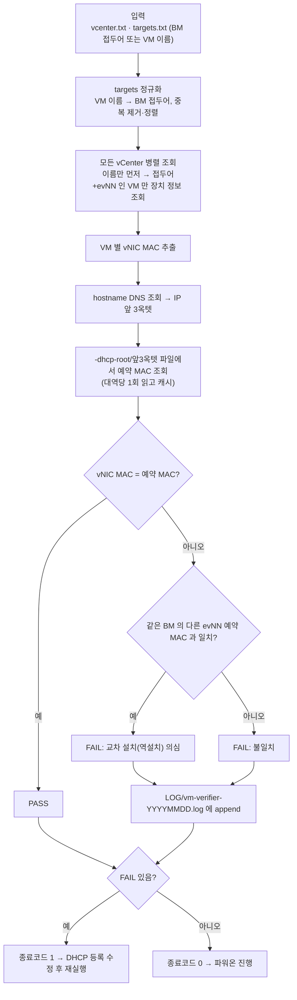

# 12. vm_verifier — 파워온 전 MAC 대조 (교차 설치 탐지)

## 한눈에 보기

| 항목 | 값 |
|---|---|
| **위험도** | 🟢 **읽기 전용.** 조회만 하고 아무것도 바꾸지 않습니다 |
| 폴더 | `.claude/VM/vm_verifier/` |
| 바이너리 | `vm-verifier` |
| 하는 일 | VM 생성 직후(파워온 전) vCenter가 아는 vNIC MAC과 DHCP 예약 MAC을 대조해 **교차 설치(역설치)** 를 탐지 |
| 인증 | `VC_USER` / `VC_PASS` (환경변수) |
| 종료 코드 | 불일치가 하나라도 있으면 **1** |

---

## 1. 바로 쓰는 명령어

```bash
cd <저장소>/.claude/VM/vm_verifier

# 1) 인증 (세션마다 1회)
export VC_USER='<계정>'
read -rsp 'vCenter 비밀번호: ' VC_PASS; export VC_PASS; echo

# 2) VM 생성 직후, 파워온 전 — 이상 있는 것만 보기
./vm-verifier -vcenterList vcenter.txt -f targets.txt -failonly

# 3) 전수 출력 (PASS 포함)
./vm-verifier -vcenterList vcenter.txt -f targets.txt

# 4) DHCP 파일 경로가 기본(/user/caedhcp)과 다를 때
./vm-verifier -vcenterList vcenter.txt -f targets.txt -dhcp-root <DHCP 파일 루트> -failonly

# 5) 옵션을 하나씩 물어보는 대화형 실행 (바이너리가 없으면 빌드부터)
bash run.sh
```

---

## 2. 흐름도



---

## 3. 준비물

### 빌드

```bash
cd .claude/VM/vm_verifier
bash setup.sh      # ../../공통/govendor/govmomi-0.39.0 을 vendor 로 링크 후 -mod=vendor 빌드
```

폐쇄망으로 옮길 때는 `.claude/공통/govendor/`를 **함께** 옮겨야 합니다.

### 입력 파일

**`vcenter.txt`** — vCenter 주소, 한 줄에 하나. 전부 병렬로 조회합니다.

**`targets.txt`** (`-f`, 필수) — BM 접두어, 한 줄에 하나 (`#` 주석 가능).

```
svr01
svr02
```

각 접두어에 대해 vCenter에 있는 `{접두어}ev숫자` VM을 **개수 제한 없이 전부** 찾아 검증합니다. VM 이름(`svr01ev01`)을 적어도 접두어로 자동 변환하고 중복을 없앤 뒤 이름순으로 진행합니다(`[INFO] 대상 목록 정리: ...`). `ev`+숫자로 끝나지 않는 줄은 그대로 접두어로 씁니다.

### DHCP 파일 접근

1. 각 hostname을 **DNS로 조회**해 IP를 얻고
2. IP **앞 3옥텟**으로 `-dhcp-root` 아래 파일명을 만들어 (`10.10.10.15` → `10.10.10`)
3. 그 파일 하나만 읽습니다

따라서 실행 서버에서 **DNS 조회가 되고 `/user/caedhcp`를 읽을 수 있어야** 합니다.

### 권한

vCenter 읽기 전용이면 충분합니다.

---

## 4. 옵션 상세표 (소스: `main.go`)

| 플래그 | 기본값 | 필수 | 설명 |
|---|---|---|---|
| `-f` | — | ✅ | BM 접두어 목록 파일 (VM 이름도 자동 변환) |
| `-failonly` | `false` | | FAIL만 출력. 전부 PASS면 요약 한 줄 |
| `-vcenterList` | `vcenter.txt` | | vCenter 주소 목록 |
| `-dhcp-root` | `/user/caedhcp` | | DHCP 설정 파일 루트 |
| `-concurrency` | `32` | | DNS/DHCP 조회·검증 동시 수. I/O 대기 위주라 CPU 수보다 크게 잡아도 됨 |

`run.sh`는 위 옵션 중 `-vcenterList`, `-f`, `-dhcp-root`, `-failonly`를 물어보고, `VC_USER`/`VC_PASS`가 없으면 입력받습니다.

---

## 5. 결과 확인 방법

| 결과 | 의미 |
|---|---|
| `검증 완료 — 이상 없음 (VM N대, ...)` | 전부 일치 (`-failonly`일 때 요약 한 줄) |
| FAIL + "교차 설치(역설치) 의심" | 이 VM의 MAC이 같은 BM의 **다른 evNN** 예약 MAC과 일치 — DHCP에 서로 뒤바뀌어 등록됨 |
| FAIL (그 외) | 예약 MAC과 다름 또는 DHCP 항목 없음 |
| 종료코드 `0` / `1` | 전부 일치 / 불일치 있음 |
| `LOG/vm-verifier-YYYYMMDD.log` | FAIL hostname만 append (`-failonly`와 무관) |

자동 조치는 하지 않습니다. FAIL이 나오면 DHCP 등록을 고치고 다시 실행합니다.

---

## 6. 자주 나는 오류와 해결

| 증상 | 원인 | 해결 |
|---|---|---|
| `-f`가 필수라는 오류 | 대상 목록 미지정 | `-f targets.txt` |
| 인증 실패 | `VC_PASSWORD`만 설정함 | 이 도구는 **`VC_PASS`** |
| DHCP 파일을 못 찾음 | DNS 실패 또는 `-dhcp-root` 다름 | `nslookup <hostname>`, `ls /user/caedhcp` |
| DHCP 파일명이 `10.10.10.0`이라 못 읽음 | 도구는 3옥텟(`10.10.10`)만 찾음 | 파일명 규칙 확인. 다르면 코드 수정 필요 |
| 빨간 깜빡임 경고 | 같은 VM 이름이 여러 vCenter에 있음 | 아래 한계 참고 |
| 빌드 시 `vendor/ 없음` | `.claude/공통/govendor/`가 함께 안 옮겨짐 | 저장소 구조대로 `공통/govendor`를 두 단계 위에 배치 |

---

## 7. 주의사항과 한계

- 같은 VM 이름이 여러 vCenter에 있으면 마지막 조회 값으로 덮어쓰고 **빨간 깜빡임 경고**를 출력합니다.
- 작업자 수동 실행만 지원합니다(이벤트 자동 트리거 없음).
- MAC 스왑 탐지 목적에만 집중합니다 — hostname/IP/PTR/UUID 이력 대조는 하지 않습니다.
- `vcenter.txt`/`targets.txt`는 `.gitignore` 대상입니다.

---

## 8. 파일 구조

```
vm_verifier/
├── README.md / PLAN.md / CHANGELOG.md / ARCHITECTURE.md / WORKFLOW.md
├── main.go          # 옵션 파싱, 대상 정규화, 병렬 조회
├── run.sh           # 대화형 실행
├── setup.sh         # 오프라인 빌드 (공통 govendor 링크)
├── vc/              # vCenter 조회 (vc.go, devices.go)
├── dhcp/dhcp.go     # 대역 파일 파싱 + 캐시
├── verify/verify.go # 판정 로직 ← "무엇을 FAIL로 볼지"
└── auditlog/        # LOG/ 기록
```

관련 문서: 1차 자료 `vm_verifier/README.md`, MAC 목록 추출은 [10. V2](./10_V2.md)의 `mac_info`.
