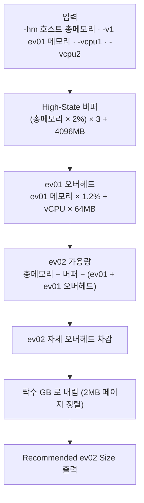

# 13. lpage_search — Large Page 메모리 사이징 계산기

## 한눈에 보기

| 항목 | 값 |
|---|---|
| **위험도** | 🟢 vCenter/ESXi에 **접속하지 않는** 순수 계산기 |
| 폴더 | `.claude/VM/lpage_search/` |
| 바이너리 | `lpage_search` |
| 하는 일 | 호스트 총 메모리와 ev01 할당량을 넣으면 **ev02에 줄 수 있는 메모리 크기**를 계산 |
| 인증 | 불필요 |

---

## 1. 바로 쓰는 명령어

```bash
cd <저장소>/.claude/VM/lpage_search

# 1) 신규 서버 스펙 정할 때 — ev02 메모리 계산 (-hm 은 항상 실제 값으로)
./lpage_search -h <호스트명> -v1 <ev01 메모리GB> -hm <호스트 총메모리GB> -vcpu1 <ev01 vCPU> -vcpu2 <ev02 vCPU>

# 예
./lpage_search -h esxi01 -v1 240 -hm 512 -vcpu1 32 -vcpu2 32

# 2) 빌드 없이 바로 계산
go run main.go -h <호스트명> -v1 <ev01 메모리GB> -hm <호스트 총메모리GB>
```

출력의 **`>> Recommended ev02 Size`** 가 답입니다. 이 값을 스펙 파일의 `mem-ev02`에 넣습니다([10. V2](./10_V2.md)).

---

## 2. 흐름도



---

## 3. 준비물

```bash
cd .claude/VM/lpage_search
bash setup.sh          # go build -o lpage_search main.go (외부 의존성 없음)
```

Windows에서도 됩니다: `go build -o lpage_search.exe main.go`

필요한 값: 호스트 총 메모리(GB), ev01 메모리(GB), ev01/ev02 vCPU 수.

---

## 4. 옵션 상세표 (소스: `main.go`)

| 플래그 | 기본값 | 필수 | 설명 |
|---|---|---|---|
| `-h` | — | ✅ | 호스트명/IP. **출력 라벨일 뿐** 접속하지 않음 |
| `-v1` | `0` | ✅ | ev01 메모리 GB (0 이하면 사용법 출력 후 종료) |
| `-hm` | `512` | | 호스트 총 메모리 GB. **자동 조회되지 않으므로 반드시 직접 입력** |
| `-vcpu1` | `32` | | ev01 vCPU 수 (오버헤드 계산) |
| `-vcpu2` | `32` | | ev02 vCPU 수 (오버헤드 계산) |

> `-hm`을 생략하면 무조건 512GB로 계산합니다. 실제 호스트가 1TB면 결과가 틀립니다.

---

## 5. 결과 확인 방법

```
==================================================
[ESXi Large Page (2MB) Memory Sizing Tool]
Target Host           : esxi01 (512 GB)
Configured ev01       : 240 GB (245760 MB)
--------------------------------------------------
ESXi High-State Buffer: 35471 MB (3x minFree + Base)
ev01 VM Overhead      : 4998 MB
ev02 Est. Overhead    : 2698 MB
--------------------------------------------------
>> Recommended ev02 Size: 226 GB (231424 MB)
   (Total 2MB LPage Mappings: 115712 pages)
==================================================
```

| 줄 | 의미 |
|---|---|
| `ESXi High-State Buffer` | Large Page 유지를 위해 남겨야 하는 여유 메모리 |
| `ev01 VM Overhead` / `ev02 Est. Overhead` | VM 오버헤드 추정치 |
| `Recommended ev02 Size` | ev02에 할당할 메모리 |

---

## 6. 자주 나는 오류와 해결

| 증상 | 원인 | 해결 |
|---|---|---|
| `Usage: go run main.go -h <Host> -v1 ...`만 출력 | `-h` 또는 `-v1` 누락 | 두 옵션 지정 |
| 결과가 비정상적으로 작거나 음수 | `-hm` 생략(512 고정) 또는 ev01이 너무 큼 | `-hm` 실제 값 입력 |

---

## 7. 주의사항과 한계

- 오버헤드 계수(minFree 2%, 1.2%, vCPU당 64MB)는 경험적 근사치입니다. 결과는 시작점으로 쓰고 vSphere Client에서 실제 여유 메모리 상태를 함께 확인하세요.
- 계산만 하고 설정은 바꾸지 않습니다. 값을 적용하는 것은 V2 `vm_create`/`vm_setup.sh`, 점검은 `vm-param-check`입니다.
- ev01/ev02 두 VM 기준 계산입니다. ev03 이상은 계산하지 않습니다.

---

## 8. 파일 구조

```
lpage_search/
├── README.md / ARCHITECTURE.md / WORKFLOW.md / PR_CHECKLIST.md
├── main.go     # 계산 로직 + 옵션 (calculateHostReservedMB, calculateVmOverheadMB)
├── go.mod      # 외부 의존성 없음
└── setup.sh
```

계수를 바꾸려면 `main.go`의 두 함수만 보면 됩니다.
