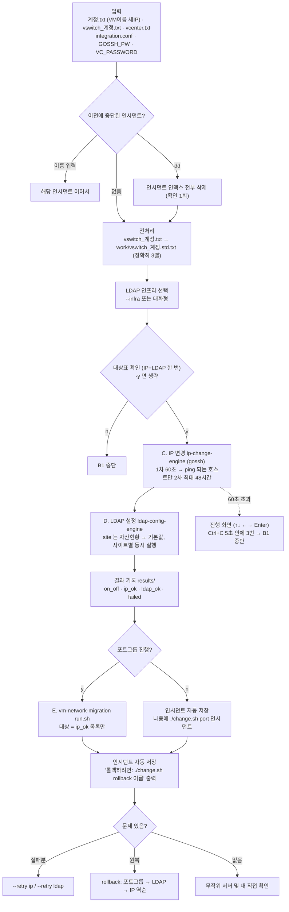

# 14. Network_Change_Integration_Script — 통합 VM 망변경 (IP → LDAP → 포트그룹)

## 한눈에 보기

| 항목 | 값 |
|---|---|
| **위험도** | 🔴 **노드의 IP 설정·LDAP 설정과 vCenter 포트그룹을 실제로 바꿉니다** (`--dry-run`은 예정만) |
| 폴더 | `.claude/VM/Network_Change_Integration_Script/` (단독 배포용 브랜치 `network-change-standalone`) |
| 진입점 | `change.sh` (bash 오케스트레이터) |
| 하는 일 | 3개 프로젝트를 순서대로 호출: **C** IP 변경(`ip_change`) → **D** LDAP 설정(`ldap_setting`) → **E** 포트그룹 이관(`vm-network-migration`). 결과 집계·인시던트 저장·역순 롤백 담당 |
| 인증 | `GOSSH_PW` (IP·LDAP, 노드 SSH) / `VC_PASSWORD` (포트그룹, 계정은 `integration.conf`의 `vc_id`) |
| 통합 여부 | **`vm-network-migration`은 이 스크립트로 통합되었습니다.** 소스는 `projects/vm-network-migration/`에 들어 있고 E 단계에서 `run.sh`를 통해 호출됩니다. 별도로 실행하지 않습니다 |

---

## 1. 바로 쓰는 명령어

```bash
cd <배포 폴더>/Network_Change_Integration_Script

# 1) 인증 (세션마다 1회)
read -rsp 'SSH PW: ' GOSSH_PW; export GOSSH_PW; echo            # IP·LDAP 단계
read -rsp 'vCenter PW: ' VC_PASSWORD; export VC_PASSWORD; echo  # 포트그룹 단계

# 2) 예정만 확인 (IP 단계는 대상만 출력, LDAP·포트그룹은 diff)
./change.sh --dry-run -u <계정> --infra <LDAP인프라>

# 3) 전체 실행 — IP → LDAP → (확인 후) 포트그룹
./change.sh -u <계정> --infra <LDAP인프라>

# 4) 포트그룹만 변경 (IP·LDAP 건너뜀, GOSSH_PW 불필요)
./change.sh --only E -u <계정>

# 5) 저장된 인시던트의 포트그룹만 이어서 진행
./change.sh port <인시던트이름>

# 6) 실패분만 재시도
./change.sh --retry ip -u <계정>
./change.sh --retry ldap -u <계정> --infra <LDAP인프라>

# 7) 되돌리기 — 실행 끝에 출력된 "롤백하려면: ..." 줄을 그대로 (포트그룹 → LDAP → IP 역순)
./change.sh rollback <인시던트이름>

# 8) VM/호스트를 못 찾을 때 — vCenter 가 보고하는 이름 그대로 덤프 (변경 없음)
./change.sh --debug-inventory

# 9) 새 버전으로 갱신 (운영값 파일 보존)
git clone -b network-change-standalone https://github.com/qazx2675/myrepo.git /tmp/nci_new
cp -a <배포 폴더> <배포 폴더>.bak.$(date +%Y%m%d)
bash update.sh /tmp/nci_new && ./setup.sh
```

작업 후 무작위로 서버 몇 대에 직접 접속해 의도대로 바뀌었는지 확인하세요.

> IP 변경 직후 대상 VM은 **"새 IP 설정 + 옛 VLAN"** 상태입니다(의도된 설계). `ip_change`는 네트워크 서비스를 재시작하지 않으므로 리부팅 전까지 옛 IP로 통신하고, 포트그룹 변경 후 리부팅 시 새 IP가 활성화됩니다. 그 사이에 VM을 리부팅하거나 네트워크를 재시작하면 콘솔 외 접근이 불가능해집니다.

---

## 2. 흐름도



---

## 3. 준비물

### 빌드·설정 (최초 1회)

```bash
cd .claude/VM/Network_Change_Integration_Script
./setup.sh                                       # Go 1.25.0+, 3개 프로젝트 오프라인 빌드
cp integration.conf.sample integration.conf      # vc_id 등 채우기
cp conf/ldap_config.conf.sample conf/ldap_config.conf
cp conf/assets.txt.sample       conf/assets.txt  # 실제 LDAP 설정·자산현황 값 채우기
```

- 빌드 결과: `bin/ip-change-engine`, `bin/ldap-config-engine`, `projects/vm-network-migration/bin/nm-*`
- 관리서버가 RHEL/CentOS 6이면 미리 빌드된 `bin_os6/`을 씁니다(`os6_hostgroup`에 관리서버 hostname 등록).
- `conf/ip_change.conf`는 실행 시 `integration.conf`의 `ipchange.*`로 자동 생성되므로 만들지 않습니다.
- `conf/ldap_config.conf`, `conf/assets.txt`는 원본 `HPC/ldap_setting`과 **자동 동기화되지 않는 사본**입니다.

### 입력 파일 (작업 폴더, 모두 `.gitignore`)

| 파일 | 형식 | 예 |
|---|---|---|
| `<계정>.txt` | `VM이름 변경될IP` (VM 이름은 도메인 없이, DNS가 짧은 이름을 해석해야 함) | `web01 10.20.30.11` |
| `vswitch_<계정>.txt` | `BM [폴더] IP VLAN` 또는 `BM PG VLAN` (**BM당 한 줄**) | `esxi7 svc 10.20.30.11 30` |
| `vcenter.txt` | vCenter 주소 | `192.168.0.50` |

`vswitch_<계정>.txt` 전처리 규칙:

| 입력 | 변환 결과 |
|---|---|
| `BM 폴더 IP VLAN` (4열) | `BM.도메인  폴더-<tag>-<IP앞3옥텟>-0  VLAN` |
| `BM IP VLAN` (3열, 2번째가 IP) | 폴더명을 입력받아 위와 같게 (비대화형은 `--folder` 필수) |
| `BM PG VLAN` (3열) | 도메인만 붙임 |
| `BM.도메인 PG VLAN` | 변경 없음 |

예: `web01 svc 10.20.30.11 30` → `web01.seccae.com  svc-cae-10-20-30-0  30`

> V2 `vm_setup.sh`의 `SPEC_DIR/vswitch_<작업이름>.txt`(BM당 여러 줄)와는 **다른 파일**입니다.

### `integration.conf` 주요 키

| 키 | 기본값 | 설명 |
|---|---|---|
| `vc_id` | `lscsystems@vsphere.local` | 포트그룹 단계 vCenter 계정 — **반드시 확인** |
| `bm_domain` | `seccae.com` | vswitch 1열에 붙일 도메인 |
| `preprocess_tag` | `cae` | 포트그룹명 가운데 문자열 (`--tag`로 덮어씀) |
| `default_site` | (빈 값) | 자산현황에 없는 호스트의 LDAP site. 비우면 건너뜀 |
| `ldap_conf` / `ldap_assets` | `./conf/ldap_config.conf` / `./conf/assets.txt` | LDAP 설정·자산현황 |
| `gossh` / `ssh_user` / `ssh_port` | `gossh` / `root` / `22` | 노드 접속 |
| `timeout_pass1` / `timeout_pass2` | `60` / `172800` | 1차 / 2차(ping 되는 호스트만) 로그인 대기 초. 2026-09-23 이전 conf는 `600`이므로 `172800`으로 변경 |
| `concurrency` / `nm_vswitch` | `8` / `vSwitch0` | 포트그룹 단계 동시 수 / vSwitch |
| `os6_hostgroup` / `os6_gossh` / `os6_bin_dir` | (빈 값) / (빈 값) / `./bin_os6` | RHEL 6 관리서버용 (쉼표 구분 hostname 목록) |
| `result_dir` | `./results` | 결과 파일 위치 |

LDAP 대상 인프라는 conf에 두지 않습니다. 실행마다 `--infra`로 주거나 대화형으로 고릅니다.

---

## 4. 옵션 상세표 (소스: `change.sh` 인자 파싱)

### 4-1. 서브커맨드

| 명령 | 동작 |
|---|---|
| `change.sh [옵션] [계정]` | 전처리 → IP → LDAP → 결과 → 포트그룹 질의 |
| `change.sh port -u <계정>` | 이미 전처리된 `work/vswitch_<계정>.std.txt`로 포트그룹만 |
| `change.sh port <인시던트>` | 저장된 인시던트의 포트그룹 이어서 (`-u` 없는 이름은 인시던트로 해석) |
| `change.sh rollback <인시던트>` | 역순 원복 (포트그룹 → LDAP → IP) |
| `change.sh --retry ip\|ldap [계정]` | 해당 단계 실패분만 재시도 |
| `change.sh --debug-inventory` | vCenter 인벤토리 덤프 (변경 없음) |

### 4-2. 옵션

| 옵션 | 설명 |
|---|---|
| `-u, --user <계정>` | 작업 계정 (없으면 `user선택()` — 기본은 텍스트 입력) |
| `--infra <이름>` | LDAP 인프라(`ldap_config.conf`의 `infra.<이름>`). 비대화형이면 필수 |
| `--dry-run` | 예정만. **IP 엔진은 dry-run을 지원하지 않아 대상만 출력**, LDAP·포트그룹은 diff |
| `-y, --yes` | 확인 프롬프트 생략 |
| `--only C\|D\|E` | 해당 단계만 (C=IP, D=LDAP, E=포트그룹) |
| `--from C\|D\|E` | 해당 단계부터 끝까지 |
| `--folder <이름>` | 3열 `BM IP VLAN` 줄에 쓸 폴더명 (비대화형이면 필수) |
| `--tag <문자열>` | 포트그룹명 가운데 문자열 |
| `-d1` / `-d2` / `-d3` | 단계별 시간 / 중간 산출물 보존 / + gossh raw 출력·`set -x` |
| `-h, --help` | 도움말 |

환경변수 `NO_COLOR=1`이면 화면 색을 끕니다(로그 파일에는 원래 색 없음).

### 4-3. 진행 화면 (IP·LDAP 단계가 60초를 넘을 때)

| 키 | 동작 |
|---|---|
| ↑ / ↓ | 호스트 선택 |
| ← / → 또는 PgUp / PgDn | 페이지 이동 |
| Enter | 선택한 호스트의 원격 출력·오류 보기 (아무 키 = 목록) |
| Ctrl+C | **5초 안에 3번** 눌러야 종료 → 끝난/안 끝난 호스트 목록 남기고 `B1`로 멈춤 (되돌리기 안 함) |

---

## 5. 결과 확인 방법

`results/` 아래 (기존 파일은 `.bak.<시점>`으로 백업):

| 파일 | 내용 |
|---|---|
| `on_off_<계정>.txt` | IP·LDAP **둘 다 성공**한 VM — 별도 전원 on/off 작업의 입력 |
| `ip_ok_<계정>.txt` | IP 성공 — **포트그룹 단계의 대상** |
| `ldap_ok_<계정>.txt` | LDAP을 이번에 바꾼 VM (롤백 대상). 이미 원하는 설정(NOCHANGE)은 성공이지만 여기엔 없음 |
| `on_off_<계정>.failed.txt` | 하나라도 실패한 VM 이름 |
| `failed_<계정>.txt` | `VM이름 코드` — `C2` IP 실패 / `D3` LDAP 실패 / `CD` 둘 다 |

- `incidents/incident_<시각>/` — 실행이 끝나면 성공·실패와 무관하게 자동 저장. 콘솔에 `롤백하려면: ./change.sh rollback <이름>` 출력.
- `logs/change_<시각>.log` — 실행 로그 (색 코드 없음).

### 에러코드 (화면 첫 줄에 코드만 크게 출력)

| 코드 | 의미 | 대처 |
|---|---|---|
| A1 / A2 / A3 | 전처리: 파일 열기 실패 / 열 개수 판정 불가 / IP·VLAN 형식 오류 | 경로·권한, 줄 형식 확인 |
| B1 | `<계정>.txt` 없음 / 사용자 중단 / Ctrl+C 3회 | 파일 준비, `-u` 지정 |
| B2 / B3 | `vswitch_<계정>.txt` 없음 / `<계정>.txt` 형식 오류 | 파일 준비, `VM이름 IP` 형식 |
| C1 / C2 | IP 엔진 실행 실패 / 일부 변경 실패 | `logs/`, `conf/ip_change.conf` / `--retry ip` |
| D1 | LDAP site 판정 실패 | 자산현황에 호스트 추가 또는 `default_site` |
| D2 / D3 | LDAP 엔진 실행 실패·`--infra` 미지정 / 일부 변경 실패 | `--infra`, `ldap_conf` 확인 / `--retry ldap` |
| E1 / E2 / E3 / E5 | VM 못 찾음 / 동명 VM 여러 개 / 호스트 못 찾음 / 호스트↔worklist 불일치 | `--debug-inventory`로 실제 이름 대조 |
| E9 | 남은 상태 파일 삭제 거부 / nm `run.sh` 실패 | 삭제 확인에 `y`, `logs/`와 nm 출력 확인 |
| F1 / F2 / F3 | 인시던트 디렉터리 생성 실패 / meta 손상 / 대상 없음 | 권한, `incidents/<이름>/meta`, 이름 오타 |
| G1 / G2 / G3 / G4 | gossh 없음 / 바이너리 없음 / conf·vcenter.txt 없음 / 비밀번호 미설정 | `gossh` 경로 / `./setup.sh` / `.sample` 복사 / `export` |

---

## 6. 자주 나는 오류와 해결

| 증상 | 원인 | 해결 |
|---|---|---|
| G4 | `GOSSH_PW` 또는 `VC_PASSWORD` 없음 | 1절 인증 명령 |
| D2 (비대화형) | `--infra` 없음 | `--infra <이름>` |
| 일부 VM/호스트를 못 찾음 (E1/E3) | 상위 폴더가 여러 개이거나 FQDN/짧은 이름 표기 차이 | `--debug-inventory`로 확인 후 `<계정>.txt`·vswitch 1열 수정 |
| 로그인이 매우 오래 걸림 | 다른 VM이 CPU 과점유 | 살아 있으면(ping) 2차에서 최대 48시간 대기. 진행 화면으로 상태 확인 |
| `--dry-run`인데 IP 단계 diff가 없음 | IP 엔진이 dry-run 미지원 | 설계상 대상만 출력 |
| `integration.conf`의 `timeout_pass2 = 600` | 구버전 conf | `172800`으로 변경 (`update.sh`가 안내) |
| `incidents/`가 많이 쌓임 | 실행마다 자동 저장 | 재개 확인 프롬프트에서 `dd` 입력 → 확인 (노드·vCenter 백업은 남음) |

---

## 7. 주의사항과 한계

- 🔴 작업 후 무작위로 서버 몇 대에 직접 접속해 확인하세요. 단계별 "성공"이 서비스 정상 동작을 뜻하지는 않습니다.
- **포트그룹 단계는 `ip_ok` 목록만** 대상으로 합니다(IP 실패 VM이 새 VLAN으로 옮겨져 고립되는 것 방지).
- IP 변경 후 포트그룹 변경 전까지 VM을 리부팅하지 마세요.
- `rollback`의 IP 단계에서 엔진이 실패하면 대상 목록을 출력하고 각 노드의 `<ifcfg>.bak.<STAMP>` 수동 복원을 안내합니다.
- 통합 스크립트는 자체 백업을 만들지 않습니다(각 엔진이 만든 백업 위치만 인덱싱). 통합 레벨에서 백업을 추가하면 LDAP 롤백이 원본으로 돌아가지 않습니다.
- gossh를 직접 호출하지 않고 항상 엔진을 거칩니다(base64 `spaceOut`으로 위험 키워드 오탐 방지).
- `update.sh`는 자동 롤백이 없습니다. 실행 전 배포 폴더를 통째로 백업하세요.
- `projects/` 아래 세 프로젝트는 원본(`.claude/HPC/ip_change`, `.claude/HPC/ldap_setting`, `.claude/VM/vm-network-migration`)의 스냅샷 사본입니다. 자동 동기화되지 않습니다.
- IP가 잘못 들어가 **네트워크로 접속할 수 없게 된 VM**은 SSH 기반인 이 스크립트로 고칠 수 없습니다 → [15. vCenter API IP 자동변경](./15_vCenter_API_IP_자동변경.md).

---

## 8. 파일 구조

```
Network_Change_Integration_Script/
├── change.sh                    # 진입점: 인자 파싱, 단계 제어, 포트그룹 위임
├── setup.sh / update.sh         # 오프라인 빌드 / 증분 업데이트
├── integration.conf.sample      # 중앙 설정 예시
├── 사용법.txt                    # 명령만 순서대로
├── lib/
│   ├── common.sh                # conf 로드, 로그, die, user선택()
│   ├── conf.sh                  # integration.conf → conf/ip_change.conf
│   ├── preprocess.sh            # vswitch 표준화
│   ├── stages.sh                # C·D 단계, OS6 분기, 2패스 타임아웃, 엔진 출력 파싱
│   ├── results.sh               # 결과 파일, --retry 대상
│   └── incident.sh              # 인시던트 저장/로드/롤백/전체 삭제
├── projects/
│   ├── ip_change/               # IP 엔진 (표준 라이브러리만)
│   ├── ldap_setting/            # LDAP 엔진 (표준 라이브러리만)
│   └── vm-network-migration/    # 포트그룹 이관 (govmomi vendor), run.sh + nm-* 7종
├── bin/ · bin_os6/              # 빌드 결과 / OS6용 사전 빌드
├── conf/ · work/ · results/ · incidents/ · logs/   # 운영 데이터 (gitignore)
└── README.md / ARCHITECTURE.md / CHANGELOG.md / PR_CHECKLIST.md / Network_Change_Integration_Plan.md
```

관련 문서: 1차 자료 `README.md`, 수정 진입점 `ARCHITECTURE.md`의 "수정 요청별 진입점" 표.
