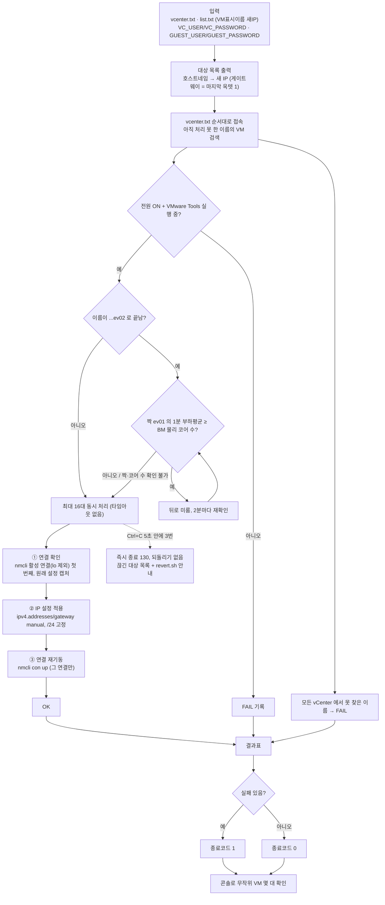

# 15. vCenter API IP 자동변경 (vm-ip-change) — 접속 불가 VM 의 IP 재설정

## 한눈에 보기

| 항목 | 값 |
|---|---|
| **위험도** | 🔴 **대상 VM 게스트 OS의 IP 설정을 실제로 바꿉니다** |
| 폴더 | `".claude/VM/vCenter API IP 자동변경/project/"` — **폴더명에 공백이 있으므로 항상 따옴표로 감쌉니다** |
| 바이너리 | `bin/vm-ip-change` |
| 하는 일 | IP가 잘못 들어가 **네트워크로 접속할 수 없는** RHEL 8.10 VM의 IP를, vCenter → ESXi → VMware Tools 경로(Guest Operations)로 게스트 안에서 `nmcli`를 실행해 재설정 |
| 인증 | `VC_USER` / `VC_PASSWORD` (vCenter) + `GUEST_USER` / `GUEST_PASSWORD` (게스트 OS) |
| 종료 코드 | `0` 전부 성공 / `1` 하나라도 실패 / `130` Ctrl+C 3회 중단 |

> vCenter 자체의 IP를 바꾸는 도구가 **아닙니다.** 폴더 이름의 "vCenter API"는 변경 경로를 뜻합니다.
> 네트워크가 살아 있는 VM의 IP 변경은 [14. Network_Change_Integration_Script](./14_Network_Change_Integration_Script.md)(SSH 기반)를 씁니다.

---

## 1. 바로 쓰는 명령어

```bash
cd "<저장소>/.claude/VM/vCenter API IP 자동변경/project"

# 1) 인증 (세션마다 1회)
export VC_USER='<vCenter 계정>'
read -rsp 'vCenter 비밀번호: ' VC_PASSWORD; export VC_PASSWORD; echo
export GUEST_USER='root'
read -rsp '게스트 OS 비밀번호: ' GUEST_PASSWORD; export GUEST_PASSWORD; echo

# 2) 입력 파일 준비 (처음 1회)
cp vcenter.txt.example vcenter.txt      # vCenter 주소
cp list.txt.example    list.txt         # "VM표시이름 새IP" 한 줄에 하나

# 3) 실행 — 현재 폴더의 vcenter.txt, list.txt 사용
./bin/vm-ip-change

# 4) 입력 파일 경로를 지정해서 실행
./bin/vm-ip-change -vcenter <vcenter.txt 경로> -list <list.txt 경로>

# 5) 도중에 끊긴 VM 을 원래 IP 로 되돌리기 — 그 VM 콘솔에서 (종료 요약에 표시된 명령)
bash /tmp/vm-ip-change/<호스트네임>.revert.sh
```

실행 후 무작위 VM 몇 대에 콘솔로 접속해 IP가 실제로 바뀌었는지 확인하세요.

---

## 2. 흐름도



---

## 3. 준비물

### 빌드

```bash
cd "<저장소>/.claude/VM/vCenter API IP 자동변경/project"
./setup.sh          # GOPROXY=off, -mod=vendor → bin/vm-ip-change (Go 1.25 이상)
```

### 입력 파일 (`.gitignore` 대상)

| 파일 | 형식 | 예 |
|---|---|---|
| `vcenter.txt` | vCenter 주소, 한 줄에 하나. 순서대로 찾아 VM이 있는 vCenter에서 처리 | `192.168.0.50` |
| `list.txt` | `VM호스트네임 새IP` — VM **표시 이름**(도메인 없음, 게스트 안 hostname 아님) | `web0001ev02 10.10.5.23` |

빈 줄과 `#`로 시작하는 줄은 무시합니다.

### 대상 VM 조건

- RHEL 8.10, NetworkManager(`nmcli`) 사용
- **전원 ON + VMware Tools 실행 중** (Guest Operations 전제조건)

### 권한

vCenter: Virtual machine > Guest operations (+ 조회). 게스트: IP를 바꿀 수 있는 계정(보통 `root`).

---

## 4. 옵션 상세표 (소스: `cmd/vm-ip-change/main.go`)

| 플래그 | 기본값 | 설명 |
|---|---|---|
| `-vcenter` | `vcenter.txt` | 대상 vCenter 목록 파일 |
| `-list` | `list.txt` | 작업 대상(호스트네임 새IP) 목록 파일 |

| 환경변수 | 필수 | 설명 |
|---|---|---|
| `VC_USER` / `VC_PASSWORD` | ✅ | vCenter 로그인 |
| `GUEST_USER` / `GUEST_PASSWORD` | ✅ | 게스트 OS 로그인 |

코드 수정 없이는 바꿀 수 없는 고정값: 동시 처리 16대, 서브넷 `/24`, 게이트웨이 = 새 IP 마지막 옥텟 `1`, ev02 짝 재확인 주기 2분.

### 진행 화면 (60초 이후, 터미널일 때)

| 키 | 동작 |
|---|---|
| ↑ / ↓ | 대상 선택 |
| ← / → 또는 PgUp / PgDn | 페이지 이동 |
| Enter | 선택 대상의 현재 단계 (연결 확인 → IP 설정 적용 → 연결 재기동) |
| `s` | 그 시점 완료/실패/진행중 목록을 `vm-ip-change-snapshot-<시각>.txt`로 저장 |
| Ctrl+C | **5초 안에 3번** 눌러야 즉시 종료 (1~2번째는 안내만) |

60초 전이나 출력이 파일로 리다이렉트된 경우는 `진행: 12/40 (30%)` 한 줄만 갱신됩니다.

---

## 5. 결과 확인 방법

- 끝나면 전체 결과표가 출력됩니다. 대상별 `[OK]` / `[FAIL]` + 사유.
- 종료 코드: `0` 전부 성공, `1` 실패 있음, `130` Ctrl+C 3회.
- Ctrl+C 3회로 중단하면 완료/실패/시작 안 함/도중 중단 개수와 끊긴 대상 목록을 출력합니다.

| 끊긴 단계 | 상태 | 조치 |
|---|---|---|
| 연결 확인 중 | 변경 전 — 바뀐 것 없음 | 다시 실행 |
| IP 설정 적용 / 연결 재기동 중 | IP가 바뀌었을 수 있음 | 원래대로 되돌리려면 그 VM 콘솔에서 `bash /tmp/vm-ip-change/<호스트네임>.revert.sh` |

`pkill vm-ip-change`(SIGTERM)는 요약 없이 즉시 종료됩니다.

---

## 6. 자주 나는 오류와 해결

| 증상 | 원인 | 해결 |
|---|---|---|
| 전원/Tools 관련 FAIL | VM 전원 OFF 또는 VMware Tools 미실행 | VM 켜고 Tools 상태 확인 |
| 모든 vCenter에서 못 찾음 | `list.txt` 이름이 VM **표시 이름**과 다름 | vSphere Client의 VM 이름 그대로 |
| 게스트 로그인 실패 | `GUEST_USER`/`GUEST_PASSWORD` 틀림 | 게스트 계정 확인 |
| vCenter 로그인 실패 | `VC_PASS`만 설정 | 이 도구는 **`VC_PASSWORD`** |
| ev02 대상이 계속 "대기중" | 짝 ev01의 부하가 BM 물리 코어 수 이상 | 설계대로 2분마다 재확인. 부하가 내려가면 자동 시작 |
| 다른 NIC가 바뀜 | 활성 연결이 여러 개면 첫 번째(`lo` 제외)만 변경 | 연결 지정 기능 없음 — 해당 VM은 수동 처리 |
| `cd` 실패 | 폴더명 공백 | 경로 전체를 따옴표로 |

---

## 7. 주의사항과 한계

- 🔴 적용 후 대상 VM 몇 대는 콘솔로 직접 접속해 IP 반영을 확인하세요.
- RHEL 8.10 + NetworkManager 전제. netplan, systemd-networkd 등은 지원하지 않습니다.
- 새 IP는 항상 `/24`, 게이트웨이는 `.1`로 고정입니다.
- 네트워크 서비스 전체를 재시작하지 않고 변경한 연결만 `nmcli con up` 합니다.
- vCenter 인증서 검증을 하지 않습니다(폐쇄망 자체서명 전제).
- 게스트 명령에 타임아웃이 없습니다. 느린 VM도 다른 VM을 막지 않고 끝날 때까지 기다립니다.
- ev02 짝 확인은 이름이 정확히 `...ev01`/`...ev02`로 끝나고 vCenter에 BM 이름과 같은 ESXi 호스트가 있을 때만 동작합니다.

---

## 8. 파일 구조

```
vCenter API IP 자동변경/
├── 계획서.md
└── project/
    ├── README.md / ARCHITECTURE.md / WORKFLOW.md / CHANGELOG.md / PR_CHECKLIST.md
    ├── setup.sh                 # 오프라인 빌드
    ├── vcenter.txt.example / list.txt.example
    ├── cmd/vm-ip-change/        # 진입점 (옵션, 환경변수)
    ├── internal/
    │   ├── vsphere/             # vCenter 접속, Guest Operations
    │   ├── target/              # list.txt 파싱
    │   ├── status/              # 대상별 진행 상태
    │   └── tui/                 # 진행 화면
    ├── vendor/                  # govmomi, google/uuid, golang.org/x/term·sys
    └── bin/                     # 빌드 결과
```

관련 문서: 1차 자료 `project/README.md`, 흐름 `project/WORKFLOW.md`.
