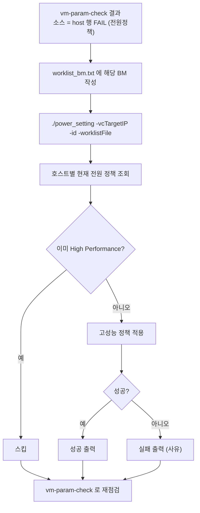

# 17. VM_setup 잔여 도구 — power_setting (호스트 전원정책)

## 한눈에 보기

| 항목 | 값 |
|---|---|
| **위험도** | 🔴 **ESXi 호스트의 전원 정책을 실제로 바꿉니다** |
| 파일 | `.claude/VM/VM_setup/vm-param-fix/power_setting` (컴파일된 바이너리, 약 19MB) |
| 하는 일 | 목록의 호스트(BM)에 **고성능(High Performance) 전원 정책**을 일괄 적용. 이미 적용된 호스트는 건너뜀 |
| 인증 | `VC_PASSWORD` (계정은 `-id`) |
| 남아 있는 이유 | 참고·구버전(V1) 호환용. **V2에는 소스가 있는 대체 도구 `VMsetup/power_setting-source`가 이미 있고**, `vm_setup.sh`가 스펙마다 자동으로 호출합니다 → [10번 5-9절](./10_V2.md) |

> ⚠️ **새로 작업할 때는 이 V1 바이너리 대신 V2의 `VMsetup/power_setting-source`를 쓰세요** (소스 있음, `vm_setup.sh`가 이미 자동 호출). 이 문서는 V2를 아직 배치하지 않은 곳이나 옛 기록을 볼 때만 참고하세요.
> 소스가 없는 바이너리이므로 **삭제·이동은 하지 마세요**(Go 소스를 확정하지 못해 재빌드 불가). `VM_setup`의 나머지 도구는 모두 [10. V2](./10_V2.md)로 대체되었습니다.

**언제 실행하나요?** V2 없이 V1만 쓰는 환경에서는, [전체 작업 흐름](./README.md)의 MAC 목록 추출(`mac_info`) 다음·파워온 전 MAC 대조(`vm_verifier`) 전에 한 번 실행해 두는 것을 표준 순서로 둡니다. 이미 지나쳤거나 나중에 FAIL이 나오면 아래 명령으로 다시 실행해도 됩니다(멱등 — 이미 적용된 호스트는 건너뜀).

---

## 1. 바로 쓰는 명령어

```bash
cd <저장소>/.claude/VM/VM_setup/vm-param-fix

# 1) 인증 (세션마다 1회)
read -rsp 'vCenter 비밀번호: ' VC_PASSWORD; export VC_PASSWORD; echo

# 2) 대상 호스트 목록 작성 (BM 이름, 한 줄에 하나)
vi worklist_bm.txt

# 3) vm-param-check 에서 host 전원정책 FAIL 이 나온 호스트에 적용
./power_setting -vcTargetIP=<vCenter IP> -id=<vCenter 계정> -worklistFile=worklist_bm.txt

# 4) 적용 후 다시 점검 (host 행이 OK 인지) → 11번 문서
cd /home/V2/vm-param-check-usability-improvement/vm-param-check
./vm-param-check -vcenterList=vcenter.txt -f=targets.txt -specRoot=../../SPEC_DIR -out=result.csv
```

적용 후 무작위 호스트 몇 대를 vSphere Client(호스트 > 구성 > 하드웨어 > 전원 관리)에서 확인하세요.

---

## 2. 흐름도



---

## 3. 준비물

- 바이너리: 저장소의 `VM_setup/vm-param-fix/power_setting`을 그대로 씁니다(빌드 없음). 실행 권한이 없으면 `chmod +x power_setting`.
- `worklist_bm.txt`: 대상 BM 이름, 한 줄에 하나.
- 권한: Host > Configuration > Power.
- 폐쇄망 반출: 이 파일을 복사합니다(Linux amd64 실행 파일, .58 Rocky Linux에서 `-h` 실행 확인).

---

## 4. 옵션 상세표 (바이너리 `-h` 출력 기준)

| 플래그 | 기본값 | 필수 | 설명 |
|---|---|---|---|
| `-vcTargetIP` | — | ✅ | vCenter 접속 IP |
| `-id` | `lscsystems@vsphere.local` | | vCenter 로그인 계정 |
| `-worklistFile` | `worklist_bm.txt` | | 작업 대상 호스트 목록 파일 |

| 환경변수 | 설명 |
|---|---|
| `VC_PASSWORD` | vCenter 비밀번호 (바이너리 문자열에서 확인) |

---

## 5. 결과 확인 방법

호스트마다 한 줄씩 출력됩니다.

| 출력 | 의미 |
|---|---|
| `[호스트] 성공: 고성능(High Performance) 전원 정책 주입 완료` | 적용됨 |
| `[호스트] 스킵: 이미 고성능(High Performance) 정책이 적용되어 있습니다.` | 변경 없음 |
| `[호스트] 실패: 전원 관리 시스템 속성을 불러올 수 없습니다.` | 호스트 전원 관리 정보 조회 불가 |
| `[호스트] 실패: 전원 정책 주입 중 오류 발생 - ...` | 적용 실패 |

최종 확인은 `vm-param-check`의 `host` 행이 `OK`인지로 합니다.

---

## 6. 자주 나는 오류와 해결

| 증상 | 원인 | 해결 |
|---|---|---|
| `Permission denied` | 실행 권한 없음 | `chmod +x power_setting` |
| 인증 실패 | `VC_PASSWORD` 없음 / `-id` 기본값 계정 사용 | `export VC_PASSWORD`, `-id` 명시 |
| 호스트를 못 찾음 | `worklist_bm.txt`의 이름이 vCenter 등록 이름과 다름 | vSphere Client의 호스트 이름 그대로 |

---

## 7. 주의사항과 한계

- 소스가 없어 동작을 고치거나 재빌드할 수 없습니다. 기능 변경이 필요하면 같은 로직을 새로 작성해야 합니다.
- 옵션은 `-h` 출력으로만 확인했습니다. 호스트 이름 매칭 규칙(FQDN/짧은 이름) 등 세부 동작은 확인되지 않았습니다 — 처음에는 호스트 1~2대로 실행하세요.
- `VM_setup/vm-param-fix/`의 나머지 파일(`main.go` 등)은 `vm-param-check -fix`로 대체된 구버전 오케스트레이터입니다. 쓰지 않습니다.

---

## 8. 파일 구조

```
VM_setup/
└── vm-param-fix/
    ├── power_setting    # ⚠️ 소스 없는 바이너리 — 삭제 금지 (이 문서의 대상)
    └── (main.go 등)      # 대체된 구버전 오케스트레이터 — 사용 안 함
```
