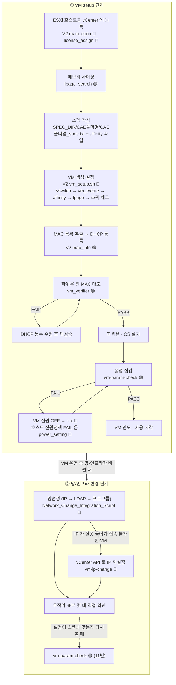

# VM 자동화 도구 인수인계 문서

> `.claude/VM/` 아래 운영 도구를 빌드·실행·수정하기 위한 문서 세트입니다. (2026-09 저장소 기준)
> 리눅스 SSH 접속과 파일 편집은 할 줄 안다고 가정합니다.

---

## 문서 지도

| 순서 | 문서 | 내용 |
|---|---|---|
| 1 | [00_빠른시작](./00_빠른시작.md) | 빌드 → 인증 → 첫 실행까지 명령어만 |
| 2 | [01_기초지식](./01_기초지식.md) | vCenter/ESXi/NUMA/lpage/affinity 개념 |
| 3 | [02_공통_실행환경](./02_공통_실행환경.md) | Go 설치, 폐쇄망 빌드, 도구별 비밀번호 환경변수, 공통 입력 파일 |
| 4 | 아래 "도구별 문서" | 도구마다 첫 절이 **바로 쓰는 명령어** |
| 5 | [30_유지보수_AI_활용가이드](./30_유지보수_AI_활용가이드.md) | 코드를 고쳐야 할 때 AI에게 시키는 방법 |

---

## 전체 작업 흐름

도구가 쓰이는 순서를 두 단계로 나눴습니다. **① VM setup 단계**는 호스트 등록부터 VM 인도까지, **② 망/인프라 변경 단계**는 이미 쓰고 있는 VM 의 IP·LDAP·포트그룹을 바꾸는 작업입니다. 🔴는 실제 설정을 바꾸는 단계입니다.

색 구분: 주황 = 설정 변경 · 파랑 = 입력/준비 · 청록 = 조회·계산 · 보라 = 판정/확인 · 빨강 = 실패·중단 · 초록 = 완료



---

## 도구별 문서

| 문서 | 폴더 (`.claude/VM/` 기준) | 하는 일 | 위험도 |
|---|---|---|---|
| [10. V2](./10_V2.md) | `V2/` | VM 생성·설정(`VMsetup`) + 설정 점검·교정(`vm-param-check`)이 `SPEC_DIR`를 공유하는 현행 구성 | 🔴 |
| [11. vm-param-check](./11_vm-param-check.md) | `V2/vm-param-check-usability-improvement/vm-param-check/` | VM 설정이 스펙과 맞는지 점검, `-fix`로 자동 교정 (주력) | 🟢 점검 / 🔴 `-fix` |
| [12. vm_verifier](./12_vm_verifier.md) | `vm_verifier/` | 파워온 전 vNIC MAC ↔ DHCP 예약 MAC 대조, 교차설치 탐지 | 🟢 |
| [13. lpage_search](./13_lpage_search.md) | `lpage_search/` | Large Page 기준 ev02 메모리 크기 계산 (접속 없음) | 🟢 |
| [14. Network_Change_Integration_Script](./14_Network_Change_Integration_Script.md) | `Network_Change_Integration_Script/` | IP 변경 → LDAP 설정 → 포트그룹(VLAN) 이관을 한 번에, 롤백 포함 | 🔴 |
| [15. vCenter API IP 자동변경](./15_vCenter_API_IP_자동변경.md) | `"vCenter API IP 자동변경/project"` | 네트워크로 접속 못 하는 VM 의 IP 를 VMware Tools 경로로 재설정 | 🔴 |
| [17. VM_setup 잔여 도구](./17_VM_setup_잔여도구.md) | `VM_setup/vm-param-fix/power_setting` | 호스트 전원정책 High Performance 적용 (소스 없는 바이너리) | 🔴 |

> 제외·통합된 폴더(`VM_setup`의 나머지 도구, V1 `vm-param-check-usability-improvement`, `vm-network-migration`, `integrated-vm-param-check-test-tool` 등)는 [40_폴더구조](./40_폴더구조.md)에 한 줄씩 안내되어 있습니다.

---

## 유지보수 · 찾아보기

| 문서 | 내용 |
|---|---|
| [30_유지보수_AI_활용가이드](./30_유지보수_AI_활용가이드.md) | AI에게 수정을 시키는 표준 절차, 절대 없애면 안 되는 안전장치 |
| [31_변경요청서_양식](./31_변경요청서_양식.md) | 복사해서 채우는 도구별 양식 |
| [40_폴더구조](./40_폴더구조.md) | 폴더 트리, 제외·통합 폴더 안내, 같은 이름의 사본 구분 |
| [90_용어집](./90_용어집.md) | vSphere 용어와 이 저장소 고유 용어 |
| [91_트러블슈팅_FAQ](./91_트러블슈팅_FAQ.md) | 오류 메시지별 원인과 해결 |
| [99_인수인계_체크리스트](./99_인수인계_체크리스트.md) | 인수 완료 판정 기준 |

---

## 배포용 단일 HTML

`VM_인수인계_핸드북.html` 하나에 이 폴더의 모든 문서와 흐름도가 들어 있습니다. **인터넷도 서버도 필요 없습니다** — 흐름도 렌더러(mermaid)도 HTML 안에 포함되어 있습니다.

문서(.md)를 고친 뒤 다시 만듭니다:

```bash
cd .claude/VM/인수인계
python3 build_handbook.py
```

- **원본은 `.md`입니다.** HTML을 직접 고치면 다음 생성 때 사라집니다.
- **1차 자료는 도구 폴더의 `README.md`와 소스의 `flag` 정의입니다.** 이 문서의 옵션표는 소스 기준으로 작성했습니다.

---

## 소스–README 불일치 목록

옵션표는 소스(`main.go`의 `flag` 정의, `*.sh`의 `case`/`getopts` 분기) 기준입니다. 원본 README와 다른 곳:

| 도구 | README | 소스 | 영향 |
|---|---|---|---|
| V2 `VMsetup/*-source` 6종 (license_assign, mac_info, main_conn, tag_setting, vm_create, vswitch_setting) | 빌드 예시 경로가 `.claude/VM/VM_setup/<도구>-source` (V1 경로) | V2 는 `.claude/VM/V2/VMsetup/<도구>-source`, `setup.sh`가 `../../govendor`를 링크 | V1 경로에서 빌드하면 V1 소스가 빌드됨. [10번](./10_V2.md)은 V2 경로로 적음 |
| V2 `VMsetup/README.md` "공통 규칙" | 접속은 `-vcTargetIP`, 대상은 `-worklistFile` | `numa_preferht_setting`은 `-vc`/`-f`, `tag_setting`은 `-hostListFile`, `nic_assign`은 `-mapFile`만 | [10번 옵션표](./10_V2.md)에 도구별로 적음 |
| `Network_Change_Integration_Script/integration.conf.sample` | `preprocess_tag` 주석에 "실행 시 `-tag`로 덮어쓸 수 있음" | `change.sh`는 `--tag`만 받음 | `-tag`로 주면 인식 안 됨 |
| V2 `README.md` "비밀번호" 절 | `vm_setup.sh`, `vm_setting_check_insert.sh`가 "환경변수 → 암호 파일 → 직접 입력" 순 | 두 스크립트 모두 시작할 때 `unset VC_PASSWORD VC_PASS VCENTER_PASS` → 암호 파일 → 입력 | `export`로 비밀번호를 넣어도 쓰이지 않음. [10번](./10_V2.md)은 소스 기준으로 적음 |
| `vm_verifier/setup.sh` 주석 | "`vendor/`가 없으면 `go mod vendor` 후 옮길 것" | 실제로는 `../../공통/govendor/govmomi-0.39.0`을 `vendor`로 링크 | 반출 시 `.claude/공통/govendor/`를 함께 옮겨야 함 (README는 맞게 적혀 있음) |
