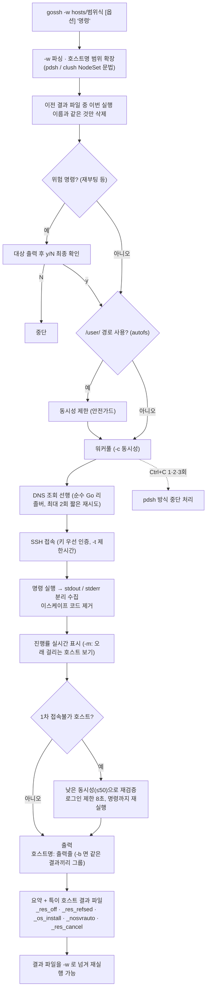

# ARCHITECTURE.md

| 폴더/파일 | 역할 |
|---|---|
| `main.go` | gossh v2 전체: `-w` 파싱·범위 확장, 워커풀, DNS 선행 조회, SSH(키 우선), stdout/stderr 분리, 진행률, `-b` 그룹, 위험 명령 가드, autofs 가드, 재검증, 결과 파일 |
| `term_linux.go` | 터미널 크기 조회·키 입력 모드(`-m`) — Linux 전용 |
| `term_other.go` | Linux 외 OS용 대체 구현(`-m` 미지원, 빌드만 가능) |
| `setup.sh` | 오프라인 빌드 (`vendor/`) |
| `update.sh` | 대상 서버 배포 스크립트 |
| `gossh_os6` | RHEL 6 / CentOS 6용 사전 정적 빌드 바이너리 |
| `old/` | 구버전(v1) 소스 아카이브 |
| `PLAN.md` / `CHANGELOG.md` | 개선 계획 / 버전별 변경 이력 |

수정 요청별로 볼 곳 (모두 `main.go`):

- **"옵션 추가"** → flag 정의 + README 4장 옵션 표
- **"접속불가 판정·재검증 조정"** → DNS 선행 조회 / 재검증 부분
- **"결과 파일 추가"** → 결과 파일 기록·시작 시 정리 부분 (README 5장 표도 갱신)
- gossh를 부르는 도구(`esxi-log-check`, `OS 환경설정 체크`, `ip_change`, `ldap_setting`, `조사`)가 출력 형식(`호스트: 줄`)에 의존하므로, 출력 형식을 바꾸면 그 도구들도 함께 확인하세요.

## 작업 흐름도

단계별 설명은 [WORKFLOW.md](WORKFLOW.md)를 참고하세요.

