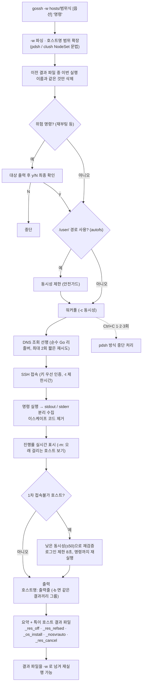

# 작업 흐름도 — gossh (pdsh 스타일 병렬 SSH)

`gossh -w <hosts> "명령"` 한 번이 실행되는 흐름입니다. 옵션 전체는 [README.md](README.md)의 "4. 옵션 전체 목록"을 참고하세요.

```mermaid
flowchart TD
    A["gossh -w hosts/범위식 [옵션] '명령'"] --> B["-w 파싱 · 호스트명 범위 확장<br/>(pdsh / clush NodeSet 문법)"]
    B --> C["이전 결과 파일 중 이번 실행 이름과 같은 것만 삭제"]
    C --> D{"위험 명령? (재부팅 등)"}
    D -- 예 --> D1["대상 출력 후 y/N 최종 확인"]
    D1 -- N --> Z["중단"]
    D1 -- y --> E
    D -- 아니오 --> E{"/user/ 경로 사용? (autofs)"}
    E -- 예 --> E1["동시성 제한 (안전가드)"] --> F
    E -- 아니오 --> F["워커풀 (-c 동시성)"]
    F --> G["DNS 조회 선행 (순수 Go 리졸버, 최대 2회 짧은 재시도)"]
    G --> H["SSH 접속 (키 우선 인증, -t 제한시간)"]
    H --> I["명령 실행 → stdout / stderr 분리 수집<br/>이스케이프 코드 제거"]
    I --> J["진행률 실시간 표시 (-m: 오래 걸리는 호스트 보기)"]
    J --> K{"1차 접속불가 호스트?"}
    K -- 예 --> L["낮은 동시성(≤50)으로 재검증<br/>로그인 제한 8초, 명령까지 재실행"]
    K -- 아니오 --> M
    L --> M["출력<br/>호스트명: 출력줄 (-b 면 같은 결과끼리 그룹)"]
    M --> N["요약 + 특이 호스트 결과 파일<br/>_res_off · _res_refsed · _os_install · _nosvrauto · _res_cancel"]
    N --> O["결과 파일을 -w 로 넘겨 재실행 가능"]
    F -.->|Ctrl+C 1·2·3회| P["pdsh 방식 중단 처리"]
```

SVG 이미지로 보기 (workflow.svg)

