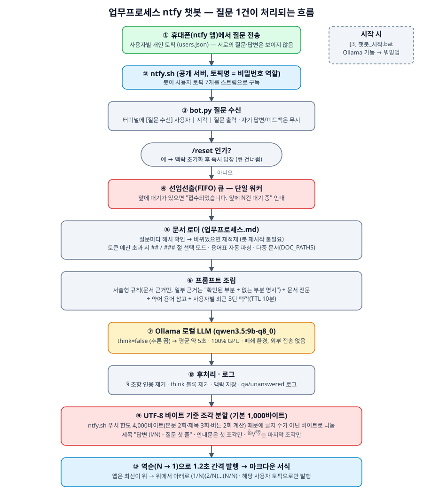
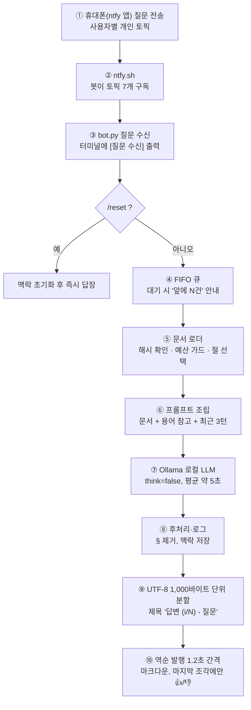

# 작업 흐름도 — 업무프로세스 ntfy 챗봇

휴대폰에서 질문 1건을 보냈을 때 답변이 돌아오기까지의 흐름입니다. 옵션 전체는 [README.md](README.md), 파일별 역할은 [ARCHITECTURE.md](ARCHITECTURE.md)를 참고하세요.

> GitHub에서 위 그림이 보이지 않으면 아래 mermaid 흐름도를 참고하세요. 내용은 같습니다.

## 단계별 한 줄 설명
| 단계 | 하는 일 | 코드 위치 |
|---|---|---|
| ①② | 사용자 토픽으로 질문 도착, 봇이 스트림 구독 | `bot.py` `subscribe_stream` |
| ③ | 수신 즉시 터미널 출력, 자기 답변·피드백 무시 | `accept_question`, `handle_single_topic_event` |
| ④ | 선입선출 단일 워커, 대기 안내 | `enqueue_question`, `_worker_loop` |
| ⑤ | 문서 해시 비교, 토큰 예산 가드, 절 선택 | `assemble_documents` |
| ⑥⑦ | 프롬프트 조립과 모델 호출(`think:false`) | `build_system_prompt`, `query_llm` |
| ⑧ | § 인용 제거, 맥락·로그 저장 | `strip_clause_refs`, `add_turn` |
| ⑨⑩ | 바이트 기준 분할, 역순 발행 | `publish_ntfy`, `build_answer_title` |

수정 요청이 "표시 형식 변경"이면 ⑨⑩(`publish_ntfy`), "답변 품질 변경"이면 ⑥(프롬프트)와 ⑦(모델·옵션)만 보면 됩니다.
