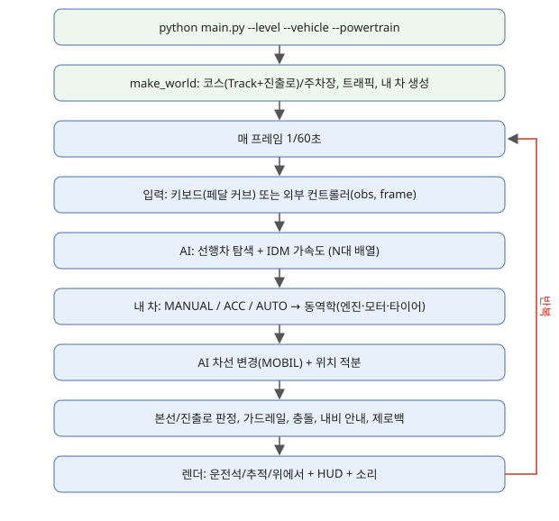
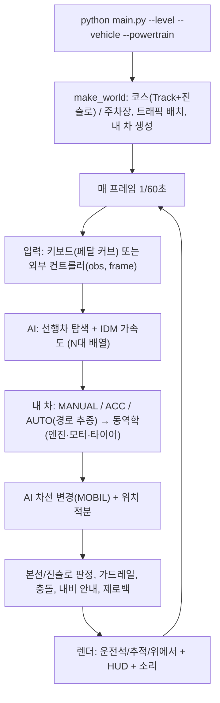

# 작업 흐름도 — 자율주행 도로 시뮬레이터

`python main.py` 한 번이 실행되는 흐름입니다. 옵션 전체는 [README.md](README.md)를 참고하세요.

```mermaid
flowchart TD
    A["python main.py --level --vehicle --powertrain"] --> B["make_world: 코스(Track+진출로) / 주차장, 트래픽 배치, 내 차 생성"]
    B --> C["매 프레임 1/60초"]
    C --> D["입력: 키보드(페달 커브) 또는 외부 컨트롤러(obs, frame)"]
    D --> E["AI: 선행차 탐색 + IDM 가속도 (N대 배열)"]
    E --> F["내 차: MANUAL / ACC / AUTO(경로 추종) → 동역학(엔진·모터·타이어)"]
    F --> G["AI 차선 변경(MOBIL) + 위치 적분"]
    G --> H["본선/진출로 판정, 가드레일, 충돌, 내비 안내, 제로백"]
    H --> I["렌더: 운전석/추적/위에서 + HUD + 소리"]
    I --> C
```
