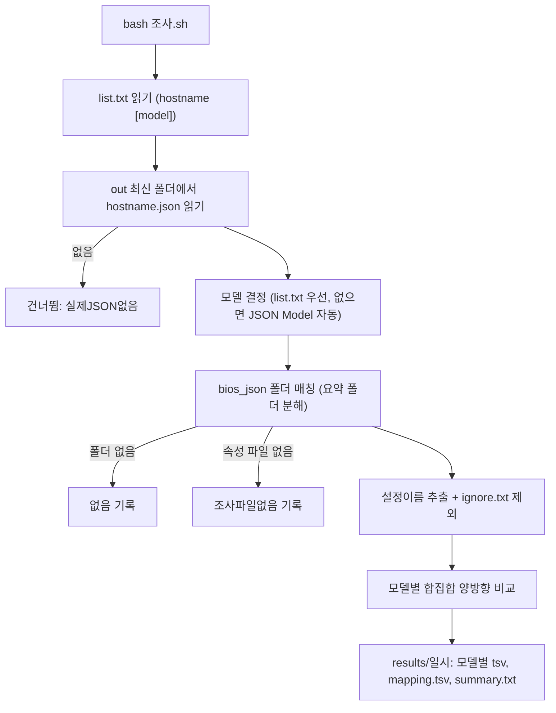

# 작업 흐름도 — bios_compare

`bash 조사.sh` 한 번이 실행되는 흐름입니다. 옵션은 [README.md](README.md) 참고.

```mermaid
flowchart TD
    A["bash 조사.sh"] --> B["list.txt 읽기 (hostname [model])"]
    B --> C["out 최신 폴더에서 hostname.json 읽기"]
    C -->|없음| X["건너뜀: 실제JSON없음"]
    C --> D["모델 결정 (list.txt 우선, 없으면 JSON Model 자동)"]
    D --> E["bios_json 폴더 매칭 (요약 폴더 분해)"]
    E -->|폴더 없음| N["없음 기록"]
    E -->|속성 파일 없음| M["조사파일없음 기록"]
    E --> F["설정이름 추출 + ignore.txt 제외"]
    F --> G["모델별 합집합 양방향 비교"]
    G --> H["results/일시: 모델별 tsv, mapping.tsv, summary.txt"]
```
