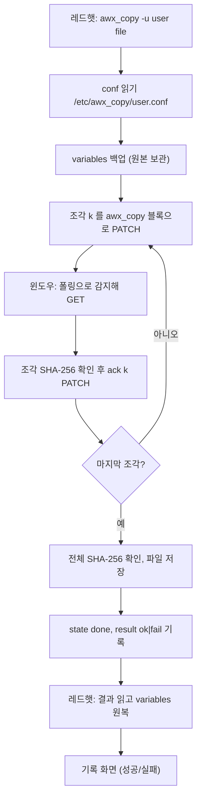

# 작업 흐름도 — AWX_copy

`awx_copy -u {user} {file}` 한 번이 실행되는 흐름입니다. 옵션 전체는 [README.md](README.md), 파일별 역할은 [ARCHITECTURE.md](ARCHITECTURE.md)를 참고하세요.

```mermaid
flowchart TD
    A["레드햇: awx_copy -u user file"] --> B["conf 읽기 /etc/awx_copy/user.conf"]
    B --> C["variables 백업 (원본 보관)"]
    C --> D["조각 k 를 awx_copy 블록으로 PATCH"]
    D --> E["윈도우: 폴링으로 감지해 GET"]
    E --> F["조각 SHA-256 확인 후 ack k PATCH"]
    F --> G{"마지막 조각?"}
    G -- 아니오 --> D
    G -- 예 --> H["전체 SHA-256 확인, 파일 저장"]
    H --> I["state done, result ok|fail 기록"]
    I --> J["레드햇: 결과 읽고 variables 원복"]
    J --> K["기록 화면 (성공/실패)"]
```
