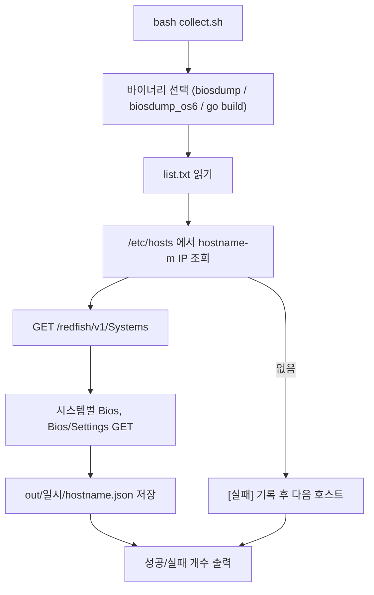
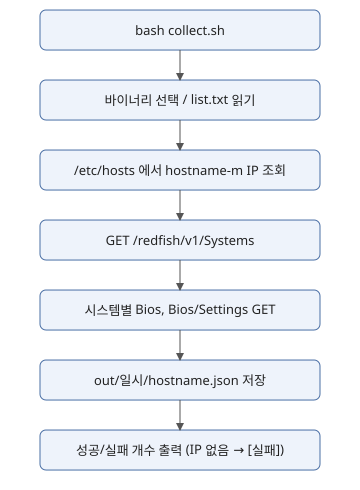

# 작업 흐름도 — collect (biosdump)

`bash collect.sh` 한 번이 실행되는 흐름입니다. 옵션 전체는 [README.md](README.md)를 참고하세요.

```mermaid
flowchart TD
    A["bash collect.sh"] --> B["바이너리 선택 (biosdump / biosdump_os6 / go build)"]
    B --> C["list.txt 읽기"]
    C --> D["/etc/hosts 에서 hostname-m IP 조회"]
    D -->|없음| X["[실패] 기록 후 다음 호스트"]
    D --> E["GET /redfish/v1/Systems"]
    E --> F["시스템별 Bios, Bios/Settings GET"]
    F --> G["out/일시/hostname.json 저장"]
    G --> H["성공/실패 개수 출력"]
    X --> H
```

